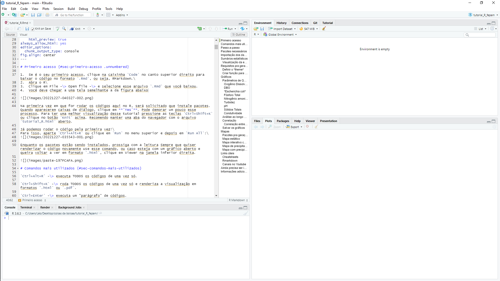
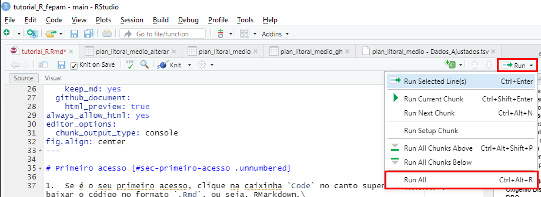
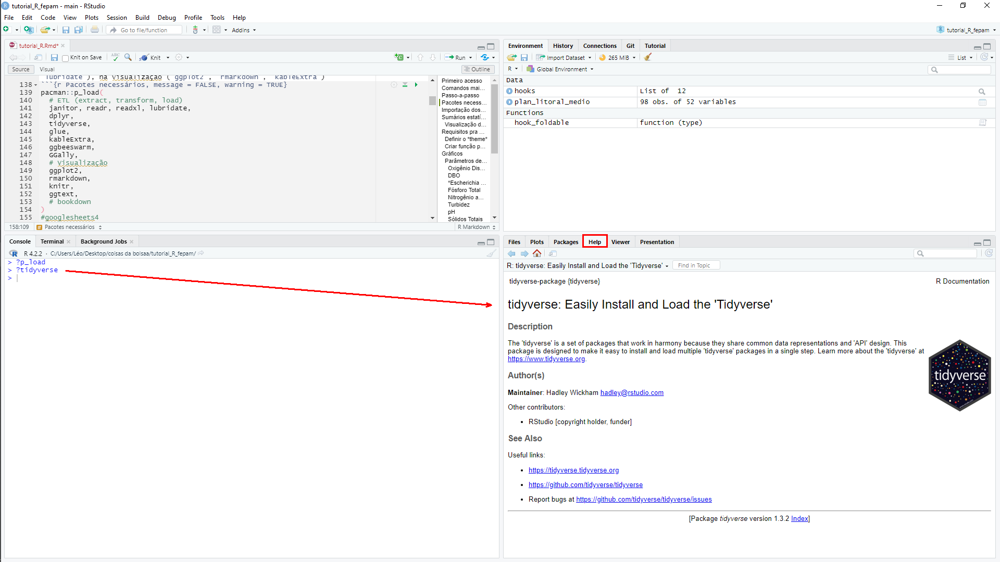

# Primeiro acesso {#sec-primeiro-acesso .unnumbered}

Olá! Nesse tutorial você irá aprender a replicar tudo que será exibido nessa página!\

Para isso, você precisa ter instalado em seu computador 2 programas: o `R` e o `RStudio`.\
O R é a linguagem de programação e o RStudio a interface gráfica,

Você pode baixar o `R` e o `RStudio` através do link <https://posit.co/download/rstudio-desktop/>\

1.  Se é o seu primeiro acesso, clique na caixinha `Code` no canto superior direito para baixar o código no formato `.Rmd`, ou seja, RMarkdown.
2.  Abra o RStudio
3.  Clique em File -\> Open file -\> e selecione esse arquivo `.Rmd` que você baixou.
4.  Você deve chegar a uma tela semelhante a da figura abaixo



Na primeira vez em que for rodar os códigos aqui no R, será solicitado que instale pacotes. Quando aparecerem caixas de diálogo, clique em **`Yes`**.

Pode demorar um pouco esse processo. Para ter uma melhor visualização desse tutorial pressione as teclas `Ctrl+Shift+K` ou clique no botão `Knit` acima. Recomendo manter uma aba do navegador com o arquivo `tutorial_R.html` aberto.

Já podemos rodar o código pela primeira vez!\
Para isso, aperte `Ctrl+Alt+R` ou clique em `Run` no menu superior e depois em `Run All`:\


Enquanto os pacotes estão sendo instalados, prossiga com a leitura. Deixei alguns conteúdos nas [Referências](#sec-links-úteis) que irão complementar esse documento.

Quando quiser renderizar o código para ter a mesma visualização como a do formato `.html` use o comando de `Knit`, o `Ctrl+Shift+K`, ou caso esteja com um gráfico aberto, clique em Viewer na janela inferior direita.


# Comandos mais utilizados {#sec-comandos-mais-utilizados}

`Ctrl+Alt+R` -\> executa TODOS os códigos de uma vez só.

`Knit` ou `Ctrl+Shift+K` -\> roda TODOS os códigos de uma vez só e renderiza a visualização em formatos `.html` ou `.pdf`.

`Ctrl+Enter` -\> executa um "parágrafo" de códigos.

`Alt+Enter` -\> executa o "parágrafo" de códigos mas sem mover o cursor.

`Ctrl+Shift+C` -\> para comentar ou *descomentar* um intervalo de linhas.

> As linhas de código que começam com `#` são **comentários**. Elas não impactam o resultado final do código.

`Ctrl+Alt+I` -\> cria um novo *code chunk*.

`Ctrl+I` -\> Indenta o código (ajusta a tabulação entre as linhas, facilita a leitura do código).

> A lista completa de atalhos pode ser conferida no menu superior Tools -\> Keyboard Shortcuts Help, ou através do atalho `Alt+Shift+K`.

# Passo-a-passo {#sec-passo-a-passo}

> **Importante**: Com esse arquivo `.Rmd` você deve chegar aos mesmos resultados que presentes no arquivo `tutorial_R.html`.
>
> Vou deixar comentado os pedaços de código que necessitam de alteração obrigatória com a nomenclatura `alteracao_` seguido de um número.
>
> Para encontrar facilmente os locais que precisam ser ajustados, basta utilizar o comando `Ctrl+F` e procurar por `alteracao_` e o respectivo número listado abaixo.

1.  Renomear a planilha a ser importada pra facilitar a leitura.
    -   nesse caso renomeei a plan gerada pelo RSÁgua de `Dados_20221222143305.xls` para `plan_litoral_medio.xls`.
    -   você pode usar `Ctrl+F` e substituir todas as ocorrências de `plan_litoral_medio` para o nome que você deu à planilha.
2.  Ajustar o caminho do arquivo. (**alteracao_1**)
    -   nesse exemplo estou importando diretamente da pasta de downloads do meu computador: `"C:/Users/Léo/Downloads/plan_litoral_medio.xls"`
    -   Futuramente quero implementar a integração com o [Google Sheets](#sec-ainda-precisa-ser-implementado).
3.  Verificar o intervalo de dados da planilha. As últimas 10 linhas costumam ser dos sumários, mas o R não entende isso.
    -   verificar até qual linha a coluna `Índice` tem valores registrados, neste caso o `Índice` vai até 98 (+1 linha de cabeçalho) = linha 99
    -   Alterar na parte de importação o intervalo para compreender somente os dados (**alteracao_2**)
    -   Estou tentando descobrir como economizar essa etapa.

# Pacotes necessários {#sec-pacotes-necessários .pacotes}

```{r configurando exibir/ocultar código e resultados, include=FALSE}
hooks = knitr::knit_hooks$get()

hook_foldable = function(type) {
  force(type)
  function(x, options) {
    res = hooks[[type]](x, options)
    
    if (isFALSE(options[[paste0("fold.", type)]])) return(res)
    
    paste0(
      "<details><summary>", type, "</summary>\n\n",
      res,
      "\n\n</details>"
    )
  }
}

knitr::knit_hooks$set(
  output = hook_foldable("output"),
  plot = hook_foldable("plot")
)

# Disable folding

# ```{r, fold.output=FALSE, fold.plot=FALSE}
# rnorm(10)
# plot(iris)
# ```
```

No `code chunk` abaixo serão instalados todos os pacotes necessários. Cada pacote contém funções específicas que auxiliam no desenvolvimento da atividade, seja a importação do dado (`readr`, `readxl`), na manipulação dos dados (limpeza/tratamento com `janitor` e `lubridate`), na visualização (`ggplot2`, `rmarkdown`, `kableExtra`) ou pra praticamente tudo (`tidyverse`).

```{r Pacotes necessários, message = FALSE, warning = TRUE}
pacman::p_load(
  # ETL (extract, transform, load)
  janitor, readr, readxl, lubridate,
  dplyr, 
  tidyverse, 
  glue,
  # Visualização
  ggplot2,
  GGally, 
  rmarkdown, 
  knitr,
  kableExtra,
  ggbeeswarm, 
  ggtext
  # bookdown
)
#googlesheets4
```

Para acessar a página de ajuda dos pacotes ou das funções, basta usar um `?` antes do que se está buscando.  

No exemplo abaixo estou verificando os argumentos da função `p_load`, do pacote `pacman`. Na sequência abro o menu de ajuda do pacote `tidyverse`, um dos mais importantes da comunidade R. Outra maneira possível seria utilizando `help(package = 'pacman')`.



# Importação dos dados {#sec-importação-dos-dados}

```{r replicando importação dos dados, warning=FALSE, message=FALSE}
plan_litoral_medio <- read_delim(
  "https://raw.githubusercontent.com/leonardofwink/tutorial_R_fepam/main/planilha_rsagua/plan_litoral_medio%20-%20Dados_Ajustados.tsv", 
  delim = "\t", 
  escape_double = FALSE,
  col_types = cols(
    ÍNDICE = col_number(),
    `CÓD. ESTAÇÃO` = col_character(),
    LATITUDE = col_number(),
    LONGITUDE = col_number(),
    `BACIA HIDROGRÁFICA` = col_character(),
    `RECURSO HÍDRICO` = col_character(),
    REGIÃO = col_character(),
    MUNICÍPIO = col_character(),
    AMBIENTE = col_character(),
    `DATA COLETA` = col_date(format = "%m/%d/%Y"),
    `HORA COLETA` = col_time(format = "%H:%M:%S"),
    `CHUVA 24H` = col_character(),
    ALCALINIDADE = col_number(),
    ALUMÍNIO = col_number(),
    CÁDMIO = col_number(),
    CHUMBO = col_number(),
    CLORETO = col_number(),
    `CLOROFILA A` = col_number(),
    COBRE = col_number(),
    `COLIFORMES TERMOTOLERANTES` = col_number(),
    `COLIFORMES TOTAIS` = col_number(),
    CONDUTIVIDADE = col_number(),
    `CROMO TOTAL` = col_number(),
    `DEMANDA BIOQUÍMICA DE OXIGÊNIO` = col_number(),
    `DEMANDA QUÍMICA DE OXIGÊNIO` = col_number(),
    `ESCHERICHIA COLI` = col_number(),
    FERRO = col_number(),
    `FITOPLANCTON  - CIANOBACTÉRIAS` = col_number(),
    `FOSFATO ORTO` = col_number(),
    `FÓSFORO TOTAL` = col_number(),
    MANGANÊS = col_number(),
    `MERCÚRIO EM MICROGRAMA POR LITRO (UG/L)` = col_number(),
    NÍQUEL = col_number(),
    NITRATO = col_number(),
    `NITROGÊNIO AMONIACAL` = col_number(),
    `NITROGÊNIO ORGÂNICO` = col_number(),
    `NITROGÊNIO TOTAL KJELDAHL` = col_number(),
    `OXIGÊNIO DISSOLVIDO` = col_number(),
    PH = col_number(),
    `PROFUNDIDADE COLETA` = col_number(),
    `PROFUNDIDADE TOTAL` = col_number(),
    SALINIDADE = col_number(),
    `SÓLIDOS DISSOLVIDOS TOTAIS` = col_number(),
    `SÓLIDOS SUSPENSOS TOTAIS` = col_number(),
    `SÓLIDOS TOTAIS` = col_number(),
    `TEMPERATURA DA ÁGUA` = col_number(),
    `TEMPERATURA DO AR` = col_number(),
    `TRANSPARÊNCIA DA ÁGUA` = col_number(),
    TURBIDEZ = col_number(),
    `VAZÃO RECURSO HÍDRICO` = col_number(),
    ZINCO = col_number()
  ),
  locale = locale(
    date_names = "pt", 
    decimal_mark = ",",
    grouping_mark = ""
  ),
  trim_ws = TRUE
) %>%
  janitor::clean_names() %>%
  slice(
    1:(n() - 8) #retirando as ultimas 8 linhas
  ) %>% 
  rename(
    e_coli = escherichia_coli,
    dbo = demanda_bioquimica_de_oxigenio,
    mercurio = mercurio_em_micrograma_por_litro_ug_l
  ) %>%
  mutate(
    municipio = str_to_title(municipio),
    data_coleta = ymd(data_coleta),
    ano_coleta = year(data_coleta),
  ) %>%
  dplyr::select( #reordenando as colunas
    c(1:10),
    ano_coleta,
    everything()
  )
```

```{r Importando os dados}
plan_litoral_medio_alterar <- read_excel(
  "C:/Users/Léo/Downloads/plan_litoral_medio.xls", #alteracao_1
  sheet = "Dados_Ajustados", 
  col_types = c(
    "numeric", "text", "numeric", "numeric", "text", 
    "text", "text", "text", "text", "date", 
    "date", "text", "numeric", "numeric", 
    "numeric", "numeric", "numeric", 
    "numeric", "numeric", "numeric", 
    "numeric", "numeric", "numeric", 
    "numeric", "numeric", "numeric", 
    "numeric", "numeric", "numeric", 
    "numeric", "numeric", "numeric", 
    "numeric", "numeric", "numeric", 
    "numeric", "numeric", "numeric", 
    "numeric", "numeric", "numeric", 
    "numeric", "numeric", "numeric", 
    "numeric", "numeric", "numeric", 
    "numeric", "numeric", "numeric", 
    "numeric"),
  range = "A1:AY99", #alteracao_2
  trim_ws = TRUE
) %>% 
  janitor::clean_names() %>% 
  rename(
    e_coli = escherichia_coli,
    dbo = demanda_bioquimica_de_oxigenio,
    mercurio = mercurio_em_micrograma_por_litro_ug_l
  ) %>% 
  mutate(
    municipio = str_to_title(municipio),
    data_coleta = ymd(data_coleta),
    ano_coleta = year(data_coleta),
    # hora_coleta = parse_datetime(hora_coleta),
  ) %>%
  dplyr::select( #reordenando as colunas
    c(1:10),
    ano_coleta,
    everything()
  )
```

# Sumários estatísticos {#sec-sumários-estatísticos}

```{r sumario, echo = TRUE}
sumario <- plan_litoral_medio %>%
  dplyr::select(cod_estacao, oxigenio_dissolvido, ano_coleta) %>%
  filter(ano_coleta > "2013" &
           ano_coleta <= "2025") %>%
  group_by(cod_estacao) %>%
  summarize(
    min =
      min(oxigenio_dissolvido,
          na.rm = TRUE),
    q1 =
      quantile(oxigenio_dissolvido, 0.25,
               na.rm = TRUE),
    median =
      median(oxigenio_dissolvido,
             na.rm = TRUE),
    mean =
      mean(oxigenio_dissolvido,
           na.rm= TRUE),
    q3 =
      quantile(oxigenio_dissolvido, 0.75,
               na.rm = TRUE),
    max =
      max(oxigenio_dissolvido,
          na.rm = TRUE))

sumario
```

## Visualização da estrutura de dados da planilha {#sec-visualização-da-estrutura-de-dados-da-planilha}

Conferir se o tipo dos dados está correto, data em formato de data (date/dttm), código da estação como character (chr), valor medido dos parâmetros como double (dbl).

```{r estrutura da planilha,}
glimpse(plan_litoral_medio)
# str(plan_litoral_medio) #outra maneira de visualizar a eSTRutura 
```

```{r Visualização da planilha importada, echo = FALSE}
paged_table(plan_litoral_medio,
            options = list(rows.print = 15,
                           cols.print = 10))
```

# Requisitos pra gerar os gráficos {#sec-requisitos-pra-gerar-os-gráficos}

## Definir o *theme*

Definindo uma cor de letra e de fundo padrão a ser adotada nos gráficos.

```{r setting theme}
theme_grafs <- function(bg = "white", 
                        coloracao_letra = "black") {
  theme(
    plot.title = 
      element_text(
        hjust = 0.5,
        color = coloracao_letra,
        size = 19),
    
    axis.title.x = 
      # element_text(
      # color = coloracao_letra,
      # size = 15,
      # angle = 0,),
      element_blank(),
    axis.title.y = element_text(
      color = coloracao_letra,
      size = 15,
      angle = 90),
    
    axis.text.x = element_text(
      color = coloracao_letra,
      size = 17),
    axis.text.y = element_text(
      color = coloracao_letra,
      size = 17,
      angle = 0),
    
    strip.background = element_rect(fill = bg,
                                    linetype = 1,
                                    size = 0.5,
                                    color = "black"),
    strip.text = element_text(size = 17),
    panel.background = element_rect(fill = bg),
    plot.background = element_rect(fill = bg),
    plot.margin = margin(l = 5, r = 10,
                         b = 5, t = 5)
  )
}
```

## Criar função para gerar boxplots com percentis 20 e 80

```{r funcao percentil 20 e 80}
f <- function(x) {
  r <- quantile(x, probs = c(0.10, 0.20, 0.50, 0.80, 0.90))
  names(r) <- c("ymin", "lower", "middle", "upper", "ymax")
  return(r)
}
```

# Gráficos {#sec-gráficos .graficos}

> **Atenção:** Tomar muito cuidado com a ordem que estão dispostas as estações. Deve-se sempre respeitar o sentido nascente -\> foz.
>
> Conferir a ordem das estações através do [mapa interativo](#sec-mapa-interativo-com-localização-dos-pontos-de-monitoramento).
>
> Elas acabam ficando fora de ordem por conta do código de ottobacias Para reordenar as estações, atente-se à função `scale_x_discrete` descrito no code chunk abaixo:

```{r reordenar estações no gráfico, eval = FALSE}
scale_x_discrete(
  limits = c(
    "87332500",
    "87420130",
    "87420150",
    "87420350",
    "87420500",
    "87510010"
  ),
  labels = c(
    "PM1", "PM2", "PM3", "PM4", "PM5", "PM6"
  )
)+
```

Obs: Para a Bacia Hidrográfica do Rio Gravataí é necessário

> Sempre tomar cuidado com os limites do **eixo y**. Deixei como padrão o R buscar automaticamente qual o valor mínimo e máximo daquele parâmetro, mas o ideal é que se ajuste caso a caso.

Caso queira alterar o tamanho dos outliers, alterar o `size` nesse trecho dos códigos:

```{r alterar tamanho do outlier, eval = FALSE}
ggbeeswarm::geom_quasirandom(
     # grouponX = FALSE,
     size = 1.2, 
     alpha = .25,
     width = .07,
   )+
```

> Todos os gráficos foram gerados utilizando como padrão os limites da Resolução nº 357/05 do CONAMA para ambientes **lóticos**. Caso queira alterar os limites para adequar aos ambientes **lênticos**, deve-se editar os `ymin` e `ymax` de cada retângulo (`rect`) do referido parâmetro.
>
> Não esquecer que o R entende a casa decimal como ponto, e não como vírgula.

```{r ambiente lótico x lêntico, eval = FALSE}
annotate("rect",
         xmin = -Inf, xmax = Inf,
         ymin = 13.3, ymax = Inf,
         alpha = 1,
         fill = "#ac5079")+ #>pior classe
annotate("rect",
         xmin = -Inf, xmax = Inf,
         ymin = 3.7, ymax = 13.3,
         alpha = 1,
         fill = "#fcf7ab")+ #classe 3
annotate("rect",
         xmin = -Inf, xmax = Inf,
         ymin = 0, ymax = 3.7,
         alpha = 1,
         fill = "#8dcdeb")+ #classe 1
```

## Parâmetros de Qualidade da Água {#sec-parâmetros-de-qualidade-da-água}

### Oxigênio Dissolvido {#sec-oxigênio-dissolvido}

```{r Gráfico OD, fig.cap="Oxigênio Dissolvido", message=FALSE, warning=FALSE, fold.plot=FALSE}
(graf_od <- plan_litoral_medio %>%
   ggplot(
     aes(
       x = cod_estacao,
       y = oxigenio_dissolvido,
     )
   )+
   annotate("rect",
            xmin = -Inf, xmax = Inf,
            ymin = -Inf, ymax = 2,
            alpha = 1,
            fill = "#ac5079")+ #>pior classe
   annotate("rect",
            xmin = -Inf, xmax = Inf,
            ymin = 2, ymax = 4,
            alpha = 1,
            fill = "#eb5661")+ #classe 4
   annotate("rect",
            xmin = -Inf, xmax = Inf,
            ymin = 4, ymax = 5,
            alpha = 1,
            fill = "#fcf7ab")+ #classe 3
   annotate("rect",
            xmin = -Inf, xmax = Inf,
            ymin = 5, ymax = 6,
            alpha = 1,
            fill = "#70c18c")+ #classe 2
   annotate("rect",
            xmin = -Inf, xmax = Inf,
            ymin= 6, ymax = Inf,
            alpha = 1,
            fill = "#8dcdeb")+ #classe 1
   stat_boxplot(
     fun.data = f,
     geom = 'errorbar',
     width = 0.3,
     position = position_dodge(width = 0.65),
   )+
   stat_boxplot(
     fun.data = f,
     width = 0.7,
     fill = '#F8F8FF',
     color = "black",
     geom = "boxplot",
     outlier.shape = 1, #se deixar NA fica só o jitter, se não, deixa 1
   )+
   # facet_wrap(~periodo)+
   labs(
     title = "Oxigênio Dissolvido",
     x= NULL,
     y="mg/L"
   )+
   ggbeeswarm::geom_quasirandom(
     size = 1.2,
     alpha = .25,
     width = .07,
   )+
   scale_y_continuous(
     expand = expansion(mult = c(0,0)),
     n.breaks = 11,
     # limits = c(-0.3,21)
     limits = c(
       min(plan_litoral_medio$oxigenio_dissolvido, na.rm = TRUE),
       max(plan_litoral_medio$oxigenio_dissolvido, na.rm = TRUE)+1)
   )+
   # scale_x_discrete(
   #   limits = c(
   #     "87332500",
   #     "87420130",
   #     "87420150",
   #     "87420350",
   #     "87420500",
   #     "87510010"
   #   ),
   #   labels = c(
   #     "PM1", "PM2", "PM3", "PM4", "PM5", "PM6"
   #   )
   # )+
   geom_smooth(
     method = "lm",
     se = FALSE, #se deixar TRUE gera o intervalo de confiança de 95%
     aes(group = 1),
     alpha = 0.5,
     na.rm = TRUE,
     size = 1
   )+
   theme_grafs()
)
```

### DBO {#sec-dbo}

```{r Gráfico DBO, warning = FALSE, message = FALSE, fig.cap="Demanda Bioquímica de Oxigênio", fold.plot=FALSE}
(graf_dbo <- ggplot(plan_litoral_medio,
                    aes(x = cod_estacao,
                   y = dbo))+
   annotate("rect",
            xmin = -Inf, xmax = Inf,
            ymin = 10, ymax = Inf,
            alpha = 1,
            fill = "#ac5079")+ #>pior classe
   annotate("rect",
            xmin = -Inf, xmax = Inf,
            ymin = 5, ymax = 10,
            alpha = 1,
            fill = "#fcf7ab")+ #classe 3
   annotate("rect",
            xmin = -Inf, xmax = Inf,
            ymin = 3, ymax = 5,
            alpha = 1,
            fill = "#70c18c")+ #classe 2
   annotate("rect",
            xmin = -Inf, xmax = Inf,
            ymin = 0, ymax = 3,
            alpha = 1,
            fill = "#8dcdeb")+ #classe 1
   stat_boxplot(
      geom = 'errorbar',
      width = 0.3,
      position = position_dodge(width = 0.65),
      fun.data = f,
    )+
    stat_boxplot(
      width = 0.7,
      fill = '#F8F8FF',
      color = "black",
      fun.data = f,
      geom = "boxplot",
      outlier.shape = 1, #se deixar NA fica só o jitter, se não, deixa 1
    )+
   # facet_wrap(~periodo)+
   labs(title = "Demanda Bioquímica de Oxigênio",
        x="Estação",
        y="mg/L")+
   ggbeeswarm::geom_quasirandom(
     # grouponX = FALSE,
     size = 1.2,
     alpha = .25,
     width = .07,
   )+
   # scale_x_discrete(limits = c("87398500", 
   #                             "87398980", 
   #                             "87398900", 
   #                             "87398950", 
   #                             "87405500", 
   #                             "87406900", 
   #                             "87409900"),
   #                  labels = c("PM1", "PM2", "PM3", "PM4", "PM5", "PM6", "PM7")
   # )+
   scale_y_continuous(expand = expansion(mult = c(0.03,0.03)),
                      n.breaks = 8,
                      limits = c(
                        min(plan_litoral_medio$dbo, na.rm = TRUE),
                        10
                        # max(plan_litoral_medio$dbo, na.rm = TRUE)
                        ),
                      trans = "log10")+
   geom_smooth(method = "lm",
               se=FALSE, #se deixar TRUE gera o intervalo de confiança de 95%
               aes(group=1),
               alpha=.5,
               na.rm = TRUE,
               size = 1)+
   theme_grafs()
)
```

### *Escherichia coli*

```{r Gráfico Ecoli, warning = FALSE, message = FALSE, fig.cap="Escherichia-coli", fold.plot=FALSE}
(graf_ecoli <- plan_litoral_medio %>% 
   ggplot(aes(cod_estacao,
              e_coli))+
   annotate("rect",
            xmin = -Inf, xmax = Inf,
            ymin = 3200, ymax = Inf,
            alpha = 1,
            fill = "#ac5079")+ #>pior classe
   annotate("rect",
            xmin = -Inf, xmax = Inf,
            ymin = 800, ymax = 3200,
            alpha = 1,
            fill = "#fcf7ab")+ #classe 3
   annotate("rect",
            xmin = -Inf, xmax = Inf,
            ymin = 160, ymax = 800,
            alpha = 1,
            fill = "#70c18c")+ #classe 2
   annotate("rect",
            xmin = -Inf, xmax = Inf,
            ymin = 0, ymax = 160,
            alpha = 1,
            fill = "#8dcdeb")+ #classe 1
   stat_boxplot(geom = 'errorbar',
                width=0.3,
                position = position_dodge(width = 0.65))+
   geom_boxplot(fill='#F8F8FF',
                color="black",
                outlier.shape = 1, #se deixar NA fica só o jitter, se não, deixa 1
                width= 0.7)+
   # facet_wrap(~periodo)+
   labs(title = "*Escherichia coli*",
        x="Estação",
        y="NMP/100mL")+
   scale_y_continuous(expand = expansion(mult = c(0.01, 0.01)),
                      # n.breaks = 9,
                      n.breaks = 6,
                      limits = c(min(plan_litoral_medio$e_coli, na.rm = TRUE),
                                 max(plan_litoral_medio$e_coli, na.rm = TRUE)),
                      trans = "log10",
                      labels = scales::number_format(accuracy = 1,
                                                     decimal.mark = ",",
                                                     big.mark = " "))+
   ggbeeswarm::geom_quasirandom(
     size = 1.2,
     alpha = .25,
     width = .07,
   )+
 # scale_x_discrete(limits = c("87398500",
 #                             "87398980",
 #                             "87398900",
 #                             "87398950",
 #                             "87405500",
 #                             "87406900",
 #                             "87409900"),
 #                  labels = c("PM1", "PM2", "PM3", "PM4", "PM5", "PM6", "PM7")
 # )+
 geom_smooth(method = "lm",
 se=FALSE, #stardand error = desvio padrão -> se deixar TRUE gera o intervalo de confiança de 95%
             aes(group=1),
             alpha= 0.5, #transparencia de 50%
             na.rm = TRUE, #remover NAs
             size = 1)+
 theme_grafs()+
   theme(
     axis.text.y = element_text(
       angle = 90,
       # size=15,
       # face=2
     ),
     plot.title = 
       element_markdown(
         hjust = 0.5,
         color = "black",
         size = 19),
   )
)
```

### Fósforo Total {#sec-fósforo-total}

```{r Gráfico fósforo total, warning = FALSE, message = FALSE, fig.cap="Fósforo total", fold.plot=FALSE}
(graf_ptot <- ggplot(plan_litoral_medio,
                     aes(cod_estacao,
                         fosforo_total))+
   annotate("rect",
            xmin = -Inf, xmax = Inf,
            ymin = 0.15, ymax = Inf,
            alpha = 1,
            fill = "#ac5079")+ #>pior classe
   annotate("rect",
            xmin = -Inf, xmax = Inf,
            ymin = 0.1, ymax = 0.15,
            alpha = 1,
            fill = "#fcf7ab")+ #classe 3
   annotate("rect",
            xmin = -Inf, xmax = Inf,
            ymin = 0, ymax = 0.1,
            alpha = 1,
            fill = "#8dcdeb")+ #classe 1
   stat_boxplot(geom = 'errorbar',
                width=0.3,
                position = position_dodge(width = 0.65))+
   geom_boxplot(fill='#F8F8FF',
                color="black",
                outlier.shape = 1, #se deixar NA fica só o jitter, se não, deixa 1
                width= 0.7)+
   # facet_wrap(~periodo)+
   labs(title = "Fósforo total",
        x="Estação",
        y="mg/L")+
   scale_y_continuous(expand = expansion(mult = c(0.03,0.03)),
                      n.breaks = 8,
                      limits = c(min(plan_litoral_medio$fosforo_total, na.rm = TRUE),
                                 max(plan_litoral_medio$fosforo_total), na.rm = TRUE),
                      trans = "log10",
                      labels = scales::number_format(accuracy = .001,
                                                     decimal.mark = ",",
                                                     big.mark = " ")
   )+
   ggbeeswarm::geom_quasirandom(
     size = 1.2,
     alpha = .25,
     width = .07,
   )+
   # scale_x_discrete(limits = c("87398500", 
   #                             "87398980", 
   #                             "87398900", 
   #                             "87398950", 
   #                             "87405500", 
   #                             "87406900", 
   #                             "87409900"),
   #                  labels = c("PM1", "PM2", "PM3", "PM4", "PM5", "PM6", "PM7")
   # )+
   geom_smooth(method = "lm",
               se=FALSE, #se deixar TRUE gera o intervalo de confiança de 95%
               aes(group=1),
               alpha=.5,
               na.rm = TRUE,
               size = 1)+
   theme_grafs()
)
```

### Nitrogênio amoniacal {#sec-nitrogênio-amoniacal}

```{r Gráfico Nitrogênio Amoniacal, warning = FALSE, message = FALSE, fig.cap="Nitrogênio Amoniacal", fold.plot=FALSE}
(graf_namon <- ggplot(plan_litoral_medio,
                 aes(cod_estacao,
                     nitrogenio_amoniacal))+
   annotate("rect",
            xmin = -Inf, xmax = Inf,
            ymin = 13.3, ymax = Inf,
            alpha = 1,
            fill = "#ac5079")+ #>pior classe
   annotate("rect",
            xmin = -Inf, xmax = Inf,
            ymin = 3.7, ymax = 13.3,
            alpha = 1,
            fill = "#fcf7ab")+ #classe 3
   annotate("rect",
            xmin = -Inf, xmax = Inf,
            ymin = 0, ymax = 3.7,
            alpha = 1,
            fill = "#8dcdeb")+ #classe 1
   stat_boxplot(geom = 'errorbar',
                width=0.3,
                position = position_dodge(width = 0.65))+
   geom_boxplot(fill='#F8F8FF',
                color="black",
                outlier.shape = 1, #se deixar NA fica só o jitter, se não, deixa 1
                width= 0.7)+
   # facet_wrap(~periodo)+
   labs(title = "Nitrogênio amoniacal",
        x="Estação",
        y="mg/L")+
   scale_y_continuous(expand = expansion(mult = c(0.01, 0.05)),
                      n.breaks = 9,
                      limits = c(min(plan_litoral_medio$nitrogenio_amoniacal, na.rm = TRUE),
                                 15
                                 # max(plan_litoral_medio$nitrogenio_amoniacal, na.rm = TRUE)
                                 ),
                      trans = "log10",
                      labels = scales::number_format(accuracy = .001,
                                                     decimal.mark = ",",
                                                     big.mark = " "))+
   ggbeeswarm::geom_quasirandom(
     size = 1.2,
     alpha = .25,
     width = .07,
   )+
   # scale_x_discrete(limits = c("87398500", 
   #                             "87398980", 
   #                             "87398900", 
   #                             "87398950", 
   #                             "87405500", 
   #                             "87406900", 
   #                             "87409900"),
   #                  labels = c("PM1", "PM2", "PM3", "PM4", "PM5", "PM6", "PM7")
   # )+
   geom_smooth(method = "lm",
               se=FALSE, #se deixar TRUE gera o intervalo de confiança de 95%
               aes(group=1),
               alpha=.5,
               na.rm = TRUE,
               size = 1)+
   theme_grafs()
)
```

### Turbidez {#sec-turbidez}

```{r Gráfico Turbidez, fig.cap="turbidez", warning = FALSE, message = FALSE, fold.plot=FALSE}
(graf_turb <- ggplot(plan_litoral_medio,
                   aes(cod_estacao,
                       turbidez))+
   annotate("rect",
            xmin = -Inf, xmax = Inf,
            ymin = 100, ymax = Inf,
            alpha = 1,
            fill = "#ac5079")+ #>pior classe
   annotate("rect",
            xmin = -Inf, xmax = Inf,
            ymin = 40, ymax = 100,
            alpha = 1,
            fill = "#fcf7ab")+ #classe 3
   annotate("rect",
            xmin = -Inf, xmax = Inf,
            ymin = 0, ymax = 40,
            alpha = 1,
            fill = "#8dcdeb")+ #classe 1
   stat_boxplot(geom = 'errorbar',
                width=0.3,
                position = position_dodge(width = 0.65))+
   geom_boxplot(fill='#F8F8FF',
                color="black",
                outlier.shape = 1, #se deixar NA fica só o jitter, se não, deixa 1
                width= 0.7)+
   # facet_wrap(~periodo)+
   labs(title = "Turbidez",
        x="Estação",
        y="UNT")+
   scale_y_continuous(expand = expansion(mult = c(0.05, 0.05)),
                      n.breaks = 8,
                      limits = c(
                        # 1,
                        min(plan_litoral_medio$turbidez, na.rm = TRUE),
                        # 500
                        max(plan_litoral_medio$turbidez, na.rm = TRUE)
                      ),
                      trans = "log10",
                      labels = scales::number_format(accuracy = 1,
                                                     decimal.mark = ",",
                                                     big.mark = " "))+
    ggbeeswarm::geom_quasirandom(
     size = 1.2,
     alpha = .25,
     width = .07,
   )+
   # scale_x_discrete(limits = c("87398500", 
   #                             "87398980", 
   #                             "87398900", 
   #                             "87398950", 
   #                             "87405500", 
   #                             "87406900", 
   #                             "87409900"),
   #                  labels = c("PM1", "PM2", "PM3", "PM4", "PM5", "PM6", "PM7")
   # )+
   geom_smooth(method = "lm",
               se=FALSE, #se deixar TRUE gera o intervalo de confiança de 95%
               aes(group=1),
               alpha=.5,
               na.rm = TRUE,
               size = 1)+
   theme_grafs()
)
```

### pH {#sec-pH}

```{r Gráfico pH, fig.cap="pH", warning = FALSE, message = FALSE, fold.plot=FALSE}
(graf_pH <- ggplot(plan_litoral_medio,
                 aes(cod_estacao,
                     ph))+
   annotate("rect",
            xmin=-Inf,
            xmax=Inf,
            ymin=-Inf,
            ymax=6,
            alpha=1,
            fill="#eb5661")+ #classe 4
   annotate("rect",
            xmin=-Inf,
            xmax=Inf,
            ymin=9,
            ymax=Inf,
            alpha=1,
            fill="#eb5661")+ #classe 4
   annotate("rect",
            xmin=-Inf,
            xmax=Inf,
            ymin=6,
            ymax=9,
            alpha=1,
            fill="#8dcdeb")+ #classe 1
   stat_boxplot(geom = 'errorbar',
                width=0.3,
                position = position_dodge(width = 0.65))+
   geom_boxplot(fill='#F8F8FF',
                color="black",
                outlier.shape = 1, #se deixar NA fica só o jitter, se não, deixa 1
                width= 0.7)+
   # facet_wrap(~periodo)+
   labs(title = "pH",
        x="Estação",
        y="")+
   scale_y_continuous(expand = expansion(mult = c(0.01, 0.01)),
                      n.breaks = 8,
                      limits = c(4,11),
                      labels = scales::number_format(accuracy = 1,
                                                     decimal.mark = ",",
                                                     big.mark = " ")
                      )+
    ggbeeswarm::geom_quasirandom(
     size = 1.2,
     alpha = .25,
     width = .07,
   )+
   # scale_x_discrete(limits = c("87398500", 
   #                             "87398980", 
   #                             "87398900", 
   #                             "87398950", 
   #                             "87405500", 
   #                             "87406900", 
   #                             "87409900"),
   #                  labels = c("PM1", "PM2", "PM3", "PM4", "PM5", "PM6", "PM7")
   # )+
   geom_smooth(method = "lm",
               se=FALSE, #se deixar TRUE gera o intervalo de confiança de 95%
               aes(group=1),
               alpha=.5,
               na.rm = TRUE,
               size = 1)+
   theme_grafs()
)
```

### Sólidos Totais {#sec-sólidos-totais}

O parâmetro `Sólidos Totais` não teve medições no período analisado, então fica armazenado na tabela como valor vazio, ou `r`NA\`.

```{r Gráfico SólTot, fig.cap="sólidos-totais", warning = FALSE, message = FALSE, fold.plot=FALSE, error = TRUE}
# (graf_solidos_totais <- ggplot(plan_litoral_medio,
#                                aes(cod_estacao,
#                                    solidos_totais))+
#    annotate("rect",
#             xmin = -Inf, xmax = Inf,
#             ymin = 500, ymax = Inf,
#             alpha = 1,
#             fill="#ac5079")+ #>pior classe
#    annotate("rect",
#             xmin = -Inf, xmax = Inf,
#             ymin = -Inf, ymax = 500,
#             alpha = 1,
#             fill="#8dcdeb")+ #classe 1
#    stat_boxplot(geom = 'errorbar',
#                 width=0.3,
#                 position = position_dodge(width = 0.65))+
#    geom_boxplot(fill='#F8F8FF',
#                 color="black",
#                 outlier.shape = 1, #se deixar NA fica só o jitter, se não, deixa 1
#                 width= 0.7)+
#    # facet_wrap(~periodo)+
#    labs(title = "Sólidos totais",
#         x="Estação",
#         y="")+
#    scale_y_continuous(expand = expansion(mult = c(0.01, 0.05)),
#                       n.breaks = 8,
#                       limits = c(0,
#                                  max(plan_litoral_medio$solidos_totais, na.rm = TRUE)
#                                  ),
#                       labels = scales::number_format(accuracy = 1,
#                                                      decimal.mark = ",",
#                                                      big.mark = " "))+
#    ggbeeswarm::geom_quasirandom(
#      size = 1.2,
#      alpha = .25,
#      width = .07,
#    )+
#    # scale_x_discrete(limits = c("87398500", 
#    #                             "87398980", 
#    #                             "87398900", 
#    #                             "87398950", 
#    #                             "87405500", 
#    #                             "87406900", 
#    #                             "87409900"),
#    #                  labels = c("PM1", "PM2", "PM3", "PM4", "PM5", "PM6", "PM7")
#    # )+
#    geom_smooth(method = "lm",
#                se=FALSE, #se deixar TRUE gera o intervalo de confiança de 95%
#                aes(group=1),
#                alpha=.5,
#                na.rm = TRUE,
#                size = 1)+
#    theme_grafs()
# )
```

### Condutividade {#sec-condutividade}

```{r Gráfico cond_elet, fig.cap="condutividade-eletrica", warning = FALSE, message = FALSE, fold.plot=FALSE}
(graf_cond_elet <- ggplot(plan_litoral_medio,
                          aes(cod_estacao,
                              condutividade))+
   annotate("rect",
            xmin = -Inf, xmax = Inf,
            ymin = 500, ymax = Inf,
            alpha = 1,
            fill = "#eb5661")+ #classe 4
   annotate("rect",
            xmin = -Inf, xmax = Inf,
            ymin = 0, ymax = 500,
            alpha = 1,
            fill = "#8dcdeb")+ #classe 1
   stat_boxplot(geom = 'errorbar',
                width=0.3,
                position = position_dodge(width = 0.65))+
   geom_boxplot(fill='#F8F8FF',
                color="black",
                outlier.shape = 1, #se deixar NA fica só o jitter, se não, deixa 1
                width= 0.7)+
   # facet_wrap(~periodo)+
   labs(title = "Condutividade elétrica",
        x="Estação",
        y="µmhos/cm")+
   scale_y_continuous(expand = expansion(mult = c(0.05, 0.05)),
                      n.breaks = 8,
                      limits = c(min(plan_litoral_medio$condutividade, na.rm = TRUE),
                                 max(plan_litoral_medio$condutividade, na.rm = TRUE)),
                      trans = "log10",
                      labels = scales::number_format(accuracy = 1,
                                                     decimal.mark = ",",
                                                     big.mark = " "))+
   ggbeeswarm::geom_quasirandom(
     size = 1.2,
     alpha = .25,
     width = .07,
   )+
   # scale_x_discrete(limits = c("87398500", 
   #                             "87398980", 
   #                             "87398900", 
   #                             "87398950", 
   #                             "87405500", 
   #                             "87406900", 
   #                             "87409900"),
   #                  labels = c("PM1", "PM2", "PM3", "PM4", "PM5", "PM6", "PM7")
   # )+
   geom_smooth(method = "lm",
               se=FALSE, #se deixar TRUE gera o intervalo de confiança de 95%
               aes(group=1),
               alpha=.5,
               na.rm = TRUE,
               size = 1)+
   theme_grafs()+
   theme(
     axis.text.y = element_text(
       angle = 90,
       # size=15,
       # face=2
     )
   )
)
```

## Análise ao longo do tempo {#sec-análise-ao-longo-do-tempo}

Para gerar um gráfico ao longo do tempo pra cada uma das estações é necessário alterar o `ano_inicial` e o `ano_final`. Também é necessário selecionar qual parâmetro que se quer fazer a visualização.

```{r gráfico ao longo do tempo, warning = FALSE, message = FALSE, fold.plot=FALSE}
ano_inicial <- 2015
ano_final <- 2022

(timeline <- plan_litoral_medio %>%
  filter(ano_coleta > ano_inicial &
           ano_coleta <= ano_final) %>%
  dplyr::select(cod_estacao, e_coli, data_coleta) %>%
  group_by(cod_estacao) %>%
  ggplot(
    aes(x = data_coleta,
        y = e_coli,
        color = cod_estacao
    ))+
    geom_line(
      # aes(color = CODIGO),
      na.rm = TRUE)+
    geom_point(
      # aes(color = CODIGO),
      na.rm = TRUE)+
    scale_x_date(
      limits = as.Date(c(
        ymd(glue("{ano_inicial}-01-01")),
        ymd(glue("{ano_final}-01-01"))
        # NA #pode usar NA também
      )),
      expand = c(0.0, 0.0),
      date_breaks = "2 years",
      minor_breaks = "1 years",
      date_labels = "%Y",
    )+
  # geom_smooth(
  #   method = "lm", #regressao linear
  #   se = TRUE, #se deixar TRUE gera o intervalo de confiança de 95%
  #   aes(group = 1),
  #   alpha =.5,
  #   na.rm = TRUE,
  #   size = 0.3,
  #   # fullrange = TRUE,
  #   show.legend = TRUE
  # )+
  stat_smooth(
    geom = "smooth",
    # span = 0.2,
    se = TRUE, #se deixar TRUE gera o intervalo de confiança de 95%
    # aes(group = 1),
    # alpha =.5,
    na.rm = TRUE,
    # size = 0.3,
    fullrange = TRUE,
    show.legend = TRUE
  )+
  facet_wrap(
    ~cod_estacao,
    nrow = 4,
  )+
  theme_bw()
)
```

## Correlação {#sec-correlação}

```{r Correlação, fig.cap="correlação-parametros-qualidade-agua", time_it = TRUE, warning=FALSE, message = FALSE, fold.plot=FALSE}
parametros_iqa_lit_medio <- plan_litoral_medio %>%
  dplyr::select(cod_estacao,
         ph,
         dbo,
         e_coli,
         nitrogenio_amoniacal,
         # nitro_kjeldahl,
         # nitro_total,
         fosforo_total,
         temperatura_da_agua,
         turbidez,
         solidos_totais,
         oxigenio_dissolvido,
         condutividade,
         ano_coleta
         ) 

parametros_iqa_lit_medio %>% 
  dplyr::select(
    -cod_estacao,
    -ano_coleta,
    -solidos_totais
    ) %>%
  # group_by(cod_estacao) %>%
  rename(
    CE = condutividade,
    OD = oxigenio_dissolvido,
    # ST = solidos_totais,
    Turb = turbidez,
    Temp = temperatura_da_agua,
    Ptot = fosforo_total,
    NAmon = nitrogenio_amoniacal,
    pH = ph,
    DBO = dbo,
    E_coli = e_coli
    # NTK = nitro_kjeldahl
  ) %>% 
  ggcorr(
    method =
    "complete.obs",
    # "pearson",
    # "pairwise",
    name = "Correlação",
    label = TRUE,
    label_alpha = TRUE,
    digits = 3,
    low = "#3B9AB2",
    mid = "#EEEEEE",
    high = "#F21A00",
    # palette = "RdYlBu",
    layout.exp = 0,
    legend.position = "left",
    label_round = 3,
    # legend.size = 18,
    geom = "tile",
    nbreaks = 10,
  )+
  labs(title = "Correlação entre parâmetros físico-químicos na\nBacia Hidrográfica do Litoral Médio")+
  theme_linedraw()+
  theme(
    legend.position = c(0.15, 0.6),
    legend.title = element_text(size = 16),
    legend.text = element_text(size = 14),
    # legend.spacing = unit(element_text(),
                          # units = 5)
    plot.title = element_text(hjust = 0.5,
                              size = 16)
  )
```

### Correlação entre parâmetros que compõem o IQA com significância estatística

```{r graf-correl-estatistica, time_it = TRUE, warning=FALSE, message = FALSE}
# Gráfico das correlações entre todos os parâmetros com significância
correl_IQA_lit_medio <- parametros_iqa_lit_medio %>%
  dplyr::select(-cod_estacao) %>%
  ggpairs(title = "Correlação entre parâmetros que compõem o IQA",
          axisLabels = "show")
# correl_IQA_lit_medio
```

## Salvar os gráficos {#sec-salvar-os-gráficos}

Replicar esse modelo pros gráficos que deseja salvar.\
1. Criar novo code chunk (`Ctrl+Alt+I`)\
2. Copiar a fórmula abaixo\
3. Colar nesse novo code chunk\
4.

Os gráficos ficarão salvos em uma pasta que irá ser criada a partir do código.

```{r salvar-graficos, message = FALSE, warning = FALSE}
ggsave("graf_od.png",
       plot = graf_od, #alteracao
       path = "./graficos",
       dpi = 300,
       type = "cairo")
```

# Mapas {#sec-mapas}

## Pacotes pra geração de mapas {#sec-pacotes-pra-geração-de-mapas .pacotes}

```{r pacotes-geoespaciais, message = TRUE, warning = FALSE}
pacman::p_load(raster, leaflet, sf
               # prettymapr, rjson, rosm,
               # ggspatial
               # rgdal, rgeos,
               # gtools, tidyverse, rnaturalearth,
               # rnaturalearthdata, reticulate, maptools,
               # maps, ggplot2, ggspatial, rgeos, ggmap
               )
```

## Mapa estático {#sec-mapa-estático}

Importando as informações necessárias pra gerar mapas de precipitação.\
Fonte: GADM [^1], [^2]

[^1]: <https://gadm.org/maps/BRA.html>

[^2]: <https://gadm.org/data.html>

```{r mapa-estatico, fig.cap = "Mapa estático do RS"}
Brasil <- getData(
  'GADM',
  country = 'Brazil',
  level = 3
) %>%
  st_as_sf()

RS <- subset(Brasil,
             NAME_1 == "Rio Grande do Sul")

lbl <- data.frame(month_abb = month.abb,
                  mes = 1:12)

plan_litoral_medio %>%
  ggplot(
    # aes(x = longtitude,
    #     y = latitude,
    #     map_id = region)
  )+
  geom_sf(
    data = RS
  )+
  theme_bw()

# Definindo o SRC
RS <- RS %>%
  st_transform (crs = 4674) #4326 = WGS84, 4674 = SIRGAS2000
```

## Mapa interativo com localização dos pontos de monitoramento {#sec-mapa-interativo-com-localização-dos-pontos-de-monitoramento}

```{r mapa-interativo, fig.cap = "Mapa interativo"}
leaflet(RS) %>% 
  addProviderTiles(
    "Esri.WorldImagery" #Imagem de satélite
    # "OpenStreetMap.Mapnik" #OpenStreetMap -> Software livre
  ) %>% 
  addCircleMarkers(
    data = plan_litoral_medio,
    lng = ~longitude,
    lat = ~latitude,
    popup = ~paste(
      "<b>Estação:</b>",{cod_estacao},"<br>",
      "<b>Recurso hídrico:</b>", recurso_hidrico, "<br>",
      "<b>Município:</b>", municipio,
      sep = " "
    )
  ) 
```

## Mapa de precipitação anual

```{r Extraindo os dados raster de precipitação, message = FALSE, warning = FALSE}
# st_centroid(RS)
# 
# Prec <- getData(
#   "worldclim", 
#   var = "prec", 
#   res = 0.5, 
#   lat = c(-30.033056, -29.68417), #procurar lat long no google e alterar aqui
#   lon = c(-51.230000, -53.80694)
# )
# 
# Prec_RS <- Prec %>% 
#   crop(RS) %>% 
#   mask(RS, na.rm = TRUE)
# 
# plot(Prec_RS)
# 
# PPAnual_RS <- do.call("sum", 
#                        unstack(Prec_RS))
# plot(PPAnual_RS)
```

```{r Elaborando os meses de precipitação, message = FALSE, warning = FALSE}
# vls <- rasterToPoints(Prec_RS) %>% 
#   as_tibble() %>% 
#   gather(var, value, -x, -y) %>% 
#   mutate(mes = parse_number(var)) %>% 
#   inner_join(., lbl, by = 'mes') %>% 
#   dplyr::select(x, y, month_abb, value) %>% 
#   mutate(month_abb = factor(month_abb, levels = month.abb))
# 
# vls %>% 
#   filter(month_abb == 'Jan')
# 
# summary(vls$value) #descobre o valor mínimo, médio e máximo de precipitação
```

## Mapa com precipitação mensal

Caso queira gerar um mapa com a precipitação mensal, alternar o include para `TRUE`. A geração desse mapa demanda bastante processamento, recomendável manter `include = FALSE` e `echo = FALSE`.

```{r mapas-precipitacao-mensal, include = TRUE, echo = FALSE}
# cores1<- c('#ff4223','#f19e21','#ffee21','#00ffff', '#10aebe', '#165dff','#9331dc')
# cores2<- c('#9331dc', '#165dff', '#10aebe', '#00ffff', '#ffee21', '#f19e21', '#ff4223')
# 
# 
# (gg <- ggplot(vls)  +
#     geom_tile(aes(x = x, 
#                   y = y, 
#                   fill = value)) +
#     scale_fill_gradientn(colours = cores1, 
#                          na.value = 'white', 
#                          limits = c(0, 250), 
#                          breaks = seq(0, 250, 25)) +
#     geom_sf(data = RS, 
#             fill = NA, 
#             color = 'black', 
#             size = 0.2)+
#     facet_wrap(~ month_abb) +
#     # scale_x_continuous(breaks = c(-72.5, -71.0, -69.5)) +
#     ggtitle("Precipitação mensal - RS")+
#     labs(title = 'Precipitação Mensal - RS',
#          fill = 'mm',  
#          x = 'Longitude', 
#          y = 'Latitude', 
#          caption = "Leonardo Fernandes Wink") +
#     labs(
#       caption = "Fonte: https://osmdata.openstreetmap.de/"
#     )+
#     theme_bw() +
#     theme(
#       plot.background = element_rect(fill = "white"),
#       panel.grid.major = element_blank(),
#       panel.grid.minor = element_blank(),
#       panel.border = element_rect(size = 2, 
#                                   color="white"),
#       legend.key.width = unit(5, 'line'),
#       legend.position = 'bottom',
#       plot.title = element_text(
#         size = 16, 
#         hjust = 0.5, 
#         color = "black", 
#         face = "bold"
#       ),
#       axis.text.x = element_text(
#         face = "bold", 
#         color = "black", 
#         size = 8
#       ),
#       axis.text.y = element_text(
#         angle = 90,
#         face = "bold", 
#         color = "black", 
#         size = 8
#       ),
#       strip.text = element_text(
#         face= 'bold', 
#         size= 14, 
#         hjust= 0.5, 
#         color= 'black'
#       ),
#       strip.background = element_rect(fill='white'),
#       plot.subtitle = element_text(
#         size = 11, 
#         hjust = 0.8, 
#         face = "italic", 
#         color = "red", #"#4e4d47"
#         family="serif"
#       ),
#       plot.caption = element_text(
#         size = 10, 
#         hjust = 0.95, 
#         color = "black",
#       )
#     ) +
#     guides(shape = guide_legend(override.aes = list(size = 10)))
# )

pacman::p_load(
  DiagrammeR
)
```

# Referências - Links úteis {#sec-links-úteis}

Recomendo, abaixo, algumas referências. Também deixo uma trilha de aprendizado que julgo ser mais fácil do que a que percorri, conforme diagrama abaixo.

```{r}
DiagrammeR::grViz("digraph {
  graph [
  layout = dot, 
  rankdir = LR
  ]
  
  node [shape = oval] #rectangle
  rec1 [label = 'Tentar reproduzir códigos\nde outras pessoas']
  rec2 [label = 'Entender a gramática\ndos gráficos']
  rec3 [label =  'Step 3. ???']
  rec4 [label = 'Step 4. PROFIT']
  
  # edge definitions with the node IDs
  rec1 -> rec2 -> rec3 -> rec4
  }",
  height = 50)
```

```{r, echo=FALSE}
# a_graph <-
#    create_graph() %>% 
#    add_node() %>% 
#    add_node() %>% 
#    add_edge(
#      from = 1,
#      to = 2
#    ) %>% 
#   add_nodes_from_table(
#     table = node_list_1,
#     label_col = label
#   ) %>% 
#   render_graph(layout = "nicely")
# 
# get_node_df(a_graph)
```

```{mermaid, echo=FALSE}
  graph TD;
      A-->B
```


## R

[R for Data Science](https://r4ds.had.co.nz/introduction.html)

> Um dos principais livros para quem está querendo aprender R. Essa é a 1ª versão, publicada em 2017. Em 2023 será publicada a 2ª, através do [link](https://r4ds.hadley.nz).

## Cheatsheets {#sec-cheatsheets}

[Cheatsheets](https://posit.co/resources/cheatsheets/)

[GitHub com as versões mais atualizadas](https://github.com/rstudio/cheatsheets/)

[ggplot2 cheatsheet](https://posit.co/wp-content/uploads/2022/10/data-visualization-1.pdf)

[ggplot2 cheatsheet em português](https://raw.githubusercontent.com/rstudio/cheatsheets/main/translations/portuguese/data-visualization_pt.pdf)

[manipulação de dados em português](https://raw.githubusercontent.com/rstudio/cheatsheets/main/translations/portuguese/data-wrangling_pt.pdf)

[dplyr cheatsheet](https://posit.co/wp-content/uploads/2022/10/data-transformation-1.pdf)

## Rmarkdown {#sec-rmarkdown}

[Tutorial sobre RMarkdown](https://youtu.be/18AUZOWAazg)

[Rmarkdown basics](https://rmarkdown.rstudio.com/authoring_basics.html)

[RMarkdown: The definitive guide](https://bookdown.org/yihui/rmarkdown/)

## Pacotes

[knitr](https://yihui.org/knitr/options/){.pacotes}

[intro2r](https://intro2r.com/graphics_r.html)

-   Getting started with R and RStudio

-   Some R basics

-   Data in R

-   Graphics with ggplot

-   Simple Statistics in R

-   Reproducible reports with R markdown

## Canais no Youtube {#sec-canais-no-youtube}

[Pat Schloss](https://www.youtube.com/@Riffomonas) #esse cara é genial

[Ambiental Pro Dev](https://www.youtube.com/@ambientalprodev5379)

[Marcelo Carvalho Ribeiro - Youtube](https://www.youtube.com/@carvalhoribeiro)

-   Tem o [Blog](https://carvalhoribeiro.netlify.app/) dele também.

[Fernanda Peres](https://www.youtube.com/@FernandaPeres)

[Marin Stats](https://www.youtube.com/@marinstatlectures)

# Ainda precisa ser implementado/ajustado {#sec-ainda-precisa-ser-implementadoajustado .unnumbered}

-   RSÁgua deve buscar dados anteriores a 2015.
-   A Fepam tem os dados de `altitude` das estações. A partir disso pode ser calculado o `% de saturação de Oxigênio Dissolvido`, necessário para o cálculo do IQA.
-   Tornar a coluna de `chuva_24h` como factor.
-   A coluna `hora_coleta` está com formato incorreto.
-   Gerar um `Shiny Web App`
-   ~~Tornar a coluna de `municipio` com apenas a primeira letra maiúscula.~~
-   Sincronização via GitHub
-   Aprender a gerar o mapa de precipitação mensal pra todo o RS
    -   O RS está entre 2 fusos, então acaba "partindo no meio" a figura
-   Futuramente: integração via Google Sheets.

# Informações adicionais {#sec-informações-adicionais .unnumbered}

E-mail para contato: [leonardofwink\@gmail.com](leonardofwink@gmail.com)

GitHub: <https://github.com/leonardofwink/>

LinkedIn: <https://www.linkedin.com/in/leonardofwink/>

```{r include = FALSE}
# no YAML do code chunk:
# pra esconder o código

# class.source = 'fold-hide' 
# fold.output=FALSE, 
# fold.plot=FALSE
```
