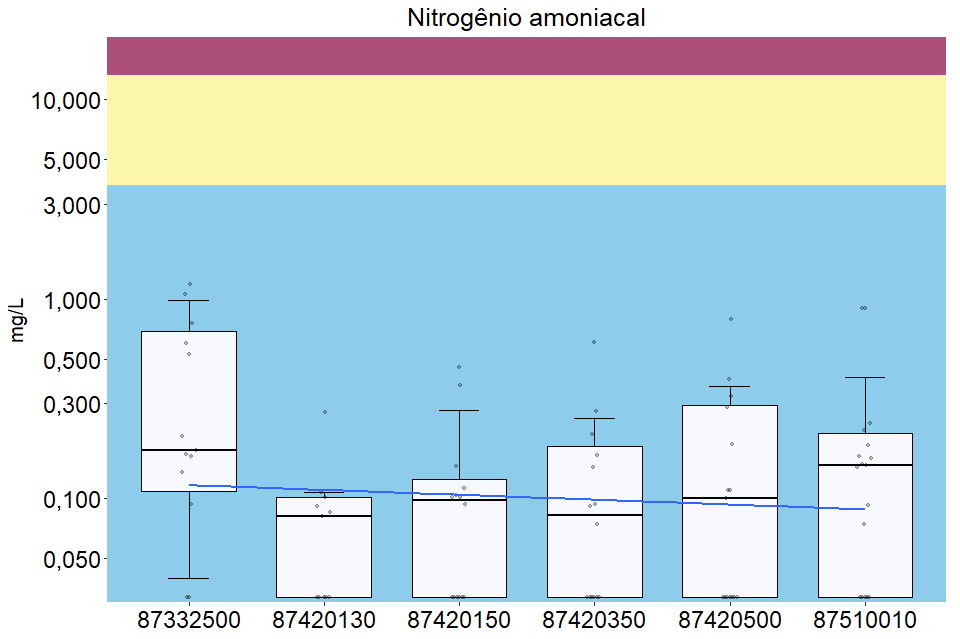

# Primeiro acesso {#sec-primeiro-acesso .unnumbered}

1.  Se é o seu primeiro acesso, clique na caixinha `Code` no canto superior direito para baixar o código no formato `.Rmd`, ou seja, RMarkdown.\
2.  Abra o R\
3.  Clique em File -\> Open file -\> e selecione esse arquivo `.Rmd` que você baixou.

Na primeira vez em que for rodar os códigos aqui no R, será solicitado que instale pacotes. Quando aparecerem caixas de diálogo, clique em **`Yes`**. Pode demorar um pouco esse processo. Para ter uma melhor visualização desse tutorial pressione as teclas `Ctrl+Shift+K` ou clique no botão `Knit` acima.

Sempre que quiser renderizar o código novamente use esse comando, ou caso esteja com um gráfico aberto e queira voltar a ver em formato `.html`, clique em Viewer na janela inferior direita.


# Comandos mais utilizados {#sec-comandos-mais-utilizados}

`Ctrl+Alt+R` -\> executa TODOS os códigos de uma vez só.

`Ctrl+Shift+K` -\> roda TODOS os códigos de uma vez só e renderiza a visualização em formatos `.html` ou `.pdf`.

`Ctrl+Enter` -\> executa um "parágrafo" de códigos.

`Alt+Enter` -\> executa o "parágrafo" de códigos mas sem mover o cursor.

`Ctrl+Shift+C` -\> para comentar ou *descomentar* um intervalo de linhas.

> As linhas de código que começam com `#` são **comentários**. Elas não impactam o resultado final do código.

`Ctrl+Alt+I` -\> cria um novo *code chunk*.

`Ctrl+I` -\> Indenta o código (ajusta a tabulação entre as linhas, facilita a leitura do código).

> A lista completa de atalhos pode ser conferida no menu superior Tools -\> Keyboard Shortcuts Help, ou através do atalho `Alt+Shift+K`.

# Passo-a-passo {#sec-passo-a-passo}

> **Importante**: vou deixar comentado os pedaços de código que necessitam de alteração obrigatória com a nomenclatura `alteracao_` seguido de um número.
>
> Para encontrar facilmente os locais que precisam ser ajustados, basta utilizar o comando `Ctrl+F` e procurar por `alteracao_` e o respectivo número listado abaixo.

1.  Renomear a planilha a ser importada pra facilitar a leitura.
    -   nesse caso renomeei a plan gerada pelo RSÁgua de `Dados_20221222143305.xls` para `plan_litoral_medio.xls`.
    -   você pode usar `Ctrl+F` e substituir todas as ocorrências de `plan_litoral_medio` para o nome que você deu à planilha.\
2.  Ajustar o caminho do arquivo. (**alteracao_1**)
    -   nesse exemplo estou importando diretamente da pasta de downloads do meu computador: `"C:/Users/Léo/Downloads/plan_litoral_medio.xls"`
    -   Futuramente quero implementar a integração com o [Google Sheets](#sec-ainda-precisa-ser-implementado).
3.  Verificar o intervalo de dados da planilha. As últimas 10 linhas costumam ser dos sumários, mas o R não entende isso.
    -   verificar até qual linha a coluna `Índice` tem valores registrados, neste caso o `Índice` vai até 98 (+1 linha de cabeçalho) = linha 99
    -   Alterar na parte de importação o intervalo para compreender somente os dados (**alteracao_2**)
    -   Estou tentando descobrir como economizar essa etapa.

# Pacotes necessários {#sec-pacotes-necessários .pacotes}


```r
pacman::p_load(readr, readxl, 
               rmarkdown, 
               # pillar, 
               dplyr, tidyverse, glue,
               # gapminder, 
               knitr, kableExtra,
               # gridExtra, gtsummary, 
               ggplot2,
               ggbeeswarm, GGally, 
               lubridate,
               ggtext,
               bookdown
               #googlesheets4
               )
```

# Importação dos dados {#sec-importação-dos-dados}


```r
plan_litoral_medio <- read_excel(
  "C:/Users/Léo/Downloads/plan_litoral_medio.xls", #alteracao_1
  sheet = "Dados_Ajustados", 
  col_types = c(
    "numeric", "text", "numeric", "numeric", "text", 
    "text", "text", "text", "text", "date", 
    "date", "text", "numeric", "numeric", 
    "numeric", "numeric", "numeric", 
    "numeric", "numeric", "numeric", 
    "numeric", "numeric", "numeric", 
    "numeric", "numeric", "numeric", 
    "numeric", "numeric", "numeric", 
    "numeric", "numeric", "numeric", 
    "numeric", "numeric", "numeric", 
    "numeric", "numeric", "numeric", 
    "numeric", "numeric", "numeric", 
    "numeric", "numeric", "numeric", 
    "numeric", "numeric", "numeric", 
    "numeric", "numeric", "numeric", 
    "numeric"),
  range = "A1:AY99", #alteracao_2
  trim_ws = TRUE
) %>% 
  janitor::clean_names() %>% 
  rename(
    e_coli = escherichia_coli,
    dbo = demanda_bioquimica_de_oxigenio,
    mercurio = mercurio_em_micrograma_por_litro_ug_l
  ) %>% 
  mutate(
    municipio = str_to_title(municipio),
    data_coleta = ymd(data_coleta),
    ano_coleta = year(data_coleta),
  ) %>%
  dplyr::select( #reordenando as colunas
    c(1:10),
    ano_coleta,
    everything()
  )
```

# Sumários estatísticos {#sec-sumários-estatísticos}


```r
sumario <- plan_litoral_medio %>%
  dplyr::select(cod_estacao, oxigenio_dissolvido, ano_coleta) %>%
  filter(ano_coleta > "2013" &
           ano_coleta <= "2025") %>%
  group_by(cod_estacao) %>%
  summarize(
    min =
      min(oxigenio_dissolvido,
          na.rm = TRUE),
    q1 =
      quantile(oxigenio_dissolvido, 0.25,
               na.rm = TRUE),
    median =
      median(oxigenio_dissolvido,
             na.rm = TRUE),
    mean =
      mean(oxigenio_dissolvido,
           na.rm= TRUE),
    q3 =
      quantile(oxigenio_dissolvido, 0.75,
               na.rm = TRUE),
    max =
      max(oxigenio_dissolvido,
          na.rm = TRUE))

sumario
```

<details><summary>output</summary>

```
## # A tibble: 6 x 7
##   cod_estacao   min    q1 median  mean    q3   max
##   <chr>       <dbl> <dbl>  <dbl> <dbl> <dbl> <dbl>
## 1 87332500     0     3.5    4.94  4.75  6.57  9.23
## 2 87420130     8.14  8.73   9.06  9.15  9.52 10.6 
## 3 87420150     6.7   8.21   8.41  8.49  8.63  9.83
## 4 87420350     5.93  7.04   8.34  8.07  8.99  9.64
## 5 87420500     4.65  6.87   7.25  7.50  8.61 11.0 
## 6 87510010     2.32  4.23   5.9   5.53  6.71  8.24
```


</details>

## Visualização da estrutura de dados da planilha {#sec-visualização-da-estrutura-de-dados-da-planilha}

Conferir se o tipo dos dados está correto, data em formato de data (date/dttm), código da estação como character (chr), valor medido dos parâmetros como double (dbl).


```r
glimpse(plan_litoral_medio)
```

<details><summary>output</summary>

```
## Rows: 98
## Columns: 52
## $ indice                      <dbl> 1, 2, 3, 4, 5, 6, 7, 8, 9, 10, 11, 12, 13,~
## $ cod_estacao                 <chr> "87332500", "87332500", "87332500", "87332~
## $ latitude                    <dbl> -29.91447, -29.91447, -29.91447, -29.91447~
## $ longitude                   <dbl> -50.31819, -50.31819, -50.31819, -50.31819~
## $ bacia_hidrografica          <chr> "Litoral Médio", "Litoral Médio", "Litoral~
## $ recurso_hidrico             <chr> "Lagoa dos Barros", "Lagoa dos Barros", "L~
## $ regiao                      <chr> "Litoral", "Litoral", "Litoral", "Litoral"~
## $ municipio                   <chr> "Osorio", "Osorio", "Osorio", "Osorio", "O~
## $ ambiente                    <chr> "Lêntico", "Lêntico", "Lêntico", "Lêntico"~
## $ data_coleta                 <date> 2016-06-29, 2016-09-26, 2016-12-14, 2017-~
## $ ano_coleta                  <dbl> 2016, 2016, 2016, 2017, 2017, 2017, 2017, ~
## $ hora_coleta                 <dttm> 2022-12-22 10:50:00, 2022-12-22 11:05:00,~
## $ chuva_24h                   <chr> "AUSENTE", "AUSENTE", "AUSENTE", "AUSENTE"~
## $ alcalinidade                <dbl> 35.0, 11.0, 7.7, 42.5, 22.1, 14.9, 19.4, 3~
## $ aluminio                    <dbl> NA, NA, NA, NA, NA, NA, NA, 0.0015, 0.0120~
## $ cadmio                      <dbl> NA, NA, NA, NA, 0.003, 0.003, 0.001, 0.001~
## $ chumbo                      <dbl> NA, NA, NA, NA, NA, NA, NA, 0.002, 0.016, ~
## $ cloreto                     <dbl> 27.80, 10.10, 9.60, 14.30, 10.10, 8.60, 8.~
## $ clorofila_a                 <dbl> NA, 2.19, 7.64, 40.10, 5.53, 3.56, 2.67, 1~
## $ cobre                       <dbl> NA, NA, NA, NA, 0.0040, 0.0020, 0.0030, 0.~
## $ coliformes_termotolerantes  <dbl> NA, NA, NA, NA, NA, NA, NA, NA, NA, NA, NA~
## $ coliformes_totais           <dbl> NA, NA, NA, NA, NA, NA, NA, NA, NA, NA, NA~
## $ condutividade               <dbl> 123.3, 81.0, 66.6, 139.1, 65.4, 69.0, 75.6~
## $ cromo_total                 <dbl> NA, NA, NA, NA, NA, NA, NA, 0.002, 0.009, ~
## $ dbo                         <dbl> 3, 1, 2, 4, 2, 2, 2, 4, 4, 1, 3, 3, 1, 2, ~
## $ demanda_quimica_de_oxigenio <dbl> 31, 15, 27, 24, 14, 17, 32, 40, 38, 23, 22~
## $ e_coli                      <dbl> 173.1, 28.8, 122.3, 770.1, 49.6, 34.7, 344~
## $ ferro                       <dbl> NA, NA, NA, NA, 3.120, 3.550, 1.940, 2.960~
## $ fitoplancton_cianobacterias <dbl> 171, 47, 1368, 129, 438, 68, 242, 2901, 18~
## $ fosfato_orto                <dbl> 0.071, 0.101, 0.089, 0.184, 0.109, 0.118, ~
## $ fosforo_total               <dbl> 0.105, 0.202, 0.220, 0.233, 0.113, 0.184, ~
## $ manganes                    <dbl> NA, NA, NA, NA, 0.051, 0.045, 0.066, 0.112~
## $ mercurio                    <dbl> NA, NA, NA, NA, NA, NA, NA, NA, NA, NA, NA~
## $ niquel                      <dbl> NA, NA, NA, NA, 0.0055, 0.0140, 0.0055, 0.~
## $ nitrato                     <dbl> NA, NA, 0.15, NA, NA, NA, NA, NA, NA, NA, ~
## $ nitrogenio_amoniacal        <dbl> 0.032, 0.135, 0.530, 0.603, 0.174, 0.163, ~
## $ nitrogenio_organico         <dbl> NA, NA, NA, NA, NA, NA, NA, NA, NA, NA, NA~
## $ nitrogenio_total_kjeldahl   <dbl> NA, 0.910, 1.350, 0.684, 1.120, NA, 1.907,~
## $ oxigenio_dissolvido         <dbl> 5.11, 6.39, 6.77, 3.25, 7.63, 7.50, 3.56, ~
## $ ph                          <dbl> 6.48, 7.10, 6.21, 6.67, 6.73, 6.71, 6.27, ~
## $ profundidade_coleta         <dbl> 0.88, 0.20, 0.20, 0.20, 0.20, 0.20, 0.20, ~
## $ profundidade_total          <dbl> 2.40, 2.75, 2.75, 1.75, 2.15, 2.75, 3.00, ~
## $ salinidade                  <dbl> NA, 0.04, NA, 0.07, 0.03, 0.03, 0.03, 0.07~
## $ solidos_dissolvidos_totais  <dbl> 100, 74, 123, 100, 87, 57, 86, 152, 20, 11~
## $ solidos_suspensos_totais    <dbl> 5.0, 15.0, 5.0, 13.0, 5.0, 21.0, 11.0, 15.~
## $ solidos_totais              <dbl> NA, NA, NA, NA, NA, NA, NA, NA, NA, NA, NA~
## $ temperatura_da_agua         <dbl> 14.40, 17.43, 24.89, 23.30, 16.01, 20.36, ~
## $ temperatura_do_ar           <dbl> 13.00, 16.00, 19.50, 23.00, 17.16, 21.30, ~
## $ transparencia_da_agua       <dbl> 0.4, 0.2, 0.3, 0.3, 0.3, 0.2, 0.3, 0.3, 0.~
## $ turbidez                    <dbl> 23.00, 12.00, 49.10, 23.50, 15.50, 79.60, ~
## $ vazao_recurso_hidrico       <dbl> NA, NA, NA, NA, NA, NA, NA, NA, NA, NA, NA~
## $ zinco                       <dbl> NA, NA, NA, NA, 0.0150, 0.0240, 0.0190, 0.~
```


</details>

```r
# str(plan_litoral_medio) #outra maneira de visualizar a eSTRutura 
```

<div data-pagedtable="false">
  <script data-pagedtable-source type="application/json">
{"columns":[{"label":["indice"],"name":[1],"type":["dbl"],"align":["right"]},{"label":["cod_estacao"],"name":[2],"type":["chr"],"align":["left"]},{"label":["latitude"],"name":[3],"type":["dbl"],"align":["right"]},{"label":["longitude"],"name":[4],"type":["dbl"],"align":["right"]},{"label":["bacia_hidrografica"],"name":[5],"type":["chr"],"align":["left"]},{"label":["recurso_hidrico"],"name":[6],"type":["chr"],"align":["left"]},{"label":["regiao"],"name":[7],"type":["chr"],"align":["left"]},{"label":["municipio"],"name":[8],"type":["chr"],"align":["left"]},{"label":["ambiente"],"name":[9],"type":["chr"],"align":["left"]},{"label":["data_coleta"],"name":[10],"type":["date"],"align":["right"]},{"label":["ano_coleta"],"name":[11],"type":["dbl"],"align":["right"]},{"label":["hora_coleta"],"name":[12],"type":["dttm"],"align":["right"]},{"label":["chuva_24h"],"name":[13],"type":["chr"],"align":["left"]},{"label":["alcalinidade"],"name":[14],"type":["dbl"],"align":["right"]},{"label":["aluminio"],"name":[15],"type":["dbl"],"align":["right"]},{"label":["cadmio"],"name":[16],"type":["dbl"],"align":["right"]},{"label":["chumbo"],"name":[17],"type":["dbl"],"align":["right"]},{"label":["cloreto"],"name":[18],"type":["dbl"],"align":["right"]},{"label":["clorofila_a"],"name":[19],"type":["dbl"],"align":["right"]},{"label":["cobre"],"name":[20],"type":["dbl"],"align":["right"]},{"label":["coliformes_termotolerantes"],"name":[21],"type":["dbl"],"align":["right"]},{"label":["coliformes_totais"],"name":[22],"type":["dbl"],"align":["right"]},{"label":["condutividade"],"name":[23],"type":["dbl"],"align":["right"]},{"label":["cromo_total"],"name":[24],"type":["dbl"],"align":["right"]},{"label":["dbo"],"name":[25],"type":["dbl"],"align":["right"]},{"label":["demanda_quimica_de_oxigenio"],"name":[26],"type":["dbl"],"align":["right"]},{"label":["e_coli"],"name":[27],"type":["dbl"],"align":["right"]},{"label":["ferro"],"name":[28],"type":["dbl"],"align":["right"]},{"label":["fitoplancton_cianobacterias"],"name":[29],"type":["dbl"],"align":["right"]},{"label":["fosfato_orto"],"name":[30],"type":["dbl"],"align":["right"]},{"label":["fosforo_total"],"name":[31],"type":["dbl"],"align":["right"]},{"label":["manganes"],"name":[32],"type":["dbl"],"align":["right"]},{"label":["mercurio"],"name":[33],"type":["dbl"],"align":["right"]},{"label":["niquel"],"name":[34],"type":["dbl"],"align":["right"]},{"label":["nitrato"],"name":[35],"type":["dbl"],"align":["right"]},{"label":["nitrogenio_amoniacal"],"name":[36],"type":["dbl"],"align":["right"]},{"label":["nitrogenio_organico"],"name":[37],"type":["dbl"],"align":["right"]},{"label":["nitrogenio_total_kjeldahl"],"name":[38],"type":["dbl"],"align":["right"]},{"label":["oxigenio_dissolvido"],"name":[39],"type":["dbl"],"align":["right"]},{"label":["ph"],"name":[40],"type":["dbl"],"align":["right"]},{"label":["profundidade_coleta"],"name":[41],"type":["dbl"],"align":["right"]},{"label":["profundidade_total"],"name":[42],"type":["dbl"],"align":["right"]},{"label":["salinidade"],"name":[43],"type":["dbl"],"align":["right"]},{"label":["solidos_dissolvidos_totais"],"name":[44],"type":["dbl"],"align":["right"]},{"label":["solidos_suspensos_totais"],"name":[45],"type":["dbl"],"align":["right"]},{"label":["solidos_totais"],"name":[46],"type":["dbl"],"align":["right"]},{"label":["temperatura_da_agua"],"name":[47],"type":["dbl"],"align":["right"]},{"label":["temperatura_do_ar"],"name":[48],"type":["dbl"],"align":["right"]},{"label":["transparencia_da_agua"],"name":[49],"type":["dbl"],"align":["right"]},{"label":["turbidez"],"name":[50],"type":["dbl"],"align":["right"]},{"label":["vazao_recurso_hidrico"],"name":[51],"type":["dbl"],"align":["right"]},{"label":["zinco"],"name":[52],"type":["dbl"],"align":["right"]}],"data":[{"1":"1","2":"87332500","3":"-29.91447","4":"-50.31819","5":"Litoral Médio","6":"Lagoa dos Barros","7":"Litoral","8":"Osorio","9":"Lêntico","10":"2016-06-29","11":"2016","12":"2022-12-22 10:50:00","13":"AUSENTE","14":"35.0","15":"NA","16":"NA","17":"NA","18":"27.80","19":"NA","20":"NA","21":"NA","22":"NA","23":"123.30","24":"NA","25":"3","26":"31","27":"173.1","28":"NA","29":"171","30":"0.071","31":"0.105","32":"NA","33":"NA","34":"NA","35":"NA","36":"0.0320","37":"NA","38":"NA","39":"5.11","40":"6.48","41":"0.88","42":"2.40","43":"NA","44":"100","45":"5.0","46":"NA","47":"14.40","48":"13.00","49":"0.40","50":"23.00","51":"NA","52":"NA"},{"1":"2","2":"87332500","3":"-29.91447","4":"-50.31819","5":"Litoral Médio","6":"Lagoa dos Barros","7":"Litoral","8":"Osorio","9":"Lêntico","10":"2016-09-26","11":"2016","12":"2022-12-22 11:05:00","13":"AUSENTE","14":"11.0","15":"NA","16":"NA","17":"NA","18":"10.10","19":"2.19","20":"NA","21":"NA","22":"NA","23":"81.00","24":"NA","25":"1","26":"15","27":"28.8","28":"NA","29":"47","30":"0.101","31":"0.202","32":"NA","33":"NA","34":"NA","35":"NA","36":"0.1350","37":"NA","38":"0.910","39":"6.39","40":"7.10","41":"0.20","42":"2.75","43":"0.04","44":"74","45":"15.0","46":"NA","47":"17.43","48":"16.00","49":"0.20","50":"12.00","51":"NA","52":"NA"},{"1":"3","2":"87332500","3":"-29.91447","4":"-50.31819","5":"Litoral Médio","6":"Lagoa dos Barros","7":"Litoral","8":"Osorio","9":"Lêntico","10":"2016-12-14","11":"2016","12":"2022-12-22 10:21:00","13":"AUSENTE","14":"7.7","15":"NA","16":"NA","17":"NA","18":"9.60","19":"7.64","20":"NA","21":"NA","22":"NA","23":"66.60","24":"NA","25":"2","26":"27","27":"122.3","28":"NA","29":"1368","30":"0.089","31":"0.220","32":"NA","33":"NA","34":"NA","35":"0.15","36":"0.5300","37":"NA","38":"1.350","39":"6.77","40":"6.21","41":"0.20","42":"2.75","43":"NA","44":"123","45":"5.0","46":"NA","47":"24.89","48":"19.50","49":"0.30","50":"49.10","51":"NA","52":"NA"},{"1":"4","2":"87332500","3":"-29.91447","4":"-50.31819","5":"Litoral Médio","6":"Lagoa dos Barros","7":"Litoral","8":"Osorio","9":"Lêntico","10":"2017-03-27","11":"2017","12":"2022-12-22 11:00:00","13":"AUSENTE","14":"42.5","15":"NA","16":"NA","17":"NA","18":"14.30","19":"40.10","20":"NA","21":"NA","22":"NA","23":"139.10","24":"NA","25":"4","26":"24","27":"770.1","28":"NA","29":"129","30":"0.184","31":"0.233","32":"NA","33":"NA","34":"NA","35":"NA","36":"0.6030","37":"NA","38":"0.684","39":"3.25","40":"6.67","41":"0.20","42":"1.75","43":"0.07","44":"100","45":"13.0","46":"NA","47":"23.30","48":"23.00","49":"0.30","50":"23.50","51":"NA","52":"NA"},{"1":"5","2":"87332500","3":"-29.91447","4":"-50.31819","5":"Litoral Médio","6":"Lagoa dos Barros","7":"Litoral","8":"Osorio","9":"Lêntico","10":"2017-06-26","11":"2017","12":"2022-12-22 10:50:00","13":"AUSENTE","14":"22.1","15":"NA","16":"0.003","17":"NA","18":"10.10","19":"5.53","20":"0.0040","21":"NA","22":"NA","23":"65.40","24":"NA","25":"2","26":"14","27":"49.6","28":"3.1200","29":"438","30":"0.109","31":"0.113","32":"0.051","33":"NA","34":"0.0055","35":"NA","36":"0.1740","37":"NA","38":"1.120","39":"7.63","40":"6.73","41":"0.20","42":"2.15","43":"0.03","44":"87","45":"5.0","46":"NA","47":"16.01","48":"17.16","49":"0.30","50":"15.50","51":"NA","52":"0.0150"},{"1":"6","2":"87332500","3":"-29.91447","4":"-50.31819","5":"Litoral Médio","6":"Lagoa dos Barros","7":"Litoral","8":"Osorio","9":"Lêntico","10":"2017-09-25","11":"2017","12":"2022-12-22 10:55:00","13":"AUSENTE","14":"14.9","15":"NA","16":"0.003","17":"NA","18":"8.60","19":"3.56","20":"0.0020","21":"NA","22":"NA","23":"69.00","24":"NA","25":"2","26":"17","27":"34.7","28":"3.5500","29":"68","30":"0.118","31":"0.184","32":"0.045","33":"NA","34":"0.0140","35":"NA","36":"0.1630","37":"NA","38":"NA","39":"7.50","40":"6.71","41":"0.20","42":"2.75","43":"0.03","44":"57","45":"21.0","46":"NA","47":"20.36","48":"21.30","49":"0.20","50":"79.60","51":"NA","52":"0.0240"},{"1":"7","2":"87332500","3":"-29.91447","4":"-50.31819","5":"Litoral Médio","6":"Lagoa dos Barros","7":"Litoral","8":"Osorio","9":"Lêntico","10":"2017-12-26","11":"2017","12":"2022-12-22 11:30:00","13":"AUSENTE","14":"19.4","15":"NA","16":"0.001","17":"NA","18":"8.80","19":"2.67","20":"0.0030","21":"NA","22":"NA","23":"75.60","24":"NA","25":"2","26":"32","27":"344.2","28":"1.9400","29":"242","30":"0.092","31":"0.171","32":"0.066","33":"NA","34":"0.0055","35":"NA","36":"NA","37":"NA","38":"1.907","39":"3.56","40":"6.27","41":"0.20","42":"3.00","43":"0.03","44":"86","45":"11.0","46":"NA","47":"22.41","48":"22.40","49":"0.30","50":"35.93","51":"NA","52":"0.0190"},{"1":"8","2":"87332500","3":"-29.91447","4":"-50.31819","5":"Litoral Médio","6":"Lagoa dos Barros","7":"Litoral","8":"Osorio","9":"Lêntico","10":"2018-03-28","11":"2018","12":"2022-12-22 10:15:00","13":"AUSENTE","14":"39.8","15":"0.0015","16":"0.001","17":"0.002","18":"15.90","19":"1.84","20":"0.0070","21":"NA","22":"NA","23":"149.30","24":"0.002","25":"4","26":"40","27":"NA","28":"2.9600","29":"2901","30":"0.195","31":"0.263","32":"0.112","33":"NA","34":"0.0055","35":"NA","36":"1.1900","37":"NA","38":"1.620","39":"2.21","40":"6.34","41":"0.20","42":"1.50","43":"0.07","44":"152","45":"15.0","46":"NA","47":"22.25","48":"22.90","49":"0.30","50":"29.22","51":"NA","52":"0.0100"},{"1":"9","2":"87332500","3":"-29.91447","4":"-50.31819","5":"Litoral Médio","6":"Lagoa dos Barros","7":"Litoral","8":"Osorio","9":"Lêntico","10":"2018-06-25","11":"2018","12":"2022-12-22 11:20:00","13":"AUSENTE","14":"27.2","15":"0.0120","16":"0.001","17":"0.016","18":"9.80","19":"0.50","20":"0.0050","21":"NA","22":"NA","23":"87.70","24":"0.009","25":"4","26":"38","27":"NA","28":"5.4000","29":"1812","30":"0.196","31":"0.197","32":"0.105","33":"NA","34":"0.0020","35":"NA","36":"0.7580","37":"NA","38":"1.960","39":"6.57","40":"6.40","41":"0.20","42":"2.10","43":"0.04","44":"20","45":"106.0","46":"NA","47":"13.83","48":"12.92","49":"0.20","50":"125.70","51":"NA","52":"0.0280"},{"1":"10","2":"87332500","3":"-29.91447","4":"-50.31819","5":"Litoral Médio","6":"Lagoa dos Barros","7":"Litoral","8":"Osorio","9":"Lêntico","10":"2018-09-24","11":"2018","12":"2022-12-22 10:14:00","13":"AUSENTE","14":"23.9","15":"NA","16":"0.003","17":"NA","18":"9.80","19":"6.02","20":"0.0020","21":"NA","22":"NA","23":"83.70","24":"NA","25":"1","26":"23","27":"770.1","28":"3.3500","29":"267","30":"0.041","31":"1.055","32":"0.047","33":"NA","34":"0.0055","35":"NA","36":"0.1660","37":"NA","38":"1.260","39":"4.94","40":"6.49","41":"0.20","42":"3.00","43":"0.04","44":"115","45":"13.0","46":"NA","47":"20.54","48":"20.51","49":"0.60","50":"41.60","51":"NA","52":"0.0090"},{"1":"11","2":"87332500","3":"-29.91447","4":"-50.31819","5":"Litoral Médio","6":"Lagoa dos Barros","7":"Litoral","8":"Osorio","9":"Lêntico","10":"2018-12-26","11":"2018","12":"2022-12-22 11:19:00","13":"AUSENTE","14":"40.2","15":"NA","16":"0.003","17":"NA","18":"12.30","19":"14.89","20":"0.0020","21":"NA","22":"NA","23":"138.20","24":"NA","25":"3","26":"22","27":"62.0","28":"2.6700","29":"95848","30":"0.105","31":"0.158","32":"0.087","33":"NA","34":"0.0055","35":"NA","36":"NA","37":"NA","38":"NA","39":"4.46","40":"7.05","41":"0.20","42":"2.40","43":"0.06","44":"81","45":"7.0","46":"NA","47":"24.30","48":"26.05","49":"0.50","50":"17.25","51":"NA","52":"0.1210"},{"1":"12","2":"87332500","3":"-29.91447","4":"-50.31819","5":"Litoral Médio","6":"Lagoa dos Barros","7":"Litoral","8":"Osorio","9":"Lêntico","10":"2019-03-25","11":"2019","12":"2022-12-22 10:49:00","13":"AUSENTE","14":"46.0","15":"NA","16":"0.003","17":"NA","18":"15.00","19":"8.44","20":"0.0020","21":"NA","22":"NA","23":"147.20","24":"NA","25":"3","26":"20","27":"NA","28":"3.2100","29":"717","30":"0.207","31":"0.237","32":"0.161","33":"NA","34":"0.0055","35":"NA","36":"1.0500","37":"NA","38":"1.580","39":"3.50","40":"6.71","41":"0.20","42":"1.50","43":"0.07","44":"119","45":"31.0","46":"NA","47":"22.61","48":"22.05","49":"0.20","50":"41.31","51":"NA","52":"0.0025"},{"1":"13","2":"87332500","3":"-29.91447","4":"-50.31819","5":"Litoral Médio","6":"Lagoa dos Barros","7":"Litoral","8":"Osorio","9":"Lêntico","10":"2019-06-25","11":"2019","12":"2022-12-22 11:07:00","13":"AUSENTE","14":"21.4","15":"NA","16":"0.001","17":"0.002","18":"10.60","19":"11.36","20":"0.0015","21":"NA","22":"NA","23":"97.50","24":"0.004","25":"1","26":"24","27":"NA","28":"1.7500","29":"153","30":"0.048","31":"0.077","32":"0.056","33":"NA","34":"0.0020","35":"NA","36":"0.2060","37":"NA","38":"0.850","39":"4.98","40":"6.57","41":"0.20","42":"2.45","43":"0.05","44":"61","45":"13.0","46":"NA","47":"18.77","48":"26.44","49":"0.60","50":"17.35","51":"NA","52":"0.0130"},{"1":"14","2":"87332500","3":"-29.91447","4":"-50.31819","5":"Litoral Médio","6":"Lagoa dos Barros","7":"Litoral","8":"Osorio","9":"Lêntico","10":"2019-09-24","11":"2019","12":"2022-12-22 11:17:00","13":"AUSENTE","14":"13.3","15":"NA","16":"0.003","17":"NA","18":"8.40","19":"7.03","20":"0.0020","21":"NA","22":"NA","23":"144.60","24":"NA","25":"2","26":"13","27":"10.2","28":"2.0500","29":"4410","30":"0.026","31":"0.039","32":"0.018","33":"NA","34":"0.0055","35":"NA","36":"0.0940","37":"NA","38":"0.805","39":"9.23","40":"7.05","41":"0.20","42":"2.50","43":"0.07","44":"81","45":"3.5","46":"NA","47":"20.23","48":"21.65","49":"0.40","50":"22.75","51":"NA","52":"0.0150"},{"1":"15","2":"87332500","3":"-29.91447","4":"-50.31819","5":"Litoral Médio","6":"Lagoa dos Barros","7":"Litoral","8":"Osorio","9":"Lêntico","10":"2019-12-18","11":"2019","12":"2022-12-22 11:36:00","13":"AUSENTE","14":"37.2","15":"NA","16":"NA","17":"NA","18":"12.50","19":"8.22","20":"NA","21":"NA","22":"NA","23":"106.00","24":"NA","25":"1","26":"99","27":"770.1","28":"NA","29":"2499","30":"0.106","31":"0.172","32":"NA","33":"NA","34":"NA","35":"NA","36":"0.0320","37":"NA","38":"0.183","39":"0.00","40":"5.50","41":"0.20","42":"2.10","43":"0.05","44":"101","45":"13.0","46":"NA","47":"22.70","48":"26.33","49":"0.50","50":"12.19","51":"NA","52":"NA"},{"1":"16","2":"87332500","3":"-29.91447","4":"-50.31819","5":"Litoral Médio","6":"Lagoa dos Barros","7":"Litoral","8":"Osorio","9":"Lêntico","10":"2020-03-18","11":"2020","12":"2022-12-22 10:54:00","13":"MÉDIA","14":"35.2","15":"NA","16":"NA","17":"NA","18":"14.30","19":"NA","20":"NA","21":"NA","22":"NA","23":"130.90","24":"NA","25":"6","26":"NA","27":"NA","28":"NA","29":"31084","30":"0.201","31":"NA","32":"NA","33":"NA","34":"NA","35":"NA","36":"NA","37":"NA","38":"NA","39":"0.64","40":"5.73","41":"0.20","42":"0.80","43":"0.06","44":"105","45":"10.0","46":"NA","47":"22.61","48":"23.06","49":"0.40","50":"18.72","51":"NA","52":"NA"},{"1":"17","2":"87332500","3":"-29.91447","4":"-50.31819","5":"Litoral Médio","6":"Lagoa dos Barros","7":"Litoral","8":"Osorio","9":"Lêntico","10":"2022-08-22","11":"2022","12":"2022-12-22 10:51:00","13":"AUSENTE","14":"32.0","15":"NA","16":"NA","17":"NA","18":"12.79","19":"0.19","20":"NA","21":"NA","22":"NA","23":"103.00","24":"NA","25":"2","26":"18","27":"1553.1","28":"NA","29":"57","30":"0.120","31":"0.141","32":"NA","33":"NA","34":"NA","35":"NA","36":"NA","37":"NA","38":"NA","39":"4.08","40":"6.29","41":"0.20","42":"1.20","43":"0.06","44":"129","45":"3.5","46":"NA","47":"14.46","48":"16.33","49":"0.40","50":"19.88","51":"NA","52":"NA"},{"1":"18","2":"87420130","3":"-30.79499","4":"-50.60429","5":"Litoral Médio","6":"Lagoa da Figueira","7":"Litoral","8":"Mostardas","9":"Lêntico","10":"2017-06-27","11":"2017","12":"2022-12-22 14:18:00","13":"AUSENTE","14":"3.0","15":"NA","16":"0.003","17":"NA","18":"21.10","19":"NA","20":"0.0020","21":"NA","22":"1413.6","23":"69.00","24":"NA","25":"1","26":"11","27":"7.5","28":"0.2010","29":"814","30":"0.012","31":"0.016","32":"0.012","33":"NA","34":"0.0055","35":"NA","36":"0.0320","37":"NA","38":"0.192","39":"9.72","40":"6.88","41":"0.20","42":"10.20","43":"0.03","44":"19","45":"5.0","46":"NA","47":"16.72","48":"21.27","49":"2.90","50":"0.50","51":"NA","52":"0.0025"},{"1":"19","2":"87420130","3":"-30.79499","4":"-50.60429","5":"Litoral Médio","6":"Lagoa da Figueira","7":"Litoral","8":"Mostardas","9":"Lêntico","10":"2017-09-26","11":"2017","12":"2022-12-22 13:30:00","13":"AUSENTE","14":"6.7","15":"NA","16":"0.003","17":"NA","18":"22.10","19":"7.32","20":"0.0020","21":"NA","22":"1732.9","23":"101.00","24":"NA","25":"1","26":"14","27":"0.5","28":"0.1420","29":"4000","30":"0.013","31":"0.027","32":"0.017","33":"NA","34":"0.0055","35":"NA","36":"0.0320","37":"NA","38":"0.081","39":"8.80","40":"6.84","41":"0.20","42":"3.50","43":"0.05","44":"43","45":"5.0","46":"NA","47":"22.50","48":"26.60","49":"2.20","50":"3.04","51":"NA","52":"0.0480"},{"1":"20","2":"87420130","3":"-30.79499","4":"-50.60429","5":"Litoral Médio","6":"Lagoa da Figueira","7":"Litoral","8":"Mostardas","9":"Lêntico","10":"2017-12-27","11":"2017","12":"2022-12-22 13:45:00","13":"AUSENTE","14":"6.2","15":"NA","16":"0.001","17":"NA","18":"21.30","19":"5.00","20":"0.0015","21":"NA","22":"NA","23":"103.00","24":"NA","25":"2","26":"NA","27":"0.5","28":"0.1210","29":"2207","30":"0.070","31":"0.071","32":"0.034","33":"NA","34":"0.0055","35":"NA","36":"0.0850","37":"NA","38":"0.960","39":"8.52","40":"7.21","41":"0.20","42":"8.50","43":"0.05","44":"879","45":"5.0","46":"NA","47":"25.53","48":"25.95","49":"2.00","50":"1.69","51":"NA","52":"0.0310"},{"1":"21","2":"87420130","3":"-30.79499","4":"-50.60429","5":"Litoral Médio","6":"Lagoa da Figueira","7":"Litoral","8":"Mostardas","9":"Lêntico","10":"2018-03-27","11":"2018","12":"2022-12-22 13:50:00","13":"AUSENTE","14":"8.4","15":"0.0015","16":"0.001","17":"0.002","18":"25.60","19":"22.77","20":"0.0015","21":"NA","22":"NA","23":"112.00","24":"0.002","25":"2","26":"32","27":"2.0","28":"0.3190","29":"265286","30":"0.028","31":"0.051","32":"0.052","33":"NA","34":"0.0055","35":"NA","36":"0.1010","37":"NA","38":"0.954","39":"8.86","40":"7.58","41":"0.20","42":"7.50","43":"0.05","44":"102","45":"3.5","46":"NA","47":"23.19","48":"23.36","49":"0.90","50":"5.49","51":"NA","52":"0.0060"},{"1":"22","2":"87420130","3":"-30.79499","4":"-50.60429","5":"Litoral Médio","6":"Lagoa da Figueira","7":"Litoral","8":"Mostardas","9":"Lêntico","10":"2018-06-26","11":"2018","12":"2022-12-22 12:50:00","13":"AUSENTE","14":"7.9","15":"0.0015","16":"0.001","17":"0.002","18":"23.90","19":"22.42","20":"0.0020","21":"NA","22":"NA","23":"103.40","24":"0.002","25":"1","26":"14","27":"5.2","28":"0.1110","29":"46424","30":"0.014","31":"0.035","32":"0.019","33":"NA","34":"0.0020","35":"NA","36":"0.0320","37":"NA","38":"0.872","39":"10.65","40":"7.25","41":"0.20","42":"8.40","43":"0.05","44":"46","45":"3.5","46":"NA","47":"14.50","48":"14.05","49":"1.50","50":"3.10","51":"NA","52":"0.0025"},{"1":"23","2":"87420130","3":"-30.79499","4":"-50.60429","5":"Litoral Médio","6":"Lagoa da Figueira","7":"Litoral","8":"Mostardas","9":"Lêntico","10":"2018-09-25","11":"2018","12":"2022-12-22 14:16:00","13":"AUSENTE","14":"6.8","15":"NA","16":"0.003","17":"NA","18":"22.70","19":"10.46","20":"0.0020","21":"NA","22":"NA","23":"103.50","24":"NA","25":"1","26":"16","27":"10.8","28":"0.3670","29":"18","30":"0.005","31":"0.026","32":"0.034","33":"NA","34":"0.0055","35":"NA","36":"0.1080","37":"NA","38":"0.653","39":"9.37","40":"7.08","41":"0.20","42":"1.00","43":"0.05","44":"62","45":"3.5","46":"NA","47":"20.11","48":"18.82","49":"0.90","50":"9.37","51":"NA","52":"0.0025"},{"1":"24","2":"87420130","3":"-30.79499","4":"-50.60429","5":"Litoral Médio","6":"Lagoa da Figueira","7":"Litoral","8":"Mostardas","9":"Lêntico","10":"2018-12-27","11":"2018","12":"2022-12-22 12:45:00","13":"AUSENTE","14":"38.6","15":"NA","16":"0.003","17":"NA","18":"21.50","19":"3.68","20":"0.0020","21":"NA","22":"NA","23":"115.10","24":"NA","25":"3","26":"13","27":"1.0","28":"0.2470","29":"511","30":"0.014","31":"0.035","32":"0.021","33":"NA","34":"0.0055","35":"NA","36":"0.0320","37":"NA","38":"0.583","39":"8.14","40":"7.17","41":"0.20","42":"9.90","43":"0.05","44":"34","45":"3.5","46":"NA","47":"25.21","48":"25.39","49":"1.70","50":"2.53","51":"NA","52":"0.0025"},{"1":"25","2":"87420130","3":"-30.79499","4":"-50.60429","5":"Litoral Médio","6":"Lagoa da Figueira","7":"Litoral","8":"Mostardas","9":"Lêntico","10":"2019-03-26","11":"2019","12":"2022-12-22 12:58:00","13":"FRACA","14":"9.2","15":"NA","16":"0.003","17":"NA","18":"26.00","19":"4.58","20":"0.0020","21":"NA","22":"NA","23":"122.20","24":"NA","25":"1","26":"11","27":"1.0","28":"0.1350","29":"980","30":"0.005","31":"0.005","32":"0.028","33":"NA","34":"0.0055","35":"NA","36":"0.2710","37":"NA","38":"0.654","39":"8.37","40":"7.70","41":"0.20","42":"8.70","43":"0.06","44":"268","45":"3.5","46":"NA","47":"23.22","48":"22.14","49":"1.90","50":"0.05","51":"NA","52":"0.0670"},{"1":"26","2":"87420130","3":"-30.79499","4":"-50.60429","5":"Litoral Médio","6":"Lagoa da Figueira","7":"Litoral","8":"Mostardas","9":"Lêntico","10":"2019-06-26","11":"2019","12":"2022-12-22 12:56:00","13":"MÉDIA","14":"7.5","15":"NA","16":"0.001","17":"0.002","18":"41.30","19":"3.71","20":"0.0015","21":"NA","22":"NA","23":"116.60","24":"0.002","25":"1","26":"45","27":"30.5","28":"0.4550","29":"127","30":"0.005","31":"0.005","32":"0.016","33":"NA","34":"0.0020","35":"NA","36":"0.0910","37":"NA","38":"0.694","39":"9.05","40":"6.60","41":"0.20","42":"9.00","43":"0.05","44":"256","45":"3.5","46":"NA","47":"18.12","48":"13.58","49":"1.20","50":"4.02","51":"NA","52":"0.0015"},{"1":"27","2":"87420130","3":"-30.79499","4":"-50.60429","5":"Litoral Médio","6":"Lagoa da Figueira","7":"Litoral","8":"Mostardas","9":"Lêntico","10":"2019-09-25","11":"2019","12":"2022-12-22 13:10:00","13":"AUSENTE","14":"11.3","15":"NA","16":"0.003","17":"NA","18":"26.40","19":"4.65","20":"0.0020","21":"NA","22":"NA","23":"115.00","24":"NA","25":"2","26":"17","27":"2.0","28":"0.4980","29":"11052","30":"0.005","31":"0.026","32":"0.016","33":"NA","34":"0.0055","35":"NA","36":"0.0810","37":"NA","38":"0.712","39":"9.46","40":"6.54","41":"0.20","42":"7.00","43":"0.05","44":"114","45":"3.5","46":"NA","47":"18.90","48":"20.00","49":"1.10","50":"4.20","51":"NA","52":"0.0100"},{"1":"28","2":"87420130","3":"-30.79499","4":"-50.60429","5":"Litoral Médio","6":"Lagoa da Figueira","7":"Litoral","8":"Mostardas","9":"Lêntico","10":"2019-12-19","11":"2019","12":"2022-12-22 12:46:00","13":"AUSENTE","14":"5.1","15":"NA","16":"NA","17":"NA","18":"25.50","19":"4.75","20":"NA","21":"NA","22":"NA","23":"94.00","24":"NA","25":"1","26":"NA","27":"6.3","28":"NA","29":"1231","30":"0.005","31":"0.097","32":"NA","33":"NA","34":"NA","35":"NA","36":"0.0320","37":"NA","38":"0.366","39":"9.07","40":"6.67","41":"0.20","42":"1.00","43":"0.04","44":"280","45":"3.5","46":"NA","47":"26.31","48":"26.37","49":"1.00","50":"8.23","51":"NA","52":"NA"},{"1":"29","2":"87420130","3":"-30.79499","4":"-50.60429","5":"Litoral Médio","6":"Lagoa da Figueira","7":"Litoral","8":"Mostardas","9":"Lêntico","10":"2022-08-23","11":"2022","12":"2022-12-22 10:12:00","13":"AUSENTE","14":"9.8","15":"NA","16":"NA","17":"NA","18":"34.67","19":"12.60","20":"NA","21":"NA","22":"NA","23":"123.80","24":"NA","25":"3","26":"25","27":"18.7","28":"NA","29":"28676","30":"0.005","31":"0.014","32":"NA","33":"NA","34":"NA","35":"NA","36":"NA","37":"NA","38":"NA","39":"9.82","40":"7.14","41":"0.20","42":"0.90","43":"0.07","44":"121","45":"3.5","46":"NA","47":"16.46","48":"18.02","49":"0.90","50":"3.03","51":"NA","52":"NA"},{"1":"30","2":"87420150","3":"-30.95239","4":"-50.71111","5":"Litoral Médio","6":"Lagoa São Simão","7":"Litoral","8":"Mostardas","9":"Lêntico","10":"2016-06-30","11":"2016","12":"2022-12-22 12:05:00","13":"AUSENTE","14":"12.0","15":"NA","16":"NA","17":"NA","18":"30.40","19":"6.27","20":"NA","21":"NA","22":"NA","23":"101.70","24":"NA","25":"2","26":"19","27":"2.0","28":"NA","29":"4992","30":"0.010","31":"0.040","32":"NA","33":"NA","34":"NA","35":"NA","36":"0.0320","37":"NA","38":"NA","39":"9.83","40":"7.05","41":"0.20","42":"5.00","43":"NA","44":"49","45":"5.0","46":"NA","47":"13.96","48":"13.00","49":"0.70","50":"NA","51":"NA","52":"NA"},{"1":"31","2":"87420150","3":"-30.95239","4":"-50.71111","5":"Litoral Médio","6":"Lagoa São Simão","7":"Litoral","8":"Mostardas","9":"Lêntico","10":"2016-09-27","11":"2016","12":"2022-12-22 13:40:00","13":"AUSENTE","14":"5.0","15":"NA","16":"NA","17":"NA","18":"22.20","19":"0.00","20":"NA","21":"NA","22":"NA","23":"100.20","24":"NA","25":"1","26":"16","27":"3.1","28":"NA","29":"2815","30":"0.005","31":"0.075","32":"NA","33":"NA","34":"NA","35":"NA","36":"0.1040","37":"NA","38":"0.677","39":"8.36","40":"6.91","41":"0.20","42":"1.30","43":"0.05","44":"50","45":"5.0","46":"NA","47":"18.68","48":"18.00","49":"1.30","50":"2.00","51":"NA","52":"NA"},{"1":"32","2":"87420150","3":"-30.95239","4":"-50.71111","5":"Litoral Médio","6":"Lagoa São Simão","7":"Litoral","8":"Mostardas","9":"Lêntico","10":"2016-12-15","11":"2016","12":"2022-12-22 11:05:00","13":"AUSENTE","14":"3.8","15":"NA","16":"NA","17":"NA","18":"23.90","19":"8.52","20":"NA","21":"NA","22":"NA","23":"104.80","24":"NA","25":"3","26":"35","27":"1.0","28":"NA","29":"9385","30":"0.005","31":"0.090","32":"NA","33":"NA","34":"NA","35":"0.01","36":"0.4560","37":"NA","38":"1.790","39":"8.15","40":"7.24","41":"0.20","42":"1.60","43":"NA","44":"93","45":"5.0","46":"NA","47":"23.27","48":"19.30","49":"0.80","50":"4.00","51":"NA","52":"NA"},{"1":"33","2":"87420150","3":"-30.95239","4":"-50.71111","5":"Litoral Médio","6":"Lagoa São Simão","7":"Litoral","8":"Mostardas","9":"Lêntico","10":"2017-03-28","11":"2017","12":"2022-12-22 11:50:00","13":"AUSENTE","14":"5.2","15":"NA","16":"NA","17":"NA","18":"24.30","19":"9.95","20":"NA","21":"NA","22":"NA","23":"99.00","24":"NA","25":"4","26":"20","27":"0.5","28":"NA","29":"5960","30":"0.005","31":"0.030","32":"NA","33":"NA","34":"NA","35":"NA","36":"0.0320","37":"NA","38":"0.081","39":"8.63","40":"8.21","41":"0.20","42":"1.20","43":"0.05","44":"59","45":"5.0","46":"NA","47":"24.07","48":"24.90","49":"1.20","50":"3.10","51":"NA","52":"NA"},{"1":"34","2":"87420150","3":"-30.95239","4":"-50.71111","5":"Litoral Médio","6":"Lagoa São Simão","7":"Litoral","8":"Mostardas","9":"Lêntico","10":"2017-06-27","11":"2017","12":"2022-12-22 11:52:00","13":"AUSENTE","14":"3.9","15":"NA","16":"0.003","17":"NA","18":"22.90","19":"13.98","20":"0.0020","21":"NA","22":"1046.2","23":"74.00","24":"NA","25":"3","26":"20","27":"2.0","28":"0.3340","29":"10432","30":"0.012","31":"0.024","32":"0.024","33":"NA","34":"0.0055","35":"NA","36":"0.0320","37":"NA","38":"1.100","39":"9.72","40":"6.95","41":"0.20","42":"1.00","43":"0.03","44":"43","45":"5.0","46":"NA","47":"17.64","48":"20.45","49":"1.00","50":"2.80","51":"NA","52":"0.0025"},{"1":"35","2":"87420150","3":"-30.95239","4":"-50.71111","5":"Litoral Médio","6":"Lagoa São Simão","7":"Litoral","8":"Mostardas","9":"Lêntico","10":"2017-09-26","11":"2017","12":"2022-12-22 11:05:00","13":"AUSENTE","14":"6.7","15":"NA","16":"0.003","17":"NA","18":"23.90","19":"5.55","20":"0.0020","21":"NA","22":"NA","23":"109.00","24":"NA","25":"2","26":"19","27":"5.2","28":"0.7100","29":"4526","30":"0.018","31":"0.041","32":"0.025","33":"NA","34":"0.0055","35":"NA","36":"0.0320","37":"NA","38":"2.470","39":"8.64","40":"6.80","41":"0.20","42":"0.85","43":"0.05","44":"43","45":"5.0","46":"NA","47":"22.93","48":"24.80","49":"NA","50":"8.30","51":"NA","52":"0.0090"},{"1":"36","2":"87420150","3":"-30.95239","4":"-50.71111","5":"Litoral Médio","6":"Lagoa São Simão","7":"Litoral","8":"Mostardas","9":"Lêntico","10":"2017-12-27","11":"2017","12":"2022-12-22 11:25:00","13":"AUSENTE","14":"5.8","15":"NA","16":"0.001","17":"NA","18":"24.40","19":"4.95","20":"0.0015","21":"NA","22":"NA","23":"109.40","24":"NA","25":"1","26":"NA","27":"0.5","28":"0.3510","29":"588","30":"0.016","31":"0.110","32":"0.051","33":"NA","34":"0.0120","35":"NA","36":"0.1130","37":"NA","38":"2.250","39":"8.21","40":"7.02","41":"0.20","42":"1.20","43":"0.05","44":"61","45":"5.0","46":"NA","47":"25.44","48":"24.85","49":"1.00","50":"4.52","51":"NA","52":"0.0060"},{"1":"37","2":"87420150","3":"-30.95239","4":"-50.71111","5":"Litoral Médio","6":"Lagoa São Simão","7":"Litoral","8":"Mostardas","9":"Lêntico","10":"2018-03-27","11":"2018","12":"2022-12-22 11:45:00","13":"AUSENTE","14":"7.3","15":"0.0015","16":"0.001","17":"0.002","18":"27.00","19":"11.62","20":"0.0015","21":"NA","22":"NA","23":"121.10","24":"0.002","25":"2","26":"29","27":"18.1","28":"0.7280","29":"1785","30":"0.031","31":"0.070","32":"0.056","33":"NA","34":"0.0055","35":"NA","36":"0.1010","37":"NA","38":"0.776","39":"8.38","40":"6.85","41":"0.20","42":"0.80","43":"0.06","44":"110","45":"9.0","46":"NA","47":"23.05","48":"22.85","49":"0.80","50":"6.64","51":"NA","52":"0.0060"},{"1":"38","2":"87420150","3":"-30.95239","4":"-50.71111","5":"Litoral Médio","6":"Lagoa São Simão","7":"Litoral","8":"Mostardas","9":"Lêntico","10":"2018-06-26","11":"2018","12":"2022-12-22 10:50:00","13":"AUSENTE","14":"9.1","15":"0.0040","16":"0.001","17":"0.002","18":"25.20","19":"3.49","20":"0.0020","21":"NA","22":"NA","23":"118.70","24":"0.002","25":"2","26":"18","27":"6.2","28":"0.3830","29":"1709","30":"0.005","31":"0.040","32":"0.016","33":"NA","34":"0.0020","35":"NA","36":"0.1450","37":"NA","38":"1.330","39":"6.70","40":"7.52","41":"0.20","42":"0.80","43":"0.05","44":"21","45":"3.5","46":"NA","47":"14.13","48":"13.53","49":"0.80","50":"2.70","51":"NA","52":"0.0025"},{"1":"39","2":"87420150","3":"-30.95239","4":"-50.71111","5":"Litoral Médio","6":"Lagoa São Simão","7":"Litoral","8":"Mostardas","9":"Lêntico","10":"2018-09-25","11":"2018","12":"2022-12-22 12:45:00","13":"AUSENTE","14":"8.0","15":"NA","16":"0.003","17":"NA","18":"23.30","19":"4.46","20":"0.0020","21":"NA","22":"NA","23":"100.30","24":"NA","25":"1","26":"22","27":"228.2","28":"1.4100","29":"188","30":"0.005","31":"0.020","32":"0.048","33":"NA","34":"0.0055","35":"NA","36":"0.0320","37":"NA","38":"1.090","39":"8.41","40":"6.76","41":"0.20","42":"1.00","43":"0.05","44":"74","45":"3.5","46":"NA","47":"20.14","48":"20.10","49":"0.80","50":"9.70","51":"NA","52":"0.0170"},{"1":"40","2":"87420150","3":"-30.95239","4":"-50.71111","5":"Litoral Médio","6":"Lagoa São Simão","7":"Litoral","8":"Mostardas","9":"Lêntico","10":"2018-12-27","11":"2018","12":"2022-12-22 10:55:00","13":"AUSENTE","14":"11.3","15":"NA","16":"0.003","17":"NA","18":"18.40","19":"9.08","20":"0.0020","21":"NA","22":"NA","23":"116.00","24":"NA","25":"2","26":"14","27":"10.0","28":"0.6920","29":"5457","30":"0.013","31":"0.043","32":"0.039","33":"NA","34":"0.0055","35":"NA","36":"NA","37":"NA","38":"NA","39":"8.19","40":"7.17","41":"0.20","42":"0.80","43":"0.05","44":"94","45":"21.0","46":"NA","47":"24.86","48":"24.20","49":"0.80","50":"5.48","51":"NA","52":"0.0570"},{"1":"41","2":"87420150","3":"-30.95239","4":"-50.71111","5":"Litoral Médio","6":"Lagoa São Simão","7":"Litoral","8":"Mostardas","9":"Lêntico","10":"2019-03-26","11":"2019","12":"2022-12-22 10:45:00","13":"AUSENTE","14":"13.5","15":"NA","16":"0.003","17":"NA","18":"27.00","19":"8.00","20":"0.0020","21":"NA","22":"NA","23":"129.60","24":"NA","25":"2","26":"18","27":"10.0","28":"0.5130","29":"1483","30":"0.005","31":"0.005","32":"0.074","33":"NA","34":"0.0055","35":"NA","36":"0.3680","37":"NA","38":"0.686","39":"7.79","40":"8.12","41":"0.20","42":"1.20","43":"0.06","44":"97","45":"3.5","46":"NA","47":"22.73","48":"20.26","49":"0.30","50":"3.28","51":"NA","52":"0.0025"},{"1":"42","2":"87420150","3":"-30.95239","4":"-50.71111","5":"Litoral Médio","6":"Lagoa São Simão","7":"Litoral","8":"Mostardas","9":"Lêntico","10":"2019-06-26","11":"2019","12":"2022-12-22 11:08:00","13":"MÉDIA","14":"8.4","15":"NA","16":"0.001","17":"0.002","18":"27.30","19":"8.68","20":"0.0015","21":"NA","22":"NA","23":"113.30","24":"0.002","25":"1","26":"40","27":"0.5","28":"0.5890","29":"9839","30":"0.005","31":"0.005","32":"0.017","33":"NA","34":"0.0020","35":"NA","36":"0.1010","37":"NA","38":"0.634","39":"8.58","40":"6.79","41":"0.20","42":"0.80","43":"0.05","44":"79","45":"6.0","46":"NA","47":"18.12","48":"11.64","49":"0.80","50":"5.30","51":"NA","52":"0.0025"},{"1":"43","2":"87420150","3":"-30.95239","4":"-50.71111","5":"Litoral Médio","6":"Lagoa São Simão","7":"Litoral","8":"Mostardas","9":"Lêntico","10":"2019-09-25","11":"2019","12":"2022-12-22 11:13:00","13":"AUSENTE","14":"11.2","15":"NA","16":"0.003","17":"NA","18":"25.90","19":"5.63","20":"0.0020","21":"NA","22":"NA","23":"117.00","24":"NA","25":"2","26":"21","27":"10.0","28":"0.6520","29":"13405","30":"0.005","31":"0.026","32":"0.020","33":"NA","34":"0.0055","35":"NA","36":"0.0940","37":"NA","38":"0.792","39":"9.32","40":"6.74","41":"0.20","42":"1.10","43":"0.05","44":"70","45":"3.5","46":"NA","47":"19.88","48":"20.94","49":"1.10","50":"4.50","51":"NA","52":"0.0130"},{"1":"44","2":"87420150","3":"-30.95239","4":"-50.71111","5":"Litoral Médio","6":"Lagoa São Simão","7":"Litoral","8":"Mostardas","9":"Lêntico","10":"2019-12-19","11":"2019","12":"2022-12-22 10:50:00","13":"AUSENTE","14":"7.1","15":"NA","16":"NA","17":"NA","18":"25.00","19":"4.63","20":"NA","21":"NA","22":"NA","23":"95.00","24":"NA","25":"1","26":"NA","27":"18.5","28":"NA","29":"2387","30":"0.005","31":"0.067","32":"NA","33":"NA","34":"NA","35":"NA","36":"0.0320","37":"NA","38":"0.854","39":"8.49","40":"6.59","41":"0.20","42":"1.20","43":"0.04","44":"83","45":"3.5","46":"NA","47":"24.34","48":"28.72","49":"0.60","50":"4.98","51":"NA","52":"NA"},{"1":"45","2":"87420150","3":"-30.95239","4":"-50.71111","5":"Litoral Médio","6":"Lagoa São Simão","7":"Litoral","8":"Mostardas","9":"Lêntico","10":"2020-03-19","11":"2020","12":"2022-12-22 10:54:00","13":"FRACA","14":"9.9","15":"NA","16":"NA","17":"NA","18":"29.60","19":"NA","20":"NA","21":"NA","22":"NA","23":"145.30","24":"NA","25":"1","26":"NA","27":"59.8","28":"NA","29":"8391","30":"0.010","31":"0.046","32":"NA","33":"NA","34":"NA","35":"NA","36":"NA","37":"NA","38":"NA","39":"8.31","40":"6.76","41":"0.20","42":"1.30","43":"0.07","44":"103","45":"10.0","46":"NA","47":"24.27","48":"23.57","49":"0.80","50":"5.70","51":"NA","52":"NA"},{"1":"46","2":"87420150","3":"-30.95239","4":"-50.71111","5":"Litoral Médio","6":"Lagoa São Simão","7":"Litoral","8":"Mostardas","9":"Lêntico","10":"2022-08-23","11":"2022","12":"2022-12-22 08:43:00","13":"AUSENTE","14":"8.5","15":"NA","16":"NA","17":"NA","18":"60.46","19":"4.57","20":"NA","21":"NA","22":"NA","23":"108.50","24":"NA","25":"3","26":"26","27":"30.9","28":"NA","29":"803","30":"0.005","31":"0.020","32":"NA","33":"NA","34":"NA","35":"NA","36":"NA","37":"NA","38":"NA","39":"8.56","40":"6.42","41":"0.20","42":"1.40","43":"0.06","44":"117","45":"7.0","46":"NA","47":"15.86","48":"16.21","49":"0.40","50":"12.29","51":"NA","52":"NA"},{"1":"47","2":"87420350","3":"-31.26082","4":"-50.96819","5":"Litoral Médio","6":"Lagoa do Peixe","7":"Litoral","8":"Tavares","9":"Lêntico","10":"2016-06-30","11":"2016","12":"2022-12-22 09:59:00","13":"AUSENTE","14":"10.0","15":"NA","16":"NA","17":"NA","18":"24.10","19":"10.00","20":"NA","21":"NA","22":"NA","23":"4389.80","24":"NA","25":"1","26":"24","27":"1.0","28":"NA","29":"3337","30":"0.010","31":"0.030","32":"NA","33":"NA","34":"NA","35":"NA","36":"0.0320","37":"NA","38":"NA","39":"9.41","40":"7.28","41":"0.20","42":"0.20","43":"NA","44":"587","45":"5.0","46":"NA","47":"14.14","48":"13.00","49":"0.20","50":"2.00","51":"NA","52":"NA"},{"1":"48","2":"87420350","3":"-31.26082","4":"-50.96819","5":"Litoral Médio","6":"Lagoa do Peixe","7":"Litoral","8":"Tavares","9":"Lêntico","10":"2016-09-27","11":"2016","12":"2022-12-22 11:12:00","13":"AUSENTE","14":"20.0","15":"NA","16":"NA","17":"NA","18":"721.00","19":"2.36","20":"NA","21":"NA","22":"NA","23":"2671.00","24":"NA","25":"1","26":"28","27":"5.0","28":"NA","29":"28199","30":"0.005","31":"0.079","32":"NA","33":"NA","34":"NA","35":"NA","36":"0.1430","37":"NA","38":"1.100","39":"8.87","40":"7.85","41":"0.20","42":"3.60","43":"1.39","44":"1423","45":"5.0","46":"NA","47":"17.80","48":"15.00","49":"1.00","50":"4.00","51":"NA","52":"NA"},{"1":"49","2":"87420350","3":"-31.26082","4":"-50.96819","5":"Litoral Médio","6":"Lagoa do Peixe","7":"Litoral","8":"Tavares","9":"Lêntico","10":"2016-12-15","11":"2016","12":"2022-12-22 09:45:00","13":"AUSENTE","14":"54.1","15":"NA","16":"NA","17":"NA","18":"3422.00","19":"14.85","20":"NA","21":"NA","22":"NA","23":"11425.00","24":"NA","25":"1","26":"99","27":"NA","28":"NA","29":"77088","30":"0.014","31":"0.092","32":"NA","33":"NA","34":"NA","35":"0.01","36":"0.6070","37":"NA","38":"1.730","39":"7.90","40":"7.78","41":"0.20","42":"3.75","43":"6.53","44":"6867","45":"5.0","46":"NA","47":"18.58","48":"17.47","49":"1.20","50":"3.30","51":"NA","52":"NA"},{"1":"50","2":"87420350","3":"-31.26082","4":"-50.96819","5":"Litoral Médio","6":"Lagoa do Peixe","7":"Litoral","8":"Tavares","9":"Lêntico","10":"2017-03-28","11":"2017","12":"2022-12-22 10:20:00","13":"AUSENTE","14":"78.6","15":"NA","16":"NA","17":"NA","18":"4520.00","19":"12.90","20":"NA","21":"NA","22":"NA","23":"12067.00","24":"NA","25":"4","26":"175","27":"100.0","28":"NA","29":"162630","30":"0.019","31":"0.049","32":"NA","33":"NA","34":"NA","35":"NA","36":"0.2110","37":"NA","38":"0.323","39":"8.80","40":"8.07","41":"0.20","42":"3.40","43":"6.91","44":"8567","45":"5.0","46":"NA","47":"22.20","48":"22.80","49":"0.80","50":"3.70","51":"NA","52":"NA"},{"1":"51","2":"87420350","3":"-31.26082","4":"-50.96819","5":"Litoral Médio","6":"Lagoa do Peixe","7":"Litoral","8":"Tavares","9":"Lêntico","10":"2017-06-27","11":"2017","12":"2022-12-22 10:31:00","13":"AUSENTE","14":"22.1","15":"NA","16":"0.003","17":"NA","18":"255.00","19":"8.80","20":"0.0020","21":"NA","22":"NA","23":"699.90","24":"NA","25":"2","26":"91","27":"8.5","28":"0.8790","29":"61400","30":"0.026","31":"0.056","32":"0.034","33":"NA","34":"0.0150","35":"NA","36":"0.0320","37":"NA","38":"2.590","39":"8.79","40":"7.18","41":"0.20","42":"2.90","43":"0.34","44":"520","45":"5.0","46":"NA","47":"16.46","48":"17.60","49":"0.80","50":"3.60","51":"NA","52":"0.0120"},{"1":"52","2":"87420350","3":"-31.26082","4":"-50.96819","5":"Litoral Médio","6":"Lagoa do Peixe","7":"Litoral","8":"Tavares","9":"Lêntico","10":"2017-09-26","11":"2017","12":"2022-12-22 09:30:00","13":"AUSENTE","14":"29.1","15":"NA","16":"0.003","17":"NA","18":"589.00","19":"9.95","20":"0.0020","21":"NA","22":"NA","23":"2243.00","24":"NA","25":"3","26":"95","27":"26900.0","28":"0.6330","29":"32741","30":"0.033","31":"0.070","32":"0.061","33":"NA","34":"0.0055","35":"NA","36":"0.0320","37":"NA","38":"0.081","39":"6.66","40":"6.95","41":"0.20","42":"3.00","43":"1.15","44":"1164","45":"10.0","46":"NA","47":"20.68","48":"20.70","49":"0.60","50":"17.30","51":"NA","52":"0.0090"},{"1":"53","2":"87420350","3":"-31.26082","4":"-50.96819","5":"Litoral Médio","6":"Lagoa do Peixe","7":"Litoral","8":"Tavares","9":"Lêntico","10":"2017-12-27","11":"2017","12":"2022-12-22 09:59:00","13":"AUSENTE","14":"50.4","15":"NA","16":"0.001","17":"NA","18":"1196.00","19":"16.31","20":"0.0040","21":"NA","22":"NA","23":"3965.10","24":"NA","25":"2","26":"NA","27":"325.5","28":"0.3220","29":"2003213","30":"0.027","31":"0.069","32":"0.308","33":"NA","34":"NA","35":"NA","36":"0.0910","37":"NA","38":"1.316","39":"5.93","40":"8.48","41":"0.20","42":"2.60","43":"2.10","44":"2254","45":"15.0","46":"NA","47":"23.15","48":"24.42","49":"0.60","50":"9.69","51":"NA","52":"0.0060"},{"1":"54","2":"87420350","3":"-31.26082","4":"-50.96819","5":"Litoral Médio","6":"Lagoa do Peixe","7":"Litoral","8":"Tavares","9":"Lêntico","10":"2018-03-27","11":"2018","12":"2022-12-22 10:00:00","13":"AUSENTE","14":"57.7","15":"NA","16":"NA","17":"NA","18":"15179.00","19":"16.59","20":"NA","21":"NA","22":"NA","23":"42804.60","24":"NA","25":"3","26":"858","27":"100.0","28":"NA","29":"769","30":"0.025","31":"0.103","32":"NA","33":"NA","34":"NA","35":"NA","36":"0.0740","37":"NA","38":"1.190","39":"7.23","40":"7.20","41":"0.20","42":"3.00","43":"27.59","44":"NA","45":"48.0","46":"NA","47":"20.48","48":"22.87","49":"0.70","50":"NA","51":"NA","52":"NA"},{"1":"55","2":"87420350","3":"-31.26082","4":"-50.96819","5":"Litoral Médio","6":"Lagoa do Peixe","7":"Litoral","8":"Tavares","9":"Lêntico","10":"2018-09-25","11":"2018","12":"2022-12-22 10:22:00","13":"AUSENTE","14":"21.1","15":"NA","16":"0.003","17":"NA","18":"120.00","19":"12.34","20":"0.0020","21":"NA","22":"NA","23":"438.30","24":"NA","25":"2","26":"95","27":"52.0","28":"1.7300","29":"3029","30":"0.039","31":"0.063","32":"0.049","33":"NA","34":"0.0055","35":"NA","36":"0.0320","37":"NA","38":"0.933","39":"9.60","40":"7.33","41":"0.20","42":"3.00","43":"0.21","44":"206","45":"21.0","46":"NA","47":"19.12","48":"20.38","49":"0.50","50":"1.75","51":"NA","52":"0.0170"},{"1":"56","2":"87420350","3":"-31.26082","4":"-50.96819","5":"Litoral Médio","6":"Lagoa do Peixe","7":"Litoral","8":"Tavares","9":"Lêntico","10":"2018-12-27","11":"2018","12":"2022-12-22 09:41:00","13":"AUSENTE","14":"38.6","15":"NA","16":"NA","17":"NA","18":"3108.00","19":"6.40","20":"NA","21":"NA","22":"NA","23":"11061.70","24":"NA","25":"3","26":"385","27":"35.0","28":"NA","29":"4876","30":"0.005","31":"0.053","32":"NA","33":"NA","34":"NA","35":"NA","36":"0.0320","37":"NA","38":"1.282","39":"7.06","40":"7.47","41":"0.20","42":"2.40","43":"6.29","44":"6898","45":"11.0","46":"NA","47":"22.61","48":"24.80","49":"1.20","50":"3.05","51":"NA","52":"NA"},{"1":"57","2":"87420350","3":"-31.26082","4":"-50.96819","5":"Litoral Médio","6":"Lagoa do Peixe","7":"Litoral","8":"Tavares","9":"Lêntico","10":"2019-03-26","11":"2019","12":"2022-12-22 09:39:00","13":"AUSENTE","14":"99.7","15":"NA","16":"NA","17":"NA","18":"7278.00","19":"3.86","20":"NA","21":"NA","22":"NA","23":"26305.20","24":"NA","25":"1","26":"80","27":"156.0","28":"NA","29":"128028","30":"0.005","31":"0.012","32":"NA","33":"NA","34":"NA","35":"NA","36":"0.2730","37":"NA","38":"1.860","39":"6.96","40":"8.55","41":"0.20","42":"3.20","43":"16.12","44":"16113","45":"14.0","46":"NA","47":"20.55","48":"21.77","49":"1.90","50":"NA","51":"NA","52":"NA"},{"1":"58","2":"87420350","3":"-31.26082","4":"-50.96819","5":"Litoral Médio","6":"Lagoa do Peixe","7":"Litoral","8":"Tavares","9":"Lêntico","10":"2019-06-26","11":"2019","12":"2022-12-22 09:58:00","13":"MÉDIA","14":"51.5","15":"NA","16":"NA","17":"NA","18":"2740.00","19":"32.67","20":"NA","21":"NA","22":"NA","23":"5350.00","24":"NA","25":"1","26":"NA","27":"325.5","28":"NA","29":"550467","30":"NA","31":"0.037","32":"NA","33":"NA","34":"NA","35":"NA","36":"0.0940","37":"NA","38":"1.400","39":"9.23","40":"7.47","41":"0.20","42":"2.60","43":"2.90","44":"3278","45":"18.0","46":"NA","47":"12.91","48":"10.30","49":"0.40","50":"14.30","51":"NA","52":"NA"},{"1":"59","2":"87420350","3":"-31.26082","4":"-50.96819","5":"Litoral Médio","6":"Lagoa do Peixe","7":"Litoral","8":"Tavares","9":"Lêntico","10":"2019-09-25","11":"2019","12":"2022-12-22 09:46:00","13":"AUSENTE","14":"25.9","15":"NA","16":"0.003","17":"NA","18":"329.00","19":"13.11","20":"0.0020","21":"NA","22":"NA","23":"1129.00","24":"NA","25":"2","26":"53","27":"10.0","28":"0.8420","29":"16565","30":"0.020","31":"0.056","32":"0.063","33":"NA","34":"0.0055","35":"NA","36":"0.1650","37":"NA","38":"1.410","39":"7.55","40":"6.99","41":"0.20","42":"2.90","43":"0.56","44":"646","45":"11.0","46":"NA","47":"18.24","48":"19.38","49":"0.60","50":"14.00","51":"NA","52":"0.0190"},{"1":"60","2":"87420350","3":"-31.26082","4":"-50.96819","5":"Litoral Médio","6":"Lagoa do Peixe","7":"Litoral","8":"Tavares","9":"Lêntico","10":"2019-12-19","11":"2019","12":"2022-12-22 09:37:00","13":"AUSENTE","14":"42.3","15":"NA","16":"NA","17":"NA","18":"5802.00","19":"32.46","20":"NA","21":"NA","22":"NA","23":"15540.00","24":"NA","25":"3","26":"NA","27":"200.0","28":"NA","29":"136676","30":"0.080","31":"0.138","32":"NA","33":"NA","34":"NA","35":"NA","36":"0.0320","37":"NA","38":"0.830","39":"8.91","40":"7.81","41":"0.20","42":"3.25","43":"9.08","44":"11115","45":"46.0","46":"NA","47":"22.68","48":"24.82","49":"0.40","50":"37.50","51":"NA","52":"NA"},{"1":"61","2":"87420350","3":"-31.26082","4":"-50.96819","5":"Litoral Médio","6":"Lagoa do Peixe","7":"Litoral","8":"Tavares","9":"Lêntico","10":"2020-03-19","11":"2020","12":"2022-12-22 09:36:00","13":"FRACA","14":"121.8","15":"NA","16":"NA","17":"NA","18":"22714.00","19":"NA","20":"NA","21":"NA","22":"NA","23":"66123.00","24":"NA","25":"8","26":"NA","27":"6.3","28":"NA","29":"59515","30":"0.116","31":"0.169","32":"NA","33":"NA","34":"NA","35":"NA","36":"NA","37":"NA","38":"NA","39":"6.59","40":"7.43","41":"0.20","42":"2.50","43":"47.39","44":"NA","45":"144.0","46":"NA","47":"22.63","48":"22.19","49":"0.30","50":"44.68","51":"NA","52":"NA"},{"1":"62","2":"87420350","3":"-31.26082","4":"-50.96819","5":"Litoral Médio","6":"Lagoa do Peixe","7":"Litoral","8":"Tavares","9":"Lêntico","10":"2022-08-22","11":"2022","12":"2022-12-22 16:59:00","13":"AUSENTE","14":"29.2","15":"NA","16":"NA","17":"NA","18":"724.59","19":"3.81","20":"NA","21":"NA","22":"NA","23":"2382.00","24":"NA","25":"2","26":"55","27":"50.0","28":"NA","29":"318","30":"0.005","31":"0.023","32":"NA","33":"NA","34":"NA","35":"NA","36":"NA","37":"NA","38":"NA","39":"9.64","40":"7.60","41":"0.20","42":"3.00","43":"1.43","44":"1667","45":"22.0","46":"NA","47":"18.05","48":"15.55","49":"0.70","50":"4.55","51":"NA","52":"NA"},{"1":"63","2":"87420500","3":"-31.33529","4":"-51.06018","5":"Litoral Médio","6":"Lagoa do Peixe","7":"Litoral","8":"Tavares","9":"Lêntico","10":"2016-06-30","11":"2016","12":"2022-12-22 08:35:00","13":"AUSENTE","14":"60.0","15":"NA","16":"NA","17":"NA","18":"6540.00","19":"NA","20":"NA","21":"NA","22":"NA","23":"20022.00","24":"NA","25":"2","26":"NA","27":"1.0","28":"NA","29":"1250","30":"0.020","31":"0.050","32":"NA","33":"NA","34":"NA","35":"NA","36":"0.0320","37":"NA","38":"NA","39":"8.76","40":"7.52","41":"0.20","42":"0.20","43":"NA","44":"12192","45":"5.0","46":"NA","47":"13.72","48":"13.00","49":"0.20","50":"3.00","51":"NA","52":"NA"},{"1":"64","2":"87420500","3":"-31.33529","4":"-51.06018","5":"Litoral Médio","6":"Lagoa do Peixe","7":"Litoral","8":"Tavares","9":"Lêntico","10":"2016-09-27","11":"2016","12":"2022-12-22 08:34:00","13":"AUSENTE","14":"74.0","15":"NA","16":"NA","17":"NA","18":"10506.00","19":"0.45","20":"NA","21":"NA","22":"NA","23":"37273.50","24":"NA","25":"3","26":"NA","27":"1.0","28":"NA","29":"3839","30":"0.005","31":"0.095","32":"NA","33":"NA","34":"NA","35":"NA","36":"0.1100","37":"NA","38":"0.645","39":"6.32","40":"8.59","41":"0.20","42":"0.40","43":"23.66","44":"NA","45":"15.0","46":"NA","47":"15.92","48":"14.00","49":"0.40","50":"3.00","51":"NA","52":"NA"},{"1":"65","2":"87420500","3":"-31.33529","4":"-51.06018","5":"Litoral Médio","6":"Lagoa do Peixe","7":"Litoral","8":"Tavares","9":"Lêntico","10":"2016-12-15","11":"2016","12":"2022-12-22 08:44:00","13":"AUSENTE","14":"103.1","15":"NA","16":"NA","17":"NA","18":"17284.00","19":"0.00","20":"NA","21":"NA","22":"NA","23":"46640.00","24":"NA","25":"1","26":"NA","27":"364.0","28":"NA","29":"136","30":"0.024","31":"0.113","32":"NA","33":"NA","34":"NA","35":"0.01","36":"0.7900","37":"NA","38":"1.660","39":"7.25","40":"8.00","41":"0.20","42":"0.40","43":"NA","44":"NA","45":"26.0","46":"NA","47":"15.90","48":"18.05","49":"0.40","50":"4.50","51":"NA","52":"NA"},{"1":"66","2":"87420500","3":"-31.33529","4":"-51.06018","5":"Litoral Médio","6":"Lagoa do Peixe","7":"Litoral","8":"Tavares","9":"Lêntico","10":"2017-03-28","11":"2017","12":"2022-12-22 09:10:00","13":"AUSENTE","14":"165.0","15":"NA","16":"NA","17":"NA","18":"13349.00","19":"11.31","20":"NA","21":"NA","22":"NA","23":"32614.00","24":"NA","25":"6","26":"NA","27":"52.0","28":"NA","29":"213","30":"0.013","31":"0.078","32":"NA","33":"NA","34":"NA","35":"NA","36":"0.0320","37":"NA","38":"0.081","39":"7.55","40":"8.50","41":"0.20","42":"0.40","43":"20.77","44":"NA","45":"16.0","46":"NA","47":"21.40","48":"22.50","49":"NA","50":"5.10","51":"NA","52":"NA"},{"1":"67","2":"87420500","3":"-31.33529","4":"-51.06018","5":"Litoral Médio","6":"Lagoa do Peixe","7":"Litoral","8":"Tavares","9":"Lêntico","10":"2017-06-27","11":"2017","12":"2022-12-22 09:07:00","13":"AUSENTE","14":"57.9","15":"NA","16":"0.009","17":"NA","18":"2586.00","19":"20.66","20":"0.0110","21":"NA","22":"NA","23":"5469.30","24":"NA","25":"4","26":"271","27":"13.5","28":"1.2400","29":"59532","30":"0.033","31":"0.081","32":"0.095","33":"NA","34":"0.0440","35":"NA","36":"0.0320","37":"NA","38":"1.710","39":"9.13","40":"7.97","41":"0.20","42":"0.35","43":"2.98","44":"4853","45":"15.0","46":"NA","47":"15.61","48":"16.29","49":"0.40","50":"8.30","51":"NA","52":"0.0190"},{"1":"68","2":"87420500","3":"-31.33529","4":"-51.06018","5":"Litoral Médio","6":"Lagoa do Peixe","7":"Litoral","8":"Tavares","9":"Lêntico","10":"2017-09-26","11":"2017","12":"2022-12-22 08:30:00","13":"AUSENTE","14":"79.5","15":"NA","16":"0.036","17":"NA","18":"8064.00","19":"6.97","20":"0.0410","21":"NA","22":"50.0","23":"20.52","24":"NA","25":"3","26":"NA","27":"50.0","28":"0.6520","29":"2588","30":"0.018","31":"0.052","32":"0.084","33":"NA","34":"0.1590","35":"NA","36":"0.0320","37":"NA","38":"0.081","39":"5.58","40":"7.01","41":"0.20","42":"0.30","43":"15.76","44":"16792","45":"24.0","46":"NA","47":"20.34","48":"19.30","49":"NA","50":"7.21","51":"NA","52":"0.0310"},{"1":"69","2":"87420500","3":"-31.33529","4":"-51.06018","5":"Litoral Médio","6":"Lagoa do Peixe","7":"Litoral","8":"Tavares","9":"Lêntico","10":"2017-12-27","11":"2017","12":"2022-12-22 08:50:00","13":"AUSENTE","14":"106.0","15":"NA","16":"0.001","17":"NA","18":"19464.00","19":"2.80","20":"0.0040","21":"2","22":"NA","23":"50165.10","24":"NA","25":"2","26":"NA","27":"NA","28":"0.0065","29":"1153","30":"0.005","31":"0.047","32":"0.154","33":"NA","34":"NA","35":"NA","36":"0.3960","37":"NA","38":"1.002","39":"4.65","40":"7.71","41":"0.10","42":"0.20","43":"32.89","44":"NA","45":"26.0","46":"NA","47":"23.20","48":"22.96","49":"0.20","50":"1.88","51":"NA","52":"0.0015"},{"1":"70","2":"87420500","3":"-31.33529","4":"-51.06018","5":"Litoral Médio","6":"Lagoa do Peixe","7":"Litoral","8":"Tavares","9":"Lêntico","10":"2018-03-27","11":"2018","12":"2022-12-22 09:00:00","13":"AUSENTE","14":"85.7","15":"NA","16":"NA","17":"NA","18":"14812.00","19":"8.91","20":"NA","21":"NA","22":"NA","23":"44217.10","24":"NA","25":"2","26":"209","27":"648.8","28":"NA","29":"2867","30":"0.045","31":"0.652","32":"NA","33":"NA","34":"NA","35":"NA","36":"0.2870","37":"NA","38":"0.901","39":"7.18","40":"7.56","41":"0.20","42":"0.40","43":"28.60","44":"NA","45":"29.0","46":"NA","47":"19.92","48":"21.20","49":"0.40","50":"3.61","51":"NA","52":"NA"},{"1":"71","2":"87420500","3":"-31.33529","4":"-51.06018","5":"Litoral Médio","6":"Lagoa do Peixe","7":"Litoral","8":"Tavares","9":"Lêntico","10":"2018-06-26","11":"2018","12":"2022-12-22 08:35:00","13":"AUSENTE","14":"85.2","15":"NA","16":"NA","17":"NA","18":"10324.00","19":"9.60","20":"NA","21":"NA","22":"NA","23":"25768.00","24":"NA","25":"3","26":"88","27":"601.5","28":"NA","29":"1935","30":"0.013","31":"0.073","32":"NA","33":"NA","34":"NA","35":"NA","36":"0.0320","37":"NA","38":"1.720","39":"7.18","40":"7.20","41":"0.20","42":"0.70","43":"15.75","44":"17283","45":"10.0","46":"NA","47":"12.32","48":"11.47","49":"0.70","50":"1.89","51":"NA","52":"NA"},{"1":"72","2":"87420500","3":"-31.33529","4":"-51.06018","5":"Litoral Médio","6":"Lagoa do Peixe","7":"Litoral","8":"Tavares","9":"Lêntico","10":"2018-09-25","11":"2018","12":"2022-12-22 09:10:00","13":"AUSENTE","14":"66.0","15":"NA","16":"0.003","17":"NA","18":"2749.00","19":"179.10","20":"0.0140","21":"NA","22":"NA","23":"9149.10","24":"NA","25":"2","26":"342","27":"141.4","28":"8.2300","29":"13834","30":"0.061","31":"0.279","32":"0.248","33":"NA","34":"0.0055","35":"NA","36":"0.1860","37":"NA","38":"1.300","39":"9.35","40":"7.59","41":"0.20","42":"0.40","43":"5.18","44":"4760","45":"107.0","46":"NA","47":"17.39","48":"18.46","49":"0.10","50":"137.12","51":"NA","52":"0.0600"},{"1":"73","2":"87420500","3":"-31.33529","4":"-51.06018","5":"Litoral Médio","6":"Lagoa do Peixe","7":"Litoral","8":"Tavares","9":"Lêntico","10":"2018-12-27","11":"2018","12":"2022-12-22 08:33:00","13":"AUSENTE","14":"95.8","15":"NA","16":"NA","17":"NA","18":"16199.00","19":"5.59","20":"NA","21":"2","22":"NA","23":"57751.10","24":"NA","25":"3","26":"823","27":"NA","28":"NA","29":"865","30":"0.005","31":"0.052","32":"NA","33":"NA","34":"NA","35":"NA","36":"0.0320","37":"NA","38":"1.318","39":"6.87","40":"8.06","41":"0.20","42":"0.25","43":"34.81","44":"NA","45":"25.0","46":"NA","47":"22.50","48":"23.42","49":"0.25","50":"2.09","51":"NA","52":"NA"},{"1":"74","2":"87420500","3":"-31.33529","4":"-51.06018","5":"Litoral Médio","6":"Lagoa do Peixe","7":"Litoral","8":"Tavares","9":"Lêntico","10":"2019-03-26","11":"2019","12":"2022-12-22 08:34:00","13":"AUSENTE","14":"121.4","15":"NA","16":"NA","17":"NA","18":"19408.00","19":"7.68","20":"NA","21":"NA","22":"NA","23":"49110.20","24":"NA","25":"2","26":"NA","27":"2419.6","28":"NA","29":"685","30":"0.005","31":"0.016","32":"NA","33":"NA","34":"NA","35":"NA","36":"0.3240","37":"NA","38":"1.360","39":"5.74","40":"8.08","41":"0.20","42":"0.40","43":"32.16","44":"2121","45":"35.0","46":"NA","47":"19.75","48":"18.90","49":"0.40","50":"3.10","51":"NA","52":"NA"},{"1":"75","2":"87420500","3":"-31.33529","4":"-51.06018","5":"Litoral Médio","6":"Lagoa do Peixe","7":"Litoral","8":"Tavares","9":"Lêntico","10":"2019-06-26","11":"2019","12":"2022-12-22 08:48:00","13":"MÉDIA","14":"106.7","15":"NA","16":"NA","17":"NA","18":"13346.20","19":"5.85","20":"NA","21":"NA","22":"NA","23":"34985.00","24":"NA","25":"1","26":"NA","27":"727.0","28":"NA","29":"5762","30":"0.019","31":"0.038","32":"NA","33":"NA","34":"NA","35":"NA","36":"0.1100","37":"NA","38":"0.627","39":"8.61","40":"7.78","41":"0.20","42":"0.25","43":"21.94","44":"21392","45":"38.0","46":"NA","47":"10.02","48":"8.10","49":"0.25","50":"10.98","51":"NA","52":"NA"},{"1":"76","2":"87420500","3":"-31.33529","4":"-51.06018","5":"Litoral Médio","6":"Lagoa do Peixe","7":"Litoral","8":"Tavares","9":"Lêntico","10":"2019-09-25","11":"2019","12":"2022-12-22 08:37:00","13":"AUSENTE","14":"54.2","15":"NA","16":"NA","17":"NA","18":"3452.00","19":"14.02","20":"NA","21":"NA","22":"NA","23":"16186.00","24":"NA","25":"1","26":"NA","27":"10.0","28":"NA","29":"27566","30":"0.033","31":"0.060","32":"NA","33":"NA","34":"NA","35":"NA","36":"0.1000","37":"NA","38":"1.100","39":"6.98","40":"7.28","41":"0.20","42":"0.30","43":"9.52","44":"6886","45":"28.0","46":"NA","47":"17.67","48":"18.01","49":"0.30","50":"7.30","51":"NA","52":"NA"},{"1":"77","2":"87420500","3":"-31.33529","4":"-51.06018","5":"Litoral Médio","6":"Lagoa do Peixe","7":"Litoral","8":"Tavares","9":"Lêntico","10":"2019-12-19","11":"2019","12":"2022-12-22 08:40:00","13":"AUSENTE","14":"98.2","15":"NA","16":"NA","17":"NA","18":"15783.00","19":"9.05","20":"NA","21":"NA","22":"NA","23":"40390.00","24":"NA","25":"1","26":"NA","27":"1046.2","28":"NA","29":"13265","30":"0.033","31":"0.114","32":"NA","33":"NA","34":"NA","35":"NA","36":"0.0320","37":"NA","38":"0.476","39":"7.79","40":"8.12","41":"0.20","42":"0.40","43":"25.86","44":"32265","45":"42.0","46":"NA","47":"21.83","48":"23.43","49":"0.40","50":"NA","51":"NA","52":"NA"},{"1":"78","2":"87420500","3":"-31.33529","4":"-51.06018","5":"Litoral Médio","6":"Lagoa do Peixe","7":"Litoral","8":"Tavares","9":"Lêntico","10":"2020-03-19","11":"2020","12":"2022-12-22 08:34:00","13":"AUSENTE","14":"126.2","15":"NA","16":"NA","17":"NA","18":"20173.00","19":"NA","20":"NA","21":"NA","22":"NA","23":"66260.00","24":"NA","25":"1","26":"NA","27":"108.6","28":"NA","29":"1153","30":"0.005","31":"0.060","32":"NA","33":"NA","34":"NA","35":"NA","36":"NA","37":"NA","38":"NA","39":"7.50","40":"7.51","41":"0.20","42":"0.20","43":"47.87","44":"NA","45":"35.0","46":"NA","47":"22.30","48":"22.37","49":"0.20","50":"3.31","51":"NA","52":"NA"},{"1":"79","2":"87420500","3":"-31.33529","4":"-51.06018","5":"Litoral Médio","6":"Lagoa do Peixe","7":"Litoral","8":"Tavares","9":"Lêntico","10":"2022-08-22","11":"2022","12":"2022-12-22 16:12:00","13":"AUSENTE","14":"59.6","15":"NA","16":"NA","17":"NA","18":"8257.92","19":"13.74","20":"NA","21":"NA","22":"NA","23":"24485.00","24":"NA","25":"2","26":"NA","27":"5.2","28":"NA","29":"206","30":"0.019","31":"0.081","32":"NA","33":"NA","34":"NA","35":"NA","36":"NA","37":"NA","38":"NA","39":"11.01","40":"8.59","41":"0.20","42":"0.50","43":"16.79","44":"16802","45":"101.0","46":"NA","47":"19.65","48":"15.77","49":"0.50","50":"9.32","51":"NA","52":"NA"},{"1":"80","2":"87510010","3":"-30.14400","4":"-50.54884","5":"Litoral Médio","6":"Rio Capivari","7":"Litoral","8":"Capivari Do Sul","9":"Lótico","10":"2016-06-29","11":"2016","12":"2022-12-22 11:45:00","13":"AUSENTE","14":"17.0","15":"NA","16":"NA","17":"NA","18":"13.90","19":"NA","20":"NA","21":"NA","22":"NA","23":"76.60","24":"NA","25":"1","26":"29","27":"648.8","28":"NA","29":"0","30":"0.213","31":"0.274","32":"NA","33":"NA","34":"NA","35":"NA","36":"0.8950","37":"NA","38":"NA","39":"7.67","40":"6.38","41":"1.50","42":"2.40","43":"NA","44":"192","45":"11.0","46":"NA","47":"15.36","48":"13.00","49":"0.10","50":"107.00","51":"NA","52":"NA"},{"1":"81","2":"87510010","3":"-30.14400","4":"-50.54884","5":"Litoral Médio","6":"Rio Capivari","7":"Litoral","8":"Capivari Do Sul","9":"Lótico","10":"2016-08-25","11":"2016","12":"2022-12-22 12:35:00","13":"AUSENTE","14":"2.0","15":"NA","16":"NA","17":"NA","18":"19.60","19":"NA","20":"NA","21":"NA","22":"NA","23":"93.30","24":"NA","25":"2","26":"49","27":"920.8","28":"NA","29":"0","30":"NA","31":"0.556","32":"NA","33":"NA","34":"NA","35":"NA","36":"0.0320","37":"NA","38":"NA","39":"8.24","40":"6.52","41":"0.20","42":"2.25","43":"0.04","44":"376","45":"91.0","46":"NA","47":"16.40","48":"24.00","49":"NA","50":"226.00","51":"NA","52":"NA"},{"1":"82","2":"87510010","3":"-30.14400","4":"-50.54884","5":"Litoral Médio","6":"Rio Capivari","7":"Litoral","8":"Capivari Do Sul","9":"Lótico","10":"2016-11-24","11":"2016","12":"2022-12-22 11:17:00","13":"AUSENTE","14":"2.5","15":"NA","16":"NA","17":"NA","18":"15.90","19":"NA","20":"NA","21":"NA","22":"NA","23":"80.70","24":"NA","25":"1","26":"31","27":"436.0","28":"NA","29":"NA","30":"0.120","31":"0.252","32":"NA","33":"NA","34":"NA","35":"0.01","36":"0.1840","37":"NA","38":"0.949","39":"6.37","40":"6.55","41":"0.20","42":"1.00","43":"0.04","44":"82","45":"18.0","46":"NA","47":"22.70","48":"21.00","49":"0.20","50":"29.00","51":"NA","52":"NA"},{"1":"83","2":"87510010","3":"-30.14400","4":"-50.54884","5":"Litoral Médio","6":"Rio Capivari","7":"Litoral","8":"Capivari Do Sul","9":"Lótico","10":"2017-02-23","11":"2017","12":"2022-12-22 11:03:00","13":"AUSENTE","14":"7.7","15":"NA","16":"NA","17":"NA","18":"8.90","19":"NA","20":"NA","21":"NA","22":"NA","23":"64.40","24":"NA","25":"1","26":"24","27":"206.4","28":"NA","29":"NA","30":"0.161","31":"0.187","32":"NA","33":"NA","34":"NA","35":"NA","36":"0.0320","37":"NA","38":"1.680","39":"2.89","40":"5.71","41":"0.20","42":"3.00","43":"NA","44":"82","45":"5.0","46":"NA","47":"28.74","48":"29.55","49":"NA","50":"1.60","51":"NA","52":"NA"},{"1":"84","2":"87510010","3":"-30.14400","4":"-50.54884","5":"Litoral Médio","6":"Rio Capivari","7":"Litoral","8":"Capivari Do Sul","9":"Lótico","10":"2017-05-25","11":"2017","12":"2022-12-22 12:08:00","13":"AUSENTE","14":"9.5","15":"NA","16":"NA","17":"NA","18":"25.70","19":"NA","20":"NA","21":"NA","22":"NA","23":"106.10","24":"NA","25":"1","26":"40","27":"1986.3","28":"NA","29":"NA","30":"0.139","31":"0.214","32":"NA","33":"NA","34":"NA","35":"NA","36":"0.2200","37":"NA","38":"0.918","39":"6.23","40":"6.29","41":"0.20","42":"2.00","43":"0.05","44":"97","45":"14.0","46":"NA","47":"20.18","48":"20.17","49":"NA","50":"11.40","51":"NA","52":"NA"},{"1":"85","2":"87510010","3":"-30.14400","4":"-50.54884","5":"Litoral Médio","6":"Rio Capivari","7":"Litoral","8":"Capivari Do Sul","9":"Lótico","10":"2017-08-24","11":"2017","12":"2022-12-22 11:35:00","13":"AUSENTE","14":"4.0","15":"NA","16":"0.003","17":"NA","18":"18.00","19":"NA","20":"0.0060","21":"NA","22":"NA","23":"96.00","24":"NA","25":"2","26":"62","27":"770.1","28":"8.9700","29":"NA","30":"0.135","31":"0.153","32":"0.090","33":"NA","34":"0.0150","35":"NA","36":"0.0320","37":"NA","38":"2.340","39":"7.72","40":"6.11","41":"0.20","42":"2.00","43":"0.04","44":"176","45":"195.0","46":"NA","47":"18.68","48":"23.80","49":"NA","50":"834.00","51":"NA","52":"0.0770"},{"1":"86","2":"87510010","3":"-30.14400","4":"-50.54884","5":"Litoral Médio","6":"Rio Capivari","7":"Litoral","8":"Capivari Do Sul","9":"Lótico","10":"2017-11-24","11":"2017","12":"2022-12-22 09:45:00","13":"AUSENTE","14":"10.3","15":"NA","16":"0.001","17":"NA","18":"13.30","19":"NA","20":"0.0015","21":"NA","22":"NA","23":"80.10","24":"NA","25":"1","26":"25","27":"NA","28":"2.5000","29":"NA","30":"0.155","31":"0.250","32":"0.064","33":"NA","34":"0.0055","35":"NA","36":"0.1430","37":"NA","38":"NA","39":"6.26","40":"6.37","41":"0.20","42":"1.50","43":"0.04","44":"130","45":"13.0","46":"NA","47":"23.76","48":"21.89","49":"NA","50":"50.72","51":"NA","52":"0.0170"},{"1":"87","2":"87510010","3":"-30.14400","4":"-50.54884","5":"Litoral Médio","6":"Rio Capivari","7":"Litoral","8":"Capivari Do Sul","9":"Lótico","10":"2018-02-22","11":"2018","12":"2022-12-22 11:12:00","13":"AUSENTE","14":"10.5","15":"0.0015","16":"0.001","17":"0.002","18":"15.90","19":"NA","20":"0.0015","21":"NA","22":"NA","23":"393.40","24":"0.002","25":"2","26":"21","27":"1203.3","28":"0.8640","29":"NA","30":"NA","31":"0.183","32":"0.034","33":"NA","34":"0.0055","35":"NA","36":"0.0743","37":"NA","38":"0.796","39":"4.77","40":"6.20","41":"0.20","42":"1.80","43":"0.19","44":"78","45":"3.5","46":"NA","47":"24.01","48":"24.18","49":"NA","50":"9.06","51":"NA","52":"0.0310"},{"1":"88","2":"87510010","3":"-30.14400","4":"-50.54884","5":"Litoral Médio","6":"Rio Capivari","7":"Litoral","8":"Capivari Do Sul","9":"Lótico","10":"2018-05-23","11":"2018","12":"2022-12-22 13:05:00","13":"AUSENTE","14":"18.1","15":"0.0015","16":"0.001","17":"0.002","18":"17.70","19":"NA","20":"0.0020","21":"NA","22":"NA","23":"110.90","24":"0.002","25":"2","26":"34","27":"1119.9","28":"1.3400","29":"NA","30":"0.106","31":"0.191","32":"0.034","33":"NA","34":"0.0020","35":"NA","36":"0.1630","37":"NA","38":"1.900","39":"5.90","40":"6.08","41":"0.20","42":"3.25","43":"0.06","44":"56","45":"9.0","46":"NA","47":"14.99","48":"16.11","49":"NA","50":"24.82","51":"NA","52":"0.0120"},{"1":"89","2":"87510010","3":"-30.14400","4":"-50.54884","5":"Litoral Médio","6":"Rio Capivari","7":"Litoral","8":"Capivari Do Sul","9":"Lótico","10":"2018-08-22","11":"2018","12":"2022-12-22 13:00:00","13":"AUSENTE","14":"21.7","15":"NA","16":"0.001","17":"NA","18":"14.10","19":"NA","20":"0.0020","21":"NA","22":"NA","23":"80.90","24":"NA","25":"2","26":"46","27":"NA","28":"6.0500","29":"NA","30":"0.151","31":"0.237","32":"0.070","33":"NA","34":"0.0280","35":"NA","36":"0.1490","37":"NA","38":"1.690","39":"8.00","40":"6.39","41":"0.20","42":"1.40","43":"0.04","44":"203","45":"38.0","46":"NA","47":"13.64","48":"13.91","49":"NA","50":"172.20","51":"NA","52":"0.0190"},{"1":"90","2":"87510010","3":"-30.14400","4":"-50.54884","5":"Litoral Médio","6":"Rio Capivari","7":"Litoral","8":"Capivari Do Sul","9":"Lótico","10":"2018-11-21","11":"2018","12":"2022-12-22 12:54:00","13":"AUSENTE","14":"25.7","15":"NA","16":"0.003","17":"NA","18":"17.80","19":"NA","20":"0.0020","21":"NA","22":"NA","23":"114.70","24":"NA","25":"1","26":"32","27":"344.8","28":"2.2900","29":"NA","30":"0.192","31":"0.243","32":"0.102","33":"NA","34":"0.0055","35":"NA","36":"0.8980","37":"NA","38":"2.700","39":"4.91","40":"6.30","41":"0.20","42":"1.60","43":"0.05","44":"160","45":"11.0","46":"NA","47":"22.83","48":"25.70","49":"NA","50":"18.94","51":"NA","52":"0.0080"},{"1":"91","2":"87510010","3":"-30.14400","4":"-50.54884","5":"Litoral Médio","6":"Rio Capivari","7":"Litoral","8":"Capivari Do Sul","9":"Lótico","10":"2019-02-20","11":"2019","12":"2022-12-22 12:20:00","13":"FRACA","14":"17.5","15":"NA","16":"0.003","17":"NA","18":"12.60","19":"NA","20":"0.0020","21":"NA","22":"NA","23":"71.10","24":"NA","25":"1","26":"18","27":"148.3","28":"1.2600","29":"NA","30":"0.094","31":"0.099","32":"0.114","33":"NA","34":"0.0055","35":"NA","36":"0.0930","37":"NA","38":"2.610","39":"2.85","40":"6.22","41":"0.20","42":"3.20","43":"0.03","44":"67","45":"3.5","46":"NA","47":"27.00","48":"29.94","49":"NA","50":"4.44","51":"NA","52":"0.0070"},{"1":"92","2":"87510010","3":"-30.14400","4":"-50.54884","5":"Litoral Médio","6":"Rio Capivari","7":"Litoral","8":"Capivari Do Sul","9":"Lótico","10":"2019-05-22","11":"2019","12":"2022-12-22 10:54:00","13":"FRACA","14":"24.1","15":"NA","16":"0.003","17":"NA","18":"13.30","19":"NA","20":"0.0020","21":"NA","22":"NA","23":"100.20","24":"NA","25":"1","26":"47","27":"307.6","28":"0.8100","29":"NA","30":"0.130","31":"0.151","32":"0.079","33":"NA","34":"0.0055","35":"NA","36":"0.2380","37":"NA","38":"1.680","39":"2.32","40":"6.24","41":"0.20","42":"2.30","43":"0.05","44":"58","45":"3.5","46":"NA","47":"20.61","48":"22.06","49":"NA","50":"10.00","51":"NA","52":"0.0210"},{"1":"93","2":"87510010","3":"-30.14400","4":"-50.54884","5":"Litoral Médio","6":"Rio Capivari","7":"Litoral","8":"Capivari Do Sul","9":"Lótico","10":"2019-08-21","11":"2019","12":"2022-12-22 12:23:00","13":"AUSENTE","14":"19.3","15":"NA","16":"0.003","17":"NA","18":"13.90","19":"NA","20":"0.0020","21":"NA","22":"NA","23":"97.90","24":"NA","25":"1","26":"47","27":"547.5","28":"4.8300","29":"NA","30":"0.250","31":"0.354","32":"0.062","33":"NA","34":"0.0055","35":"NA","36":"0.1600","37":"NA","38":"2.300","39":"7.05","40":"6.36","41":"0.20","42":"2.90","43":"0.05","44":"157","45":"29.0","46":"NA","47":"14.12","48":"12.68","49":"NA","50":"134.12","51":"NA","52":"0.1630"},{"1":"94","2":"87510010","3":"-30.14400","4":"-50.54884","5":"Litoral Médio","6":"Rio Capivari","7":"Litoral","8":"Capivari Do Sul","9":"Lótico","10":"2019-11-20","11":"2019","12":"2022-12-22 13:21:00","13":"AUSENTE","14":"10.6","15":"NA","16":"0.003","17":"NA","18":"12.30","19":"NA","20":"0.0050","21":"NA","22":"NA","23":"79.00","24":"NA","25":"1","26":"73","27":"1119.9","28":"2.8900","29":"NA","30":"0.211","31":"0.339","32":"0.093","33":"NA","34":"0.0055","35":"NA","36":"0.1460","37":"NA","38":"1.160","39":"4.62","40":"5.65","41":"0.20","42":"1.70","43":"0.04","44":"106","45":"24.0","46":"NA","47":"26.35","48":"29.27","49":"NA","50":"75.19","51":"NA","52":"0.0025"},{"1":"95","2":"87510010","3":"-30.14400","4":"-50.54884","5":"Litoral Médio","6":"Rio Capivari","7":"Litoral","8":"Capivari Do Sul","9":"Lótico","10":"2020-02-19","11":"2020","12":"2022-12-22 12:52:00","13":"FRACA","14":"13.3","15":"NA","16":"NA","17":"NA","18":"10.90","19":"NA","20":"NA","21":"NA","22":"NA","23":"78.10","24":"NA","25":"1","26":"33","27":"344.8","28":"NA","29":"NA","30":"0.149","31":"0.162","32":"NA","33":"NA","34":"NA","35":"NA","36":"0.0320","37":"NA","38":"1.220","39":"5.82","40":"6.61","41":"0.20","42":"2.50","43":"0.03","44":"47","45":"3.5","46":"NA","47":"27.30","48":"28.06","49":"NA","50":"12.70","51":"NA","52":"NA"},{"1":"96","2":"87510010","3":"-30.14400","4":"-50.54884","5":"Litoral Médio","6":"Rio Capivari","7":"Litoral","8":"Capivari Do Sul","9":"Lótico","10":"2022-02-23","11":"2022","12":"2022-12-22 16:30:00","13":"AUSENTE","14":"20.7","15":"NA","16":"NA","17":"NA","18":"14.30","19":"NA","20":"NA","21":"NA","22":"NA","23":"112.00","24":"NA","25":"4","26":"28","27":"461.1","28":"NA","29":"NA","30":"0.153","31":"0.233","32":"NA","33":"NA","34":"NA","35":"NA","36":"0.0320","37":"NA","38":"1.400","39":"3.54","40":"6.25","41":"NA","42":"2.10","43":"0.05","44":"72","45":"3.5","46":"NA","47":"26.49","48":"25.90","49":"NA","50":"9.90","51":"NA","52":"NA"},{"1":"97","2":"87510010","3":"-30.14400","4":"-50.54884","5":"Litoral Médio","6":"Rio Capivari","7":"Litoral","8":"Capivari Do Sul","9":"Lótico","10":"2022-08-09","11":"2022","12":"2022-12-22 10:30:00","13":"MÉDIA","14":"20.0","15":"NA","16":"NA","17":"NA","18":"15.57","19":"NA","20":"NA","21":"NA","22":"NA","23":"80.40","24":"NA","25":"1","26":"59","27":"770.1","28":"NA","29":"NA","30":"0.248","31":"1.460","32":"NA","33":"NA","34":"NA","35":"NA","36":"NA","37":"NA","38":"NA","39":"6.15","40":"6.22","41":"0.20","42":"2.00","43":"0.05","44":"138","45":"40.0","46":"NA","47":"15.59","48":"13.80","49":"NA","50":"77.89","51":"NA","52":"NA"},{"1":"98","2":"87510010","3":"-30.14400","4":"-50.54884","5":"Litoral Médio","6":"Rio Capivari","7":"Litoral","8":"Capivari Do Sul","9":"Lótico","10":"2022-11-17","11":"2022","12":"2022-12-22 17:05:00","13":"AUSENTE","14":"NA","15":"NA","16":"NA","17":"NA","18":"NA","19":"NA","20":"NA","21":"NA","22":"NA","23":"151.20","24":"NA","25":"NA","26":"NA","27":"NA","28":"NA","29":"NA","30":"NA","31":"NA","32":"NA","33":"NA","34":"NA","35":"NA","36":"NA","37":"NA","38":"NA","39":"3.84","40":"6.38","41":"0.20","42":"1.80","43":"0.07","44":"NA","45":"NA","46":"NA","47":"24.26","48":"22.99","49":"NA","50":"29.24","51":"NA","52":"NA"}],"options":{"columns":{"min":{},"max":[10]},"rows":{"min":[15],"max":[15]},"pages":{}}}
  </script>
</div>

# Requisitos pra gerar os gráficos {#sec-requisitos-pra-gerar-os-gráficos}

## Definir o *theme*

Definindo uma cor de letra e de fundo padrão a ser adotada nos gráficos.


```r
theme_grafs <- function(bg = "white", 
                        coloracao_letra = "black") {
  theme(
    plot.title = 
      element_text(
        hjust = 0.5,
        color = coloracao_letra,
        size = 19),
    
    axis.title.x = 
      # element_text(
      # color = coloracao_letra,
      # size = 15,
      # angle = 0,),
      element_blank(),
    axis.title.y = element_text(
      color = coloracao_letra,
      size = 15,
      angle = 90),
    
    axis.text.x = element_text(
      color = coloracao_letra,
      size = 17),
    axis.text.y = element_text(
      color = coloracao_letra,
      size = 17,
      angle = 0),
    
    strip.background = element_rect(fill = bg,
                                    linetype = 1,
                                    size = 0.5,
                                    color = "black"),
    strip.text = element_text(size = 17),
    panel.background = element_rect(fill = bg),
    plot.background = element_rect(fill = bg),
    plot.margin = margin(l = 5, r = 10,
                         b = 5, t = 5)
  )
}
```

## Criar função para gerar boxplots com percentis 20 e 80


```r
f <- function(x) {
  r <- quantile(x, probs = c(0.10, 0.20, 0.50, 0.80, 0.90))
  names(r) <- c("ymin", "lower", "middle", "upper", "ymax")
  return(r)
}
```

# Gráficos {#sec-gráficos .graficos}

> **Atenção:** Tomar muito cuidado com a ordem que estão dispostas as estações. Deve-se sempre respeitar o sentido nascente -\> foz.
>
> Conferir a ordem das estações através do [mapa interativo](#sec-mapa-interativo-com-localização-dos-pontos-de-monitoramento).
>
> Para reordenar as estações, fazer como descrito no code chunk abaixo:


```r
scale_x_discrete(limits = c("87398500",
                            "87398980",
                            "87398900",
                            "87398950",
                            "87405500",
                            "87406900",
                            "87409900"),
                 labels = c("PM1", "PM2", "PM3", "PM4", "PM5", "PM6", "PM7")
)+
```

> Sempre tomar cuidado com os limites do **eixo y**. Deixei como padrão o R buscar automaticamente qual o valor mínimo e máximo daquele parâmetro, mas o ideal é que se ajuste caso a caso.

Caso queira alterar o tamanho dos outliers, alterar o `size` nesse trecho dos códigos:


```r
ggbeeswarm::geom_quasirandom(
     # grouponX = FALSE,
     size = 1.2, 
     alpha = .25,
     width = .07,
   )+
```

> Todos os gráficos foram gerados utilizando como padrão os limites da Resolução nº 357/05 do CONAMA para ambientes **lóticos**. Caso queira alterar os limites para adequar aos ambientes **lênticos**, deve-se editar os `ymin` e `ymax` de cada retângulo (`rect`) do referido parâmetro.
>
> Não esquecer que o R entende a casa decimal como ponto, e não como vírgula.


```r
annotate("rect",
         xmin = -Inf, xmax = Inf,
         ymin = 13.3, ymax = Inf,
         alpha = 1,
         fill = "#ac5079")+ #>pior classe
annotate("rect",
         xmin = -Inf, xmax = Inf,
         ymin = 3.7, ymax = 13.3,
         alpha = 1,
         fill = "#fcf7ab")+ #classe 3
annotate("rect",
         xmin = -Inf, xmax = Inf,
         ymin = 0, ymax = 3.7,
         alpha = 1,
         fill = "#8dcdeb")+ #classe 1
```

## Parâmetros de Qualidade da Água {#sec-parâmetros-de-qualidade-da-água}

### Oxigênio Dissolvido {#sec-oxigênio-dissolvido}


```r
(graf_od <- plan_litoral_medio %>%
    ggplot(
      aes(
        x = cod_estacao,
        y = oxigenio_dissolvido,
        )
    )+
    annotate("rect",
             xmin = -Inf, xmax = Inf,
             ymin = -Inf, ymax = 2,
             alpha = 1,
             fill = "#ac5079")+ #>pior classe
    annotate("rect",
             xmin = -Inf, xmax = Inf,
             ymin = 2, ymax = 4,
             alpha = 1,
             fill = "#eb5661")+ #classe 4
    annotate("rect",
             xmin = -Inf, xmax = Inf,
             ymin = 4, ymax = 5,
             alpha = 1,
             fill = "#fcf7ab")+ #classe 3
    annotate("rect",
             xmin = -Inf, xmax = Inf,
             ymin = 5, ymax = 6,
             alpha = 1,
             fill = "#70c18c")+ #classe 2
    annotate("rect",
             xmin = -Inf, xmax = Inf,
             ymin= 6, ymax = Inf,
             alpha = 1,
             fill = "#8dcdeb")+ #classe 1
    stat_boxplot(
      geom = 'errorbar',
      width = 0.3,
      position = position_dodge(width = 0.65),
      fun.data = f,
    )+
    stat_boxplot(
      width = 0.7,
      fill = '#F8F8FF',
      color = "black",
      fun.data = f,
      geom = "boxplot",
      outlier.shape = 1, #se deixar NA fica só o jitter, se não, deixa 1
    )+
    # facet_wrap(~periodo)+
    labs(
      title = "Oxigênio Dissolvido",
      x= NULL,
      y="mg/L"
    )+
   ggbeeswarm::geom_quasirandom(
     grouponX = TRUE,
     size = 1.2,
     alpha = .25,
     width = .07,
   )+
   scale_y_continuous(
      expand = expansion(mult = c(0,0)),
      n.breaks = 11,
      # limits = c(-0.3,21)
      limits = c(
        min(plan_litoral_medio$oxigenio_dissolvido, na.rm = TRUE),
        max(plan_litoral_medio$oxigenio_dissolvido, na.rm = TRUE)+1)
    )+
   # scale_x_discrete(limits = c("87398500",
    #                             "87398980",
    #                             "87398900",
    #                             "87398950",
    #                             "87405500",
    #                             "87406900",
    #                             "87409900"),
    #                  labels = c("PM1", "PM2", "PM3", "PM4", "PM5", "PM6", "PM7")
    # )+
    geom_smooth(
      method = "lm",
      se = FALSE, #se deixar TRUE gera o intervalo de confiança de 95%
      aes(group = 1),
      alpha = 0.5,
      na.rm = TRUE,
      size = 1
    )+
  theme_grafs()
)
```


### DBO {#sec-dbo}


```r
(graf_dbo <- ggplot(plan_litoral_medio,
               aes(x = cod_estacao,
                   y = dbo))+
   annotate("rect",
            xmin = -Inf, xmax = Inf,
            ymin = 10, ymax = Inf,
            alpha = 1,
            fill = "#ac5079")+ #>pior classe
   annotate("rect",
            xmin = -Inf, xmax = Inf,
            ymin = 5, ymax = 10,
            alpha = 1,
            fill = "#fcf7ab")+ #classe 3
   annotate("rect",
            xmin = -Inf, xmax = Inf,
            ymin = 3, ymax = 5,
            alpha = 1,
            fill = "#70c18c")+ #classe 2
   annotate("rect",
            xmin = -Inf, xmax = Inf,
            ymin = 0, ymax = 3,
            alpha = 1,
            fill = "#8dcdeb")+ #classe 1
   stat_boxplot(
      geom = 'errorbar',
      width = 0.3,
      position = position_dodge(width = 0.65),
      fun.data = f,
    )+
    stat_boxplot(
      width = 0.7,
      fill = '#F8F8FF',
      color = "black",
      fun.data = f,
      geom = "boxplot",
      outlier.shape = 1, #se deixar NA fica só o jitter, se não, deixa 1
    )+
   # facet_wrap(~periodo)+
   labs(title = "Demanda Bioquímica de Oxigênio",
        x="Estação",
        y="mg/L")+
   ggbeeswarm::geom_quasirandom(
     # grouponX = FALSE,
     size = 1.2,
     alpha = .25,
     width = .07,
   )+
   # scale_x_discrete(limits = c("87398500", 
   #                             "87398980", 
   #                             "87398900", 
   #                             "87398950", 
   #                             "87405500", 
   #                             "87406900", 
   #                             "87409900"),
   #                  labels = c("PM1", "PM2", "PM3", "PM4", "PM5", "PM6", "PM7")
   # )+
   scale_y_continuous(expand = expansion(mult = c(0.03,0.03)),
                      n.breaks = 8,
                      limits = c(
                        min(plan_litoral_medio$dbo, na.rm = TRUE),
                        10
                        # max(plan_litoral_medio$dbo, na.rm = TRUE)
                        ),
                      trans = "log10")+
   geom_smooth(method = "lm",
               se=FALSE, #se deixar TRUE gera o intervalo de confiança de 95%
               aes(group=1),
               alpha=.5,
               na.rm = TRUE,
               size = 1)+
   theme_grafs()
)
```


### *Escherichia coli*


```r
(graf_ecoli <- plan_litoral_medio %>% 
   ggplot(aes(cod_estacao,
              e_coli))+
   annotate("rect",
            xmin = -Inf, xmax = Inf,
            ymin = 3200, ymax = Inf,
            alpha = 1,
            fill = "#ac5079")+ #>pior classe
   annotate("rect",
            xmin = -Inf, xmax = Inf,
            ymin = 800, ymax = 3200,
            alpha = 1,
            fill = "#fcf7ab")+ #classe 3
   annotate("rect",
            xmin = -Inf, xmax = Inf,
            ymin = 160, ymax = 800,
            alpha = 1,
            fill = "#70c18c")+ #classe 2
   annotate("rect",
            xmin = -Inf, xmax = Inf,
            ymin = 0, ymax = 160,
            alpha = 1,
            fill = "#8dcdeb")+ #classe 1
   stat_boxplot(geom = 'errorbar',
                width=0.3,
                position = position_dodge(width = 0.65))+
   geom_boxplot(fill='#F8F8FF',
                color="black",
                outlier.shape = 1, #se deixar NA fica só o jitter, se não, deixa 1
                width= 0.7)+
   # facet_wrap(~periodo)+
   labs(title = "*Escherichia coli*",
        x="Estação",
        y="NMP/100mL")+
   scale_y_continuous(expand = expansion(mult = c(0.01, 0.01)),
                      # n.breaks = 9,
                      n.breaks = 6,
                      limits = c(min(plan_litoral_medio$e_coli, na.rm = TRUE),
                                 max(plan_litoral_medio$e_coli, na.rm = TRUE)),
                      trans = "log10",
                      labels = scales::number_format(accuracy = 1,
                                                     decimal.mark = ",",
                                                     big.mark = " "))+
   ggbeeswarm::geom_quasirandom(
     size = 1.2,
     alpha = .25,
     width = .07,
   )+
 # scale_x_discrete(limits = c("87398500",
 #                             "87398980",
 #                             "87398900",
 #                             "87398950",
 #                             "87405500",
 #                             "87406900",
 #                             "87409900"),
 #                  labels = c("PM1", "PM2", "PM3", "PM4", "PM5", "PM6", "PM7")
 # )+
 geom_smooth(method = "lm",
 se=FALSE, #stardand error = desvio padrão -> se deixar TRUE gera o intervalo de confiança de 95%
             aes(group=1),
             alpha= 0.5, #transparencia de 50%
             na.rm = TRUE, #remover NAs
             size = 1)+
 theme_grafs()+
   theme(
     axis.text.y = element_text(
       angle = 90,
       # size=15,
       # face=2
     ),
     plot.title = 
       element_markdown(
         hjust = 0.5,
         color = "black",
         size = 19),
   )
)
```


### Fósforo Total {#sec-fósforo-total}


```r
(graf_ptot <- ggplot(plan_litoral_medio,
                     aes(cod_estacao,
                         fosforo_total))+
   annotate("rect",
            xmin = -Inf, xmax = Inf,
            ymin = 0.15, ymax = Inf,
            alpha = 1,
            fill = "#ac5079")+ #>pior classe
   annotate("rect",
            xmin = -Inf, xmax = Inf,
            ymin = 0.1, ymax = 0.15,
            alpha = 1,
            fill = "#fcf7ab")+ #classe 3
   annotate("rect",
            xmin = -Inf, xmax = Inf,
            ymin = 0, ymax = 0.1,
            alpha = 1,
            fill = "#8dcdeb")+ #classe 1
   stat_boxplot(geom = 'errorbar',
                width=0.3,
                position = position_dodge(width = 0.65))+
   geom_boxplot(fill='#F8F8FF',
                color="black",
                outlier.shape = 1, #se deixar NA fica só o jitter, se não, deixa 1
                width= 0.7)+
   # facet_wrap(~periodo)+
   labs(title = "Fósforo total",
        x="Estação",
        y="mg/L")+
   scale_y_continuous(expand = expansion(mult = c(0.03,0.03)),
                      n.breaks = 8,
                      limits = c(min(plan_litoral_medio$fosforo_total, na.rm = TRUE),
                                 max(plan_litoral_medio$fosforo_total), na.rm = TRUE),
                      trans = "log10",
                      labels = scales::number_format(accuracy = .001,
                                                     decimal.mark = ",",
                                                     big.mark = " ")
   )+
   ggbeeswarm::geom_quasirandom(
     size = 1.2,
     alpha = .25,
     width = .07,
   )+
   # scale_x_discrete(limits = c("87398500", 
   #                             "87398980", 
   #                             "87398900", 
   #                             "87398950", 
   #                             "87405500", 
   #                             "87406900", 
   #                             "87409900"),
   #                  labels = c("PM1", "PM2", "PM3", "PM4", "PM5", "PM6", "PM7")
   # )+
   geom_smooth(method = "lm",
               se=FALSE, #se deixar TRUE gera o intervalo de confiança de 95%
               aes(group=1),
               alpha=.5,
               na.rm = TRUE,
               size = 1)+
   theme_grafs()
)
```


### Nitrogênio amoniacal {#sec-nitrogênio-amoniacal}


```r
(graf_namon <- ggplot(plan_litoral_medio,
                 aes(cod_estacao,
                     nitrogenio_amoniacal))+
   annotate("rect",
            xmin = -Inf, xmax = Inf,
            ymin = 13.3, ymax = Inf,
            alpha = 1,
            fill = "#ac5079")+ #>pior classe
   annotate("rect",
            xmin = -Inf, xmax = Inf,
            ymin = 3.7, ymax = 13.3,
            alpha = 1,
            fill = "#fcf7ab")+ #classe 3
   annotate("rect",
            xmin = -Inf, xmax = Inf,
            ymin = 0, ymax = 3.7,
            alpha = 1,
            fill = "#8dcdeb")+ #classe 1
   stat_boxplot(geom = 'errorbar',
                width=0.3,
                position = position_dodge(width = 0.65))+
   geom_boxplot(fill='#F8F8FF',
                color="black",
                outlier.shape = 1, #se deixar NA fica só o jitter, se não, deixa 1
                width= 0.7)+
   # facet_wrap(~periodo)+
   labs(title = "Nitrogênio amoniacal",
        x="Estação",
        y="mg/L")+
   scale_y_continuous(expand = expansion(mult = c(0.01, 0.05)),
                      n.breaks = 9,
                      limits = c(min(plan_litoral_medio$nitrogenio_amoniacal, na.rm = TRUE),
                                 15
                                 # max(plan_litoral_medio$nitrogenio_amoniacal, na.rm = TRUE)
                                 ),
                      trans = "log10",
                      labels = scales::number_format(accuracy = .001,
                                                     decimal.mark = ",",
                                                     big.mark = " "))+
   ggbeeswarm::geom_quasirandom(
     size = 1.2,
     alpha = .25,
     width = .07,
   )+
   # scale_x_discrete(limits = c("87398500", 
   #                             "87398980", 
   #                             "87398900", 
   #                             "87398950", 
   #                             "87405500", 
   #                             "87406900", 
   #                             "87409900"),
   #                  labels = c("PM1", "PM2", "PM3", "PM4", "PM5", "PM6", "PM7")
   # )+
   geom_smooth(method = "lm",
               se=FALSE, #se deixar TRUE gera o intervalo de confiança de 95%
               aes(group=1),
               alpha=.5,
               na.rm = TRUE,
               size = 1)+
   theme_grafs()
)
```



### Turbidez {#sec-turbidez}


```r
(graf_turb <- ggplot(plan_litoral_medio,
                   aes(cod_estacao,
                       turbidez))+
   annotate("rect",
            xmin = -Inf, xmax = Inf,
            ymin = 100, ymax = Inf,
            alpha = 1,
            fill = "#ac5079")+ #>pior classe
   annotate("rect",
            xmin = -Inf, xmax = Inf,
            ymin = 40, ymax = 100,
            alpha = 1,
            fill = "#fcf7ab")+ #classe 3
   annotate("rect",
            xmin = -Inf, xmax = Inf,
            ymin = 0, ymax = 40,
            alpha = 1,
            fill = "#8dcdeb")+ #classe 1
   stat_boxplot(geom = 'errorbar',
                width=0.3,
                position = position_dodge(width = 0.65))+
   geom_boxplot(fill='#F8F8FF',
                color="black",
                outlier.shape = 1, #se deixar NA fica só o jitter, se não, deixa 1
                width= 0.7)+
   # facet_wrap(~periodo)+
   labs(title = "Turbidez",
        x="Estação",
        y="UNT")+
   scale_y_continuous(expand = expansion(mult = c(0.05, 0.05)),
                      n.breaks = 8,
                      limits = c(
                        # 1,
                        min(plan_litoral_medio$turbidez, na.rm = TRUE),
                        # 500
                        max(plan_litoral_medio$turbidez, na.rm = TRUE)
                      ),
                      trans = "log10",
                      labels = scales::number_format(accuracy = 1,
                                                     decimal.mark = ",",
                                                     big.mark = " "))+
    ggbeeswarm::geom_quasirandom(
     size = 1.2,
     alpha = .25,
     width = .07,
   )+
   # scale_x_discrete(limits = c("87398500", 
   #                             "87398980", 
   #                             "87398900", 
   #                             "87398950", 
   #                             "87405500", 
   #                             "87406900", 
   #                             "87409900"),
   #                  labels = c("PM1", "PM2", "PM3", "PM4", "PM5", "PM6", "PM7")
   # )+
   geom_smooth(method = "lm",
               se=FALSE, #se deixar TRUE gera o intervalo de confiança de 95%
               aes(group=1),
               alpha=.5,
               na.rm = TRUE,
               size = 1)+
   theme_grafs()
)
```


### pH {#sec-pH}


```r
(graf_pH <- ggplot(plan_litoral_medio,
                 aes(cod_estacao,
                     ph))+
   annotate("rect",
            xmin=-Inf,
            xmax=Inf,
            ymin=-Inf,
            ymax=6,
            alpha=1,
            fill="#eb5661")+ #classe 4
   annotate("rect",
            xmin=-Inf,
            xmax=Inf,
            ymin=9,
            ymax=Inf,
            alpha=1,
            fill="#eb5661")+ #classe 4
   annotate("rect",
            xmin=-Inf,
            xmax=Inf,
            ymin=6,
            ymax=9,
            alpha=1,
            fill="#8dcdeb")+ #classe 1
   stat_boxplot(geom = 'errorbar',
                width=0.3,
                position = position_dodge(width = 0.65))+
   geom_boxplot(fill='#F8F8FF',
                color="black",
                outlier.shape = 1, #se deixar NA fica só o jitter, se não, deixa 1
                width= 0.7)+
   # facet_wrap(~periodo)+
   labs(title = "pH",
        x="Estação",
        y="")+
   scale_y_continuous(expand = expansion(mult = c(0.01, 0.01)),
                      n.breaks = 8,
                      limits = c(4,11),
                      labels = scales::number_format(accuracy = 1,
                                                     decimal.mark = ",",
                                                     big.mark = " ")
                      )+
    ggbeeswarm::geom_quasirandom(
     size = 1.2,
     alpha = .25,
     width = .07,
   )+
   # scale_x_discrete(limits = c("87398500", 
   #                             "87398980", 
   #                             "87398900", 
   #                             "87398950", 
   #                             "87405500", 
   #                             "87406900", 
   #                             "87409900"),
   #                  labels = c("PM1", "PM2", "PM3", "PM4", "PM5", "PM6", "PM7")
   # )+
   geom_smooth(method = "lm",
               se=FALSE, #se deixar TRUE gera o intervalo de confiança de 95%
               aes(group=1),
               alpha=.5,
               na.rm = TRUE,
               size = 1)+
   theme_grafs()
)
```


### Sólidos Totais {#sec-sólidos-totais}


```r
(graf_solidos_totais <- ggplot(plan_litoral_medio,
                               aes(cod_estacao,
                                   solidos_totais))+
   annotate("rect",
            xmin = -Inf, xmax = Inf,
            ymin = 500, ymax = Inf,
            alpha = 1,
            fill="#ac5079")+ #>pior classe
   annotate("rect",
            xmin = -Inf, xmax = Inf,
            ymin = -Inf, ymax = 500,
            alpha = 1,
            fill="#8dcdeb")+ #classe 1
   stat_boxplot(geom = 'errorbar',
                width=0.3,
                position = position_dodge(width = 0.65))+
   geom_boxplot(fill='#F8F8FF',
                color="black",
                outlier.shape = 1, #se deixar NA fica só o jitter, se não, deixa 1
                width= 0.7)+
   # facet_wrap(~periodo)+
   labs(title = "Sólidos totais",
        x="Estação",
        y="")+
   scale_y_continuous(expand = expansion(mult = c(0.01, 0.05)),
                      n.breaks = 8,
                      limits = c(0,
                                 max(plan_litoral_medio$solidos_totais, na.rm = TRUE)),
                      labels = scales::number_format(accuracy = 1,
                                                     decimal.mark = ",",
                                                     big.mark = " "))+
   ggbeeswarm::geom_quasirandom(
     size = 1.2,
     alpha = .25,
     width = .07,
   )+
   # scale_x_discrete(limits = c("87398500", 
   #                             "87398980", 
   #                             "87398900", 
   #                             "87398950", 
   #                             "87405500", 
   #                             "87406900", 
   #                             "87409900"),
   #                  labels = c("PM1", "PM2", "PM3", "PM4", "PM5", "PM6", "PM7")
   # )+
   geom_smooth(method = "lm",
               se=FALSE, #se deixar TRUE gera o intervalo de confiança de 95%
               aes(group=1),
               alpha=.5,
               na.rm = TRUE,
               size = 1)+
   theme_grafs()
)
```


### Condutividade {#sec-condutividade}


```r
(graf_cond_elet <- ggplot(plan_litoral_medio,
                          aes(cod_estacao,
                              condutividade))+
   annotate("rect",
            xmin = -Inf, xmax = Inf,
            ymin = 500, ymax = Inf,
            alpha = 1,
            fill = "#eb5661")+ #classe 4
   annotate("rect",
            xmin = -Inf, xmax = Inf,
            ymin = 0, ymax = 500,
            alpha = 1,
            fill = "#8dcdeb")+ #classe 1
   stat_boxplot(geom = 'errorbar',
                width=0.3,
                position = position_dodge(width = 0.65))+
   geom_boxplot(fill='#F8F8FF',
                color="black",
                outlier.shape = 1, #se deixar NA fica só o jitter, se não, deixa 1
                width= 0.7)+
   # facet_wrap(~periodo)+
   labs(title = "Condutividade elétrica",
        x="Estação",
        y="µmhos/cm")+
   scale_y_continuous(expand = expansion(mult = c(0.05, 0.05)),
                      n.breaks = 8,
                      limits = c(min(plan_litoral_medio$condutividade, na.rm = TRUE),
                                 max(plan_litoral_medio$condutividade, na.rm = TRUE)),
                      trans = "log10",
                      labels = scales::number_format(accuracy = 1,
                                                     decimal.mark = ",",
                                                     big.mark = " "))+
   ggbeeswarm::geom_quasirandom(
     size = 1.2,
     alpha = .25,
     width = .07,
   )+
   # scale_x_discrete(limits = c("87398500", 
   #                             "87398980", 
   #                             "87398900", 
   #                             "87398950", 
   #                             "87405500", 
   #                             "87406900", 
   #                             "87409900"),
   #                  labels = c("PM1", "PM2", "PM3", "PM4", "PM5", "PM6", "PM7")
   # )+
   geom_smooth(method = "lm",
               se=FALSE, #se deixar TRUE gera o intervalo de confiança de 95%
               aes(group=1),
               alpha=.5,
               na.rm = TRUE,
               size = 1)+
   theme_grafs()+
   theme(
     axis.text.y = element_text(
       angle = 90,
       # size=15,
       # face=2
     )
   )
)
```


## Análise ao longo do tempo {#sec-análise-ao-longo-do-tempo}

Para gerar um gráfico ao longo do tempo pra cada uma das estações é necessário alterar o `ano_inicial` e o `ano_final`. Também é necessário selecionar qual parâmetro que se quer fazer a visualização.


```r
ano_inicial <- 2015
ano_final <- 2022

(timeline <- plan_litoral_medio %>%
  filter(ano_coleta > ano_inicial &
           ano_coleta <= ano_final) %>%
  dplyr::select(cod_estacao, e_coli, data_coleta) %>%
  group_by(cod_estacao) %>%
  ggplot(
    aes(x = data_coleta,
        y = e_coli,
        color = cod_estacao
    ))+
    geom_line(
      # aes(color = CODIGO),
      na.rm = TRUE)+
    geom_point(
      # aes(color = CODIGO),
      na.rm = TRUE)+
    scale_x_date(
      limits = as.Date(c(
        ymd(glue("{ano_inicial}-01-01")),
        ymd(glue("{ano_final}-01-01"))
        # NA #pode usar NA também
      )),
      expand = c(0.0, 0.0),
      date_breaks = "2 years",
      minor_breaks = "1 years",
      date_labels = "%Y",
    )+
  # geom_smooth(
  #   method = "lm", #regressao linear
  #   se = TRUE, #se deixar TRUE gera o intervalo de confiança de 95%
  #   aes(group = 1),
  #   alpha =.5,
  #   na.rm = TRUE,
  #   size = 0.3,
  #   # fullrange = TRUE,
  #   show.legend = TRUE
  # )+
  stat_smooth(
    geom = "smooth",
    # span = 0.2,
    se = TRUE, #se deixar TRUE gera o intervalo de confiança de 95%
    # aes(group = 1),
    # alpha =.5,
    na.rm = TRUE,
    # size = 0.3,
    fullrange = TRUE,
    show.legend = TRUE
  )+
  facet_wrap(
    ~cod_estacao,
    nrow = 4,
  )+
  theme_bw()
)
```

<!-- -->

## Correlação {#sec-correlação}


```r
parametros_iqa_lit_medio <- plan_litoral_medio %>%
  dplyr::select(cod_estacao,
         ph,
         dbo,
         e_coli,
         nitrogenio_amoniacal,
         # nitro_kjeldahl,
         # nitro_total,
         fosforo_total,
         temperatura_da_agua,
         turbidez,
         solidos_totais,
         oxigenio_dissolvido,
         condutividade,
         ano_coleta
         ) 

parametros_iqa_lit_medio %>% 
  dplyr::select(
    -cod_estacao,
    -ano_coleta,
    -solidos_totais
    ) %>%
  # group_by(cod_estacao) %>%
  rename(
    CE = condutividade,
    OD = oxigenio_dissolvido,
    # ST = solidos_totais,
    Turb = turbidez,
    Temp = temperatura_da_agua,
    Ptot = fosforo_total,
    NAmon = nitrogenio_amoniacal,
    pH = ph,
    DBO = dbo,
    E_coli = e_coli
    # NTK = nitro_kjeldahl
  ) %>% 
  ggcorr(
    method =
    "complete.obs",
    # "pearson",
    # "pairwise",
    name = "Correlação",
    label = TRUE,
    label_alpha = TRUE,
    digits = 3,
    low = "#3B9AB2",
    mid = "#EEEEEE",
    high = "#F21A00",
    # palette = "RdYlBu",
    layout.exp = 0,
    legend.position = "left",
    label_round = 3,
    # legend.size = 18,
    geom = "tile",
    nbreaks = 10,
  )+
  labs(title = "Correlação entre parâmetros físico-químicos na\nBacia Hidrográfica do Litoral Médio")+
  theme_linedraw()+
  theme(
    legend.position = c(0.15, 0.6),
    legend.title = element_text(size = 16),
    legend.text = element_text(size = 14),
    # legend.spacing = unit(element_text(),
                          # units = 5)
    plot.title = element_text(hjust = 0.5,
                              size = 16)
  )
```


### Correlação entre parâmetros que compõem o IQA com significância estatística


```r
# Gráfico das correlações entre todos os parâmetros com significância
correl_IQA_lit_medio <- parametros_iqa_lit_medio %>%
  dplyr::select(-cod_estacao) %>%
  ggpairs(title = "Correlação entre parâmetros que compõem o IQA",
          axisLabels = "show")
# correl_IQA_lit_medio
```

## Salvar os gráficos {#sec-salvar-os-gráficos}

Replicar esse modelo pros gráficos que deseja salvar.\
1. Criar novo code chunk (`Ctrl+Alt+I`)\
2. Copiar a fórmula abaixo\
3. Colar nesse novo code chunk\
4.

Os gráficos ficarão salvos em uma pasta que irá ser criada a partir do código.


```r
ggsave("graf_od.png",
       plot = graf_od, #alteracao
       path = "./graficos",
       dpi = 300,
       type = "cairo")
```

# Mapas {#sec-mapas}

## Pacotes pra geração de mapas {#sec-pacotes-pra-geração-de-mapas .pacotes}


```r
pacman::p_load(raster, leaflet, sf
               # prettymapr, rjson, rosm,
               # ggspatial
               # rgdal, rgeos,
               # gtools, tidyverse, rnaturalearth,
               # rnaturalearthdata, reticulate, maptools,
               # maps, ggplot2, ggspatial, rgeos, ggmap
               )
```

## Mapa estático {#sec-mapa-estático}

Importando as informações necessárias pra gerar mapas de precipitação.\
Fonte: GADM [^1], [^2]

[^1]: <https://gadm.org/maps/BRA.html>

[^2]: <https://gadm.org/data.html>


```r
Brasil <- getData(
  'GADM',
  country = 'Brazil',
  level = 3
) %>%
  st_as_sf()

RS <- subset(Brasil,
             NAME_1 == "Rio Grande do Sul")

lbl <- data.frame(month_abb = month.abb,
                  mes = 1:12)

plan_litoral_medio %>%
  ggplot(
    # aes(x = longtitude,
    #     y = latitude,
    #     map_id = region)
  )+
  geom_sf(
    data = RS
  )+
  theme_bw()
```

<details><summary>plot</summary>


</details>

```r
# Definindo o SRC
RS <- RS %>%
  st_transform (crs = 4674) #4326 = WGS84, 4674 = SIRGAS2000
```

## Mapa interativo com localização dos pontos de monitoramento {#sec-mapa-interativo-com-localização-dos-pontos-de-monitoramento}


```r
leaflet(RS) %>% 
  addProviderTiles(
    "Esri.WorldImagery" #Imagem de satélite
    # "OpenStreetMap.Mapnik" #OpenStreetMap -> Software livre
  ) %>% 
  addCircleMarkers(
    data = plan_litoral_medio,
    lng = ~longitude,
    lat = ~latitude,
    popup = ~paste(
      "<b>Estação:</b>",{cod_estacao},"<br>",
      "<b>Recurso hídrico:</b>", recurso_hidrico, "<br>",
      "<b>Município:</b>", municipio,
      sep = " "
    )
  ) 
```

<div class="figure">

```{=html}
<div id="htmlwidget-7fa17eb222f4d8262d6e" style="width:960px;height:639.36px;" class="leaflet html-widget"></div>
<script type="application/json" data-for="htmlwidget-7fa17eb222f4d8262d6e">{"x":{"options":{"crs":{"crsClass":"L.CRS.EPSG3857","code":null,"proj4def":null,"projectedBounds":null,"options":{}}},"calls":[{"method":"addProviderTiles","args":["Esri.WorldImagery",null,null,{"errorTileUrl":"","noWrap":false,"detectRetina":false}]},{"method":"addCircleMarkers","args":[[-29.914471,-29.914471,-29.914471,-29.914471,-29.914471,-29.914471,-29.914471,-29.914471,-29.914471,-29.914471,-29.914471,-29.914471,-29.914471,-29.914471,-29.914471,-29.914471,-29.914471,-30.79499,-30.79499,-30.79499,-30.79499,-30.79499,-30.79499,-30.79499,-30.79499,-30.79499,-30.79499,-30.79499,-30.79499,-30.95239,-30.95239,-30.95239,-30.95239,-30.95239,-30.95239,-30.95239,-30.95239,-30.95239,-30.95239,-30.95239,-30.95239,-30.95239,-30.95239,-30.95239,-30.95239,-30.95239,-31.260818,-31.260818,-31.260818,-31.260818,-31.260818,-31.260818,-31.260818,-31.260818,-31.260818,-31.260818,-31.260818,-31.260818,-31.260818,-31.260818,-31.260818,-31.260818,-31.33529,-31.33529,-31.33529,-31.33529,-31.33529,-31.33529,-31.33529,-31.33529,-31.33529,-31.33529,-31.33529,-31.33529,-31.33529,-31.33529,-31.33529,-31.33529,-31.33529,-30.143995,-30.143995,-30.143995,-30.143995,-30.143995,-30.143995,-30.143995,-30.143995,-30.143995,-30.143995,-30.143995,-30.143995,-30.143995,-30.143995,-30.143995,-30.143995,-30.143995,-30.143995,-30.143995],[-50.318191,-50.318191,-50.318191,-50.318191,-50.318191,-50.318191,-50.318191,-50.318191,-50.318191,-50.318191,-50.318191,-50.318191,-50.318191,-50.318191,-50.318191,-50.318191,-50.318191,-50.604288,-50.604288,-50.604288,-50.604288,-50.604288,-50.604288,-50.604288,-50.604288,-50.604288,-50.604288,-50.604288,-50.604288,-50.711107,-50.711107,-50.711107,-50.711107,-50.711107,-50.711107,-50.711107,-50.711107,-50.711107,-50.711107,-50.711107,-50.711107,-50.711107,-50.711107,-50.711107,-50.711107,-50.711107,-50.968189,-50.968189,-50.968189,-50.968189,-50.968189,-50.968189,-50.968189,-50.968189,-50.968189,-50.968189,-50.968189,-50.968189,-50.968189,-50.968189,-50.968189,-50.968189,-51.06018,-51.06018,-51.06018,-51.06018,-51.06018,-51.06018,-51.06018,-51.06018,-51.06018,-51.06018,-51.06018,-51.06018,-51.06018,-51.06018,-51.06018,-51.06018,-51.06018,-50.548839,-50.548839,-50.548839,-50.548839,-50.548839,-50.548839,-50.548839,-50.548839,-50.548839,-50.548839,-50.548839,-50.548839,-50.548839,-50.548839,-50.548839,-50.548839,-50.548839,-50.548839,-50.548839],10,null,null,{"interactive":true,"className":"","stroke":true,"color":"#03F","weight":5,"opacity":0.5,"fill":true,"fillColor":"#03F","fillOpacity":0.2},null,null,["<b>Estação:<\/b> 87332500 <br> <b>Recurso hídrico:<\/b> Lagoa dos Barros <br> <b>Município:<\/b> Osorio","<b>Estação:<\/b> 87332500 <br> <b>Recurso hídrico:<\/b> Lagoa dos Barros <br> <b>Município:<\/b> Osorio","<b>Estação:<\/b> 87332500 <br> <b>Recurso hídrico:<\/b> Lagoa dos Barros <br> <b>Município:<\/b> Osorio","<b>Estação:<\/b> 87332500 <br> <b>Recurso hídrico:<\/b> Lagoa dos Barros <br> <b>Município:<\/b> Osorio","<b>Estação:<\/b> 87332500 <br> <b>Recurso hídrico:<\/b> Lagoa dos Barros <br> <b>Município:<\/b> Osorio","<b>Estação:<\/b> 87332500 <br> <b>Recurso hídrico:<\/b> Lagoa dos Barros <br> <b>Município:<\/b> Osorio","<b>Estação:<\/b> 87332500 <br> <b>Recurso hídrico:<\/b> Lagoa dos Barros <br> <b>Município:<\/b> Osorio","<b>Estação:<\/b> 87332500 <br> <b>Recurso hídrico:<\/b> Lagoa dos Barros <br> <b>Município:<\/b> Osorio","<b>Estação:<\/b> 87332500 <br> <b>Recurso hídrico:<\/b> Lagoa dos Barros <br> <b>Município:<\/b> Osorio","<b>Estação:<\/b> 87332500 <br> <b>Recurso hídrico:<\/b> Lagoa dos Barros <br> <b>Município:<\/b> Osorio","<b>Estação:<\/b> 87332500 <br> <b>Recurso hídrico:<\/b> Lagoa dos Barros <br> <b>Município:<\/b> Osorio","<b>Estação:<\/b> 87332500 <br> <b>Recurso hídrico:<\/b> Lagoa dos Barros <br> <b>Município:<\/b> Osorio","<b>Estação:<\/b> 87332500 <br> <b>Recurso hídrico:<\/b> Lagoa dos Barros <br> <b>Município:<\/b> Osorio","<b>Estação:<\/b> 87332500 <br> <b>Recurso hídrico:<\/b> Lagoa dos Barros <br> <b>Município:<\/b> Osorio","<b>Estação:<\/b> 87332500 <br> <b>Recurso hídrico:<\/b> Lagoa dos Barros <br> <b>Município:<\/b> Osorio","<b>Estação:<\/b> 87332500 <br> <b>Recurso hídrico:<\/b> Lagoa dos Barros <br> <b>Município:<\/b> Osorio","<b>Estação:<\/b> 87332500 <br> <b>Recurso hídrico:<\/b> Lagoa dos Barros <br> <b>Município:<\/b> Osorio","<b>Estação:<\/b> 87420130 <br> <b>Recurso hídrico:<\/b> Lagoa da Figueira <br> <b>Município:<\/b> Mostardas","<b>Estação:<\/b> 87420130 <br> <b>Recurso hídrico:<\/b> Lagoa da Figueira <br> <b>Município:<\/b> Mostardas","<b>Estação:<\/b> 87420130 <br> <b>Recurso hídrico:<\/b> Lagoa da Figueira <br> <b>Município:<\/b> Mostardas","<b>Estação:<\/b> 87420130 <br> <b>Recurso hídrico:<\/b> Lagoa da Figueira <br> <b>Município:<\/b> Mostardas","<b>Estação:<\/b> 87420130 <br> <b>Recurso hídrico:<\/b> Lagoa da Figueira <br> <b>Município:<\/b> Mostardas","<b>Estação:<\/b> 87420130 <br> <b>Recurso hídrico:<\/b> Lagoa da Figueira <br> <b>Município:<\/b> Mostardas","<b>Estação:<\/b> 87420130 <br> <b>Recurso hídrico:<\/b> Lagoa da Figueira <br> <b>Município:<\/b> Mostardas","<b>Estação:<\/b> 87420130 <br> <b>Recurso hídrico:<\/b> Lagoa da Figueira <br> <b>Município:<\/b> Mostardas","<b>Estação:<\/b> 87420130 <br> <b>Recurso hídrico:<\/b> Lagoa da Figueira <br> <b>Município:<\/b> Mostardas","<b>Estação:<\/b> 87420130 <br> <b>Recurso hídrico:<\/b> Lagoa da Figueira <br> <b>Município:<\/b> Mostardas","<b>Estação:<\/b> 87420130 <br> <b>Recurso hídrico:<\/b> Lagoa da Figueira <br> <b>Município:<\/b> Mostardas","<b>Estação:<\/b> 87420130 <br> <b>Recurso hídrico:<\/b> Lagoa da Figueira <br> <b>Município:<\/b> Mostardas","<b>Estação:<\/b> 87420150 <br> <b>Recurso hídrico:<\/b> Lagoa São Simão <br> <b>Município:<\/b> Mostardas","<b>Estação:<\/b> 87420150 <br> <b>Recurso hídrico:<\/b> Lagoa São Simão <br> <b>Município:<\/b> Mostardas","<b>Estação:<\/b> 87420150 <br> <b>Recurso hídrico:<\/b> Lagoa São Simão <br> <b>Município:<\/b> Mostardas","<b>Estação:<\/b> 87420150 <br> <b>Recurso hídrico:<\/b> Lagoa São Simão <br> <b>Município:<\/b> Mostardas","<b>Estação:<\/b> 87420150 <br> <b>Recurso hídrico:<\/b> Lagoa São Simão <br> <b>Município:<\/b> Mostardas","<b>Estação:<\/b> 87420150 <br> <b>Recurso hídrico:<\/b> Lagoa São Simão <br> <b>Município:<\/b> Mostardas","<b>Estação:<\/b> 87420150 <br> <b>Recurso hídrico:<\/b> Lagoa São Simão <br> <b>Município:<\/b> Mostardas","<b>Estação:<\/b> 87420150 <br> <b>Recurso hídrico:<\/b> Lagoa São Simão <br> <b>Município:<\/b> Mostardas","<b>Estação:<\/b> 87420150 <br> <b>Recurso hídrico:<\/b> Lagoa São Simão <br> <b>Município:<\/b> Mostardas","<b>Estação:<\/b> 87420150 <br> <b>Recurso hídrico:<\/b> Lagoa São Simão <br> <b>Município:<\/b> Mostardas","<b>Estação:<\/b> 87420150 <br> <b>Recurso hídrico:<\/b> Lagoa São Simão <br> <b>Município:<\/b> Mostardas","<b>Estação:<\/b> 87420150 <br> <b>Recurso hídrico:<\/b> Lagoa São Simão <br> <b>Município:<\/b> Mostardas","<b>Estação:<\/b> 87420150 <br> <b>Recurso hídrico:<\/b> Lagoa São Simão <br> <b>Município:<\/b> Mostardas","<b>Estação:<\/b> 87420150 <br> <b>Recurso hídrico:<\/b> Lagoa São Simão <br> <b>Município:<\/b> Mostardas","<b>Estação:<\/b> 87420150 <br> <b>Recurso hídrico:<\/b> Lagoa São Simão <br> <b>Município:<\/b> Mostardas","<b>Estação:<\/b> 87420150 <br> <b>Recurso hídrico:<\/b> Lagoa São Simão <br> <b>Município:<\/b> Mostardas","<b>Estação:<\/b> 87420150 <br> <b>Recurso hídrico:<\/b> Lagoa São Simão <br> <b>Município:<\/b> Mostardas","<b>Estação:<\/b> 87420350 <br> <b>Recurso hídrico:<\/b> Lagoa do Peixe <br> <b>Município:<\/b> Tavares","<b>Estação:<\/b> 87420350 <br> <b>Recurso hídrico:<\/b> Lagoa do Peixe <br> <b>Município:<\/b> Tavares","<b>Estação:<\/b> 87420350 <br> <b>Recurso hídrico:<\/b> Lagoa do Peixe <br> <b>Município:<\/b> Tavares","<b>Estação:<\/b> 87420350 <br> <b>Recurso hídrico:<\/b> Lagoa do Peixe <br> <b>Município:<\/b> Tavares","<b>Estação:<\/b> 87420350 <br> <b>Recurso hídrico:<\/b> Lagoa do Peixe <br> <b>Município:<\/b> Tavares","<b>Estação:<\/b> 87420350 <br> <b>Recurso hídrico:<\/b> Lagoa do Peixe <br> <b>Município:<\/b> Tavares","<b>Estação:<\/b> 87420350 <br> <b>Recurso hídrico:<\/b> Lagoa do Peixe <br> <b>Município:<\/b> Tavares","<b>Estação:<\/b> 87420350 <br> <b>Recurso hídrico:<\/b> Lagoa do Peixe <br> <b>Município:<\/b> Tavares","<b>Estação:<\/b> 87420350 <br> <b>Recurso hídrico:<\/b> Lagoa do Peixe <br> <b>Município:<\/b> Tavares","<b>Estação:<\/b> 87420350 <br> <b>Recurso hídrico:<\/b> Lagoa do Peixe <br> <b>Município:<\/b> Tavares","<b>Estação:<\/b> 87420350 <br> <b>Recurso hídrico:<\/b> Lagoa do Peixe <br> <b>Município:<\/b> Tavares","<b>Estação:<\/b> 87420350 <br> <b>Recurso hídrico:<\/b> Lagoa do Peixe <br> <b>Município:<\/b> Tavares","<b>Estação:<\/b> 87420350 <br> <b>Recurso hídrico:<\/b> Lagoa do Peixe <br> <b>Município:<\/b> Tavares","<b>Estação:<\/b> 87420350 <br> <b>Recurso hídrico:<\/b> Lagoa do Peixe <br> <b>Município:<\/b> Tavares","<b>Estação:<\/b> 87420350 <br> <b>Recurso hídrico:<\/b> Lagoa do Peixe <br> <b>Município:<\/b> Tavares","<b>Estação:<\/b> 87420350 <br> <b>Recurso hídrico:<\/b> Lagoa do Peixe <br> <b>Município:<\/b> Tavares","<b>Estação:<\/b> 87420500 <br> <b>Recurso hídrico:<\/b> Lagoa do Peixe <br> <b>Município:<\/b> Tavares","<b>Estação:<\/b> 87420500 <br> <b>Recurso hídrico:<\/b> Lagoa do Peixe <br> <b>Município:<\/b> Tavares","<b>Estação:<\/b> 87420500 <br> <b>Recurso hídrico:<\/b> Lagoa do Peixe <br> <b>Município:<\/b> Tavares","<b>Estação:<\/b> 87420500 <br> <b>Recurso hídrico:<\/b> Lagoa do Peixe <br> <b>Município:<\/b> Tavares","<b>Estação:<\/b> 87420500 <br> <b>Recurso hídrico:<\/b> Lagoa do Peixe <br> <b>Município:<\/b> Tavares","<b>Estação:<\/b> 87420500 <br> <b>Recurso hídrico:<\/b> Lagoa do Peixe <br> <b>Município:<\/b> Tavares","<b>Estação:<\/b> 87420500 <br> <b>Recurso hídrico:<\/b> Lagoa do Peixe <br> <b>Município:<\/b> Tavares","<b>Estação:<\/b> 87420500 <br> <b>Recurso hídrico:<\/b> Lagoa do Peixe <br> <b>Município:<\/b> Tavares","<b>Estação:<\/b> 87420500 <br> <b>Recurso hídrico:<\/b> Lagoa do Peixe <br> <b>Município:<\/b> Tavares","<b>Estação:<\/b> 87420500 <br> <b>Recurso hídrico:<\/b> Lagoa do Peixe <br> <b>Município:<\/b> Tavares","<b>Estação:<\/b> 87420500 <br> <b>Recurso hídrico:<\/b> Lagoa do Peixe <br> <b>Município:<\/b> Tavares","<b>Estação:<\/b> 87420500 <br> <b>Recurso hídrico:<\/b> Lagoa do Peixe <br> <b>Município:<\/b> Tavares","<b>Estação:<\/b> 87420500 <br> <b>Recurso hídrico:<\/b> Lagoa do Peixe <br> <b>Município:<\/b> Tavares","<b>Estação:<\/b> 87420500 <br> <b>Recurso hídrico:<\/b> Lagoa do Peixe <br> <b>Município:<\/b> Tavares","<b>Estação:<\/b> 87420500 <br> <b>Recurso hídrico:<\/b> Lagoa do Peixe <br> <b>Município:<\/b> Tavares","<b>Estação:<\/b> 87420500 <br> <b>Recurso hídrico:<\/b> Lagoa do Peixe <br> <b>Município:<\/b> Tavares","<b>Estação:<\/b> 87420500 <br> <b>Recurso hídrico:<\/b> Lagoa do Peixe <br> <b>Município:<\/b> Tavares","<b>Estação:<\/b> 87510010 <br> <b>Recurso hídrico:<\/b> Rio Capivari <br> <b>Município:<\/b> Capivari Do Sul","<b>Estação:<\/b> 87510010 <br> <b>Recurso hídrico:<\/b> Rio Capivari <br> <b>Município:<\/b> Capivari Do Sul","<b>Estação:<\/b> 87510010 <br> <b>Recurso hídrico:<\/b> Rio Capivari <br> <b>Município:<\/b> Capivari Do Sul","<b>Estação:<\/b> 87510010 <br> <b>Recurso hídrico:<\/b> Rio Capivari <br> <b>Município:<\/b> Capivari Do Sul","<b>Estação:<\/b> 87510010 <br> <b>Recurso hídrico:<\/b> Rio Capivari <br> <b>Município:<\/b> Capivari Do Sul","<b>Estação:<\/b> 87510010 <br> <b>Recurso hídrico:<\/b> Rio Capivari <br> <b>Município:<\/b> Capivari Do Sul","<b>Estação:<\/b> 87510010 <br> <b>Recurso hídrico:<\/b> Rio Capivari <br> <b>Município:<\/b> Capivari Do Sul","<b>Estação:<\/b> 87510010 <br> <b>Recurso hídrico:<\/b> Rio Capivari <br> <b>Município:<\/b> Capivari Do Sul","<b>Estação:<\/b> 87510010 <br> <b>Recurso hídrico:<\/b> Rio Capivari <br> <b>Município:<\/b> Capivari Do Sul","<b>Estação:<\/b> 87510010 <br> <b>Recurso hídrico:<\/b> Rio Capivari <br> <b>Município:<\/b> Capivari Do Sul","<b>Estação:<\/b> 87510010 <br> <b>Recurso hídrico:<\/b> Rio Capivari <br> <b>Município:<\/b> Capivari Do Sul","<b>Estação:<\/b> 87510010 <br> <b>Recurso hídrico:<\/b> Rio Capivari <br> <b>Município:<\/b> Capivari Do Sul","<b>Estação:<\/b> 87510010 <br> <b>Recurso hídrico:<\/b> Rio Capivari <br> <b>Município:<\/b> Capivari Do Sul","<b>Estação:<\/b> 87510010 <br> <b>Recurso hídrico:<\/b> Rio Capivari <br> <b>Município:<\/b> Capivari Do Sul","<b>Estação:<\/b> 87510010 <br> <b>Recurso hídrico:<\/b> Rio Capivari <br> <b>Município:<\/b> Capivari Do Sul","<b>Estação:<\/b> 87510010 <br> <b>Recurso hídrico:<\/b> Rio Capivari <br> <b>Município:<\/b> Capivari Do Sul","<b>Estação:<\/b> 87510010 <br> <b>Recurso hídrico:<\/b> Rio Capivari <br> <b>Município:<\/b> Capivari Do Sul","<b>Estação:<\/b> 87510010 <br> <b>Recurso hídrico:<\/b> Rio Capivari <br> <b>Município:<\/b> Capivari Do Sul","<b>Estação:<\/b> 87510010 <br> <b>Recurso hídrico:<\/b> Rio Capivari <br> <b>Município:<\/b> Capivari Do Sul"],null,null,{"interactive":false,"permanent":false,"direction":"auto","opacity":1,"offset":[0,0],"textsize":"10px","textOnly":false,"className":"","sticky":true},null]}],"limits":{"lat":[-31.33529,-29.914471],"lng":[-51.06018,-50.318191]}},"evals":[],"jsHooks":[]}</script>
```

<p class="caption">Mapa interativo</p>
</div>

## Mapa de precipitação anual


```r
# st_centroid(RS)
# 
# Prec <- getData(
#   "worldclim", 
#   var = "prec", 
#   res = 0.5, 
#   lat = c(-30.033056, -29.68417), #procurar lat long no google e alterar aqui
#   lon = c(-51.230000, -53.80694)
# )
# 
# Prec_RS <- Prec %>% 
#   crop(RS) %>% 
#   mask(RS, na.rm = TRUE)
# 
# plot(Prec_RS)
# 
# PPAnual_RS <- do.call("sum", 
#                        unstack(Prec_RS))
# plot(PPAnual_RS)
```


```r
# vls <- rasterToPoints(Prec_RS) %>% 
#   as_tibble() %>% 
#   gather(var, value, -x, -y) %>% 
#   mutate(mes = parse_number(var)) %>% 
#   inner_join(., lbl, by = 'mes') %>% 
#   dplyr::select(x, y, month_abb, value) %>% 
#   mutate(month_abb = factor(month_abb, levels = month.abb))
# 
# vls %>% 
#   filter(month_abb == 'Jan')
# 
# summary(vls$value) #descobre o valor mínimo, médio e máximo de precipitação
```

## Mapa com precipitação mensal

Caso queira gerar um mapa com a precipitação mensal, alternar o include para `TRUE`. A geração desse mapa demanda bastante processamento, recomendável manter `include = FALSE` e `echo = FALSE`.


# Links úteis {#sec-links-úteis}

## Cheatsheets {#sec-cheatsheets}

[Cheatsheets](https://posit.co/resources/cheatsheets/)

[GitHub com as versões mais atualizadas](https://github.com/rstudio/cheatsheets/)

[ggplot2 cheatsheet](https://posit.co/wp-content/uploads/2022/10/data-visualization-1.pdf)

[ggplot2 cheatsheet em português](https://raw.githubusercontent.com/rstudio/cheatsheets/main/translations/portuguese/data-visualization_pt.pdf)

[manipulação de dados em português](https://raw.githubusercontent.com/rstudio/cheatsheets/main/translations/portuguese/data-wrangling_pt.pdf)

[dplyr cheatsheet](https://posit.co/wp-content/uploads/2022/10/data-transformation-1.pdf)

## Rmarkdown {#sec-rmarkdown}

[Tutorial sobre RMarkdown](https://youtu.be/18AUZOWAazg)

[Rmarkdown basics](https://rmarkdown.rstudio.com/authoring_basics.html)

[RMarkdown: The definitive guide](https://bookdown.org/yihui/rmarkdown/)

[knitr](https://yihui.org/knitr/options/){.pacotes}

## Canais no Youtube {#sec-canais-no-youtube}

[Pat Schloss](https://www.youtube.com/@Riffomonas) #esse cara é genial

[Ambiental Pro Dev](https://www.youtube.com/@ambientalprodev5379)

# Ainda precisa ser implementado {#sec-ainda-precisa-ser-implementado .unnumbered}

-   Tornar a coluna de `chuva_24h` como factor.
-   ~~Tornar a coluna de `municipio` com apenas a primeira letra maiúscula.~~
-   Sincronização via GitHub
-   Aprender a gerar o mapa de precipitação mensal pra todo o RS
    -   O RS está entre 2 fusos, então acaba "partindo no meio" a figura
-   Talvez pensar numa integração via Google Sheets.

# Informações adicionais {#sec-informações-adicionais .unnumbered}

E-mail para contato: [leonardofwink\@gmail.com](leonardofwink@gmail.com)

GitHub: <https://github.com/leonardofwink/>

LinkedIn: <https://www.linkedin.com/in/leonardofwink/>


